# PROJECT 1: LAMP STACK IMPLEMENTATION

## STEP 1: INSTALLING APACHE WEB SERVER

===============

Update a list of packages in package manager with the run command below:

```
sudo apt update
```

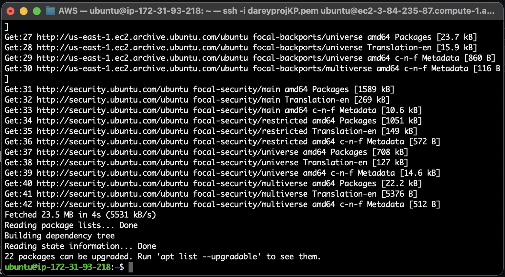

Install Apache by running the following command:

```
sudo apt install apache2
```

To verify that Apache is running as a Service in our OS, use following command:

```
sudo systemctl status apache2
```

If it is green and running like in the below pic, then you're good to go. A web server has just been launched in Cloud.

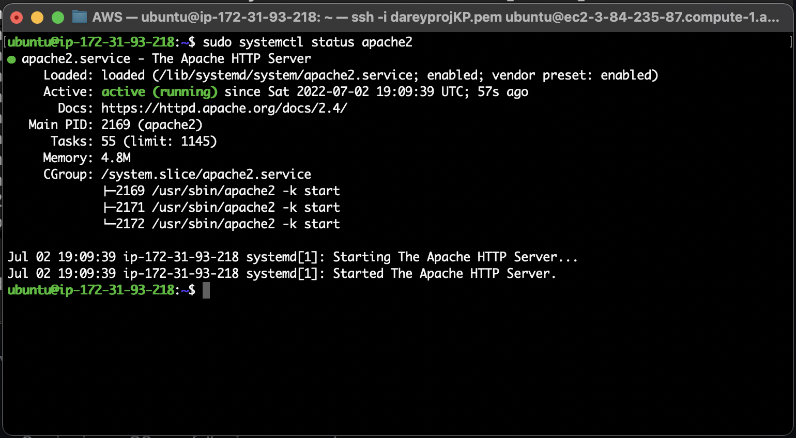

Inorder to recieve web traffic from the internet, we need to open HTTP port 80 on the security group of our EC2 instance. This is the default port that web browsers use to access web pages.

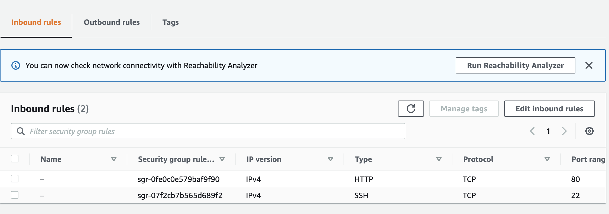

To find out how we can access the web server locally in our Ubuntu shell, we run: 

```
curl http://localhost:80
```

or 

```
curl http://127.0.0.1:80
```

We need to confirm if our web page is up and running using any web browser with the below url:

```
http://<Public-IP-Address>:80
```

The web server public IP address can be retrieved through the AWS EC2 console or by running the following command on the terminal:

```
curl -s http://169.254.169.254/latest/meta-data/public-ipv4
```

If you see following page, then your web server is now correctly installed and accessible through your firewall.

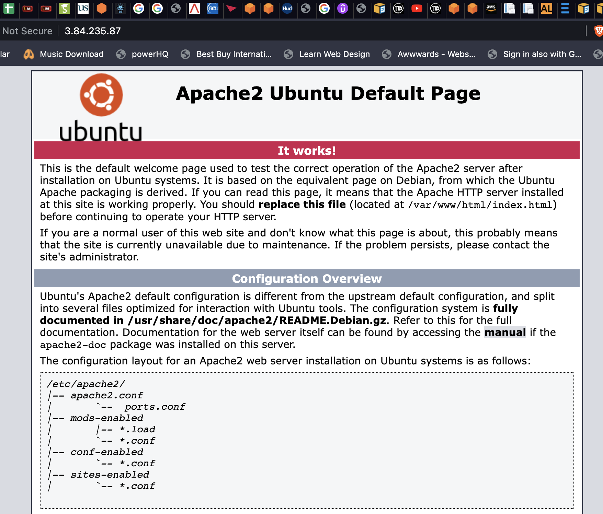

## STEP 2: INSTALLING MYSQL

===============

We will make use of MYSQL, which is a popular relational Database Management System, for the storage and data management of our website. 

Install MYSQL by running: 

```
sudo apt install mysql-server
```

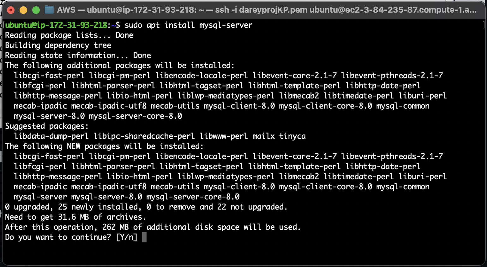

After a successful installation, we can log into the database with:

```
sudo mysql
```

This will connect to the MySQL server as the administrative database user root, which is inferred by the use of sudo when running this command. You should see output like this:

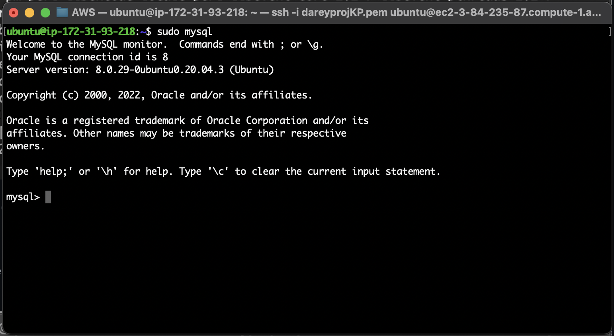

It’s recommended that you run a security script that comes pre-installed with MySQL. This script will remove some insecure default settings and lock down access to your database system. Before running the script you will set a password for the root user, using mysql_native_password as default authentication method. We’re defining this user’s password as PassWord.1.

```
ALTER USER 'root'@'localhost' IDENTIFIED WITH mysql_native_password BY 'PassWord.1';
```

Exit the MySQL shell with:

```
mysql> exit
```

Start the interactive script by running:

```
sudo mysql_secure_installation
```

This will ask if you want to configure the VALIDATE PASSWORD PLUGIN.

**Note**: Enabling this feature is something of a judgment call. If enabled, passwords which don’t match the specified criteria will be rejected by MySQL with an error. It is safe to leave validation disabled, but you should always use strong, unique passwords for database credentials.

Answer **Y** for yes, or anything else to continue without enabling.

If you answer “yes”, you’ll be asked to select a level of password validation. Keep in mind that if you enter 2 for the strongest level, you will receive errors when attempting to set any password which does not contain numbers, upper and lowercase letters, and special characters, or which is based on common dictionary words e.g PassWord.1.

For the rest of the questions, press Y and hit the ENTER key at each prompt. This will prompt you to change the root password, remove some anonymous users and the test database, disable remote root logins, and load these new rules so that MySQL immediately respects the changes you have made.

When you’re finished, test if you’re able to log in to the MySQL console by typing:

```
sudo mysql -p
```

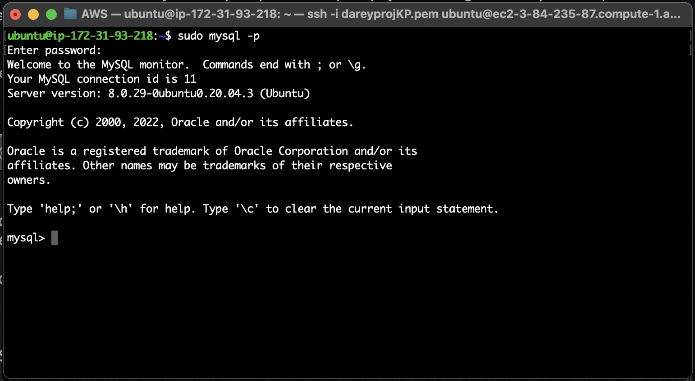


Notice the -p flag in this command, which will prompt you for the password used after changing the root user password.

To exit the MySQL console, type:

```
mysql> exit
```

## STEP 3: INSTALLING PHP

===============

PHP is the component of our setup that will process code to display dynamic content to the end user. 

In addition to the php package, you’ll need php-mysql, a PHP module that allows PHP to communicate with MySQL-based databases.

You’ll also need libapache2-mod-php to enable Apache to handle PHP files.

Other core PHP packages will automatically be installed as dependencies.

To install these 3 packages at once, run:

```
sudo apt install php libapache2-mod-php php-mysql
```

Once the installation is finished, you can run the following command to confirm your PHP version:

```
php -v
```

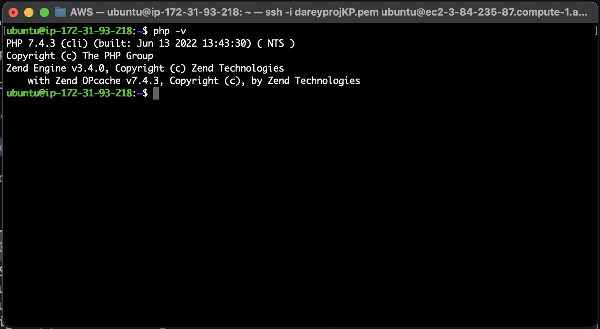

Voila! Your LAMP stack is completely installed and fully operational.

To test your setup with a PHP script, it’s best to set up a proper Apache Virtual Host to hold your website’s files and folders. Virtual host allows you to have multiple websites located on a single machine and users of the websites will not even notice it.

## STEP 4: CREATING A VIRTUAL HOST FOR THE WEBSITE USING APACHE

===============

To test the setup with a PHP script, set up a Apache Virtual Host to hold the website’s files and folders.

The objective is to setup a domain called ‘projectlamp’.

Apache on Ubuntu 20.04 has one server block enabled by default that is configured to serve documents from the /var/www/html directory.

Add a directory next to the default one.

```
sudo mkdir /var/www/projectlamp
```

Assign ownership of the directory with your current system user:

```
sudo chown -R $USER:$USER /var/www/projectlamp
```

Next, create virtual host configuration file in Apache’s sites-available directory.

```
sudo vi /etc/apache2/sites-available/projectlamp.conf
```

Paste in the following bare-bones configuration by hitting on i on the keyboard to enter the insert mode, and paste the text:

```
<VirtualHost *:80>
    ServerName projectlamp
    ServerAlias www.projectlamp 
    ServerAdmin webmaster@localhost
    DocumentRoot /var/www/projectlamp
    ErrorLog ${APACHE_LOG_DIR}/error.log
    CustomLog ${APACHE_LOG_DIR}/access.log combined
</VirtualHost>
```

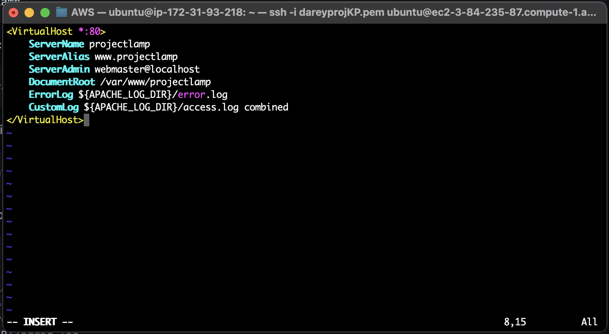


To save and close the file, simply follow the steps below:

1. Hit the esc button on the keyboard
2. Type **:**
3. Type **wq**. **w** for write and **q** for quit
4. Hit **ENTER** to save the file

You can use the **ls** command to show the new file in the **sites-available** directory like so:

```
sudo ls /etc/apache2/sites-available
```

You will see something like this;

```
000-default.conf  default-ssl.conf  projectlamp.conf
```

With this VirtualHost configuration, we’re telling Apache to serve projectlamp using /var/www/projectlampl as its web root directory.

You can now use a2ensite command to enable the new virtual host:

```
sudo a2ensite projectlamp
```

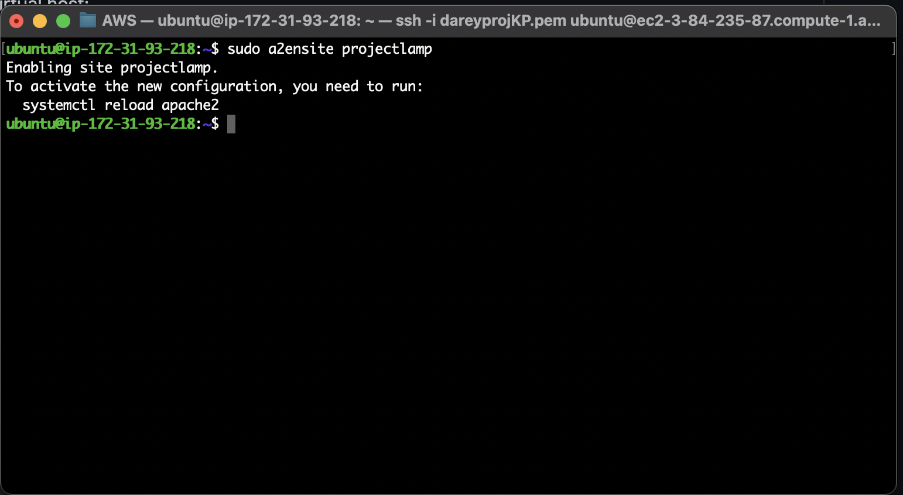

Disable the default website that comes installed with Apache. If this is not done Apache’s default configuration would overwrite the virtual host if custom domain name is not used.

```
sudo a2dissite 000-default
```

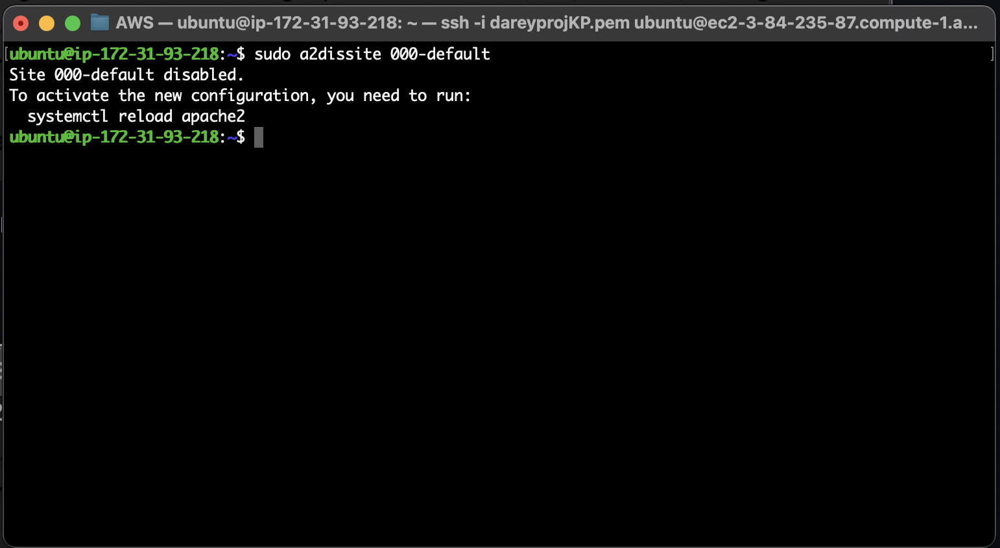

To make sure our configuration file doesn’t contain syntax errors, run:

```
sudo apache2ctl configtest
```


Finally, we reload Apache so these changes take effect:

```
sudo systemctl reload apache2
```

Our new website is now active, but the web root /var/www/projectlamp is still empty. We create an index.html file in that location so that we can test that the virtual host works as expected:

```
sudo echo 'Hello LAMP from hostname' $(curl -s http://169.254.169.254/latest/meta-data/public-hostname) 'with public IP' $(curl -s http://169.254.169.254/latest/meta-data/public-ipv4) > /var/www/projectlamp/index.html
```

Refresh your browser and you should see this:

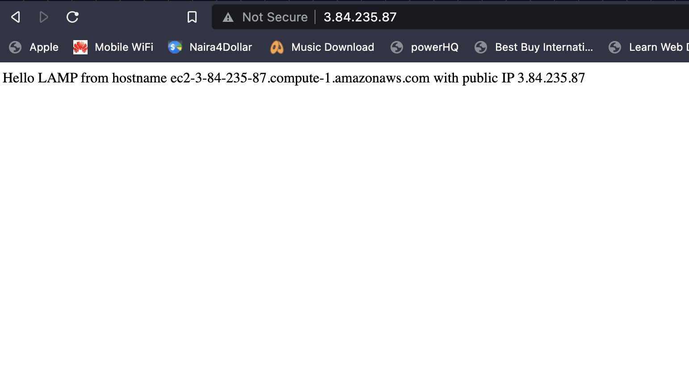

## STEP 5: ENABLE PHP ON THE WEBSITE

===============

With the default DirectoryIndex settings on Apache, a file named index.html will always take precedence over an index.php file. To change this behavior, edit the /etc/apache2/mods-enabled/dir.conf file and change the order in which the index.php file is listed within the DirectoryIndex directive.

Like so:

```
sudo vim /etc/apache2/mods-enabled/dir.conf
```

```
<IfModule mod_dir.c>
        #Change this:
        #DirectoryIndex index.html index.cgi index.pl index.php index.xhtml index.htm
        #To this:
        DirectoryIndex index.php index.html index.cgi index.pl index.xhtml index.htm
</IfModule>
```

After saving and closing the file, we will need to reload Apache so the changes take effect:

```
sudo systemctl reload apache2
```

Create a PHP test script to confirm that Apache is able to handle and process requests for PHP files by opening a new file named index.php inside the custom web root folder:

```
vim /var/www/projectlamp/index.php
```

This will open a blank file. Add the following text, which is a valid PHP code, inside the file:

```
<?php
phpinfo();
```

Save and close the file. Refresh the page and you will see a page similar to this:

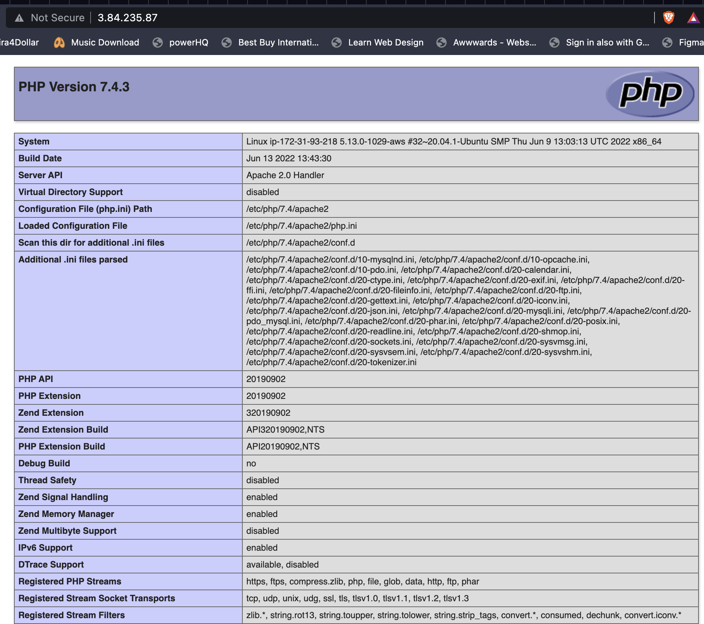


If you can see this page in your browser, then your PHP installation is working as expected.

It’s best to remove the file you created as it contains sensitive information about your PHP environment -and your Ubuntu server. You can use rm to do so:

```
sudo rm /var/www/projectlamp/index.php
```

The page can always be recreated if need be.


