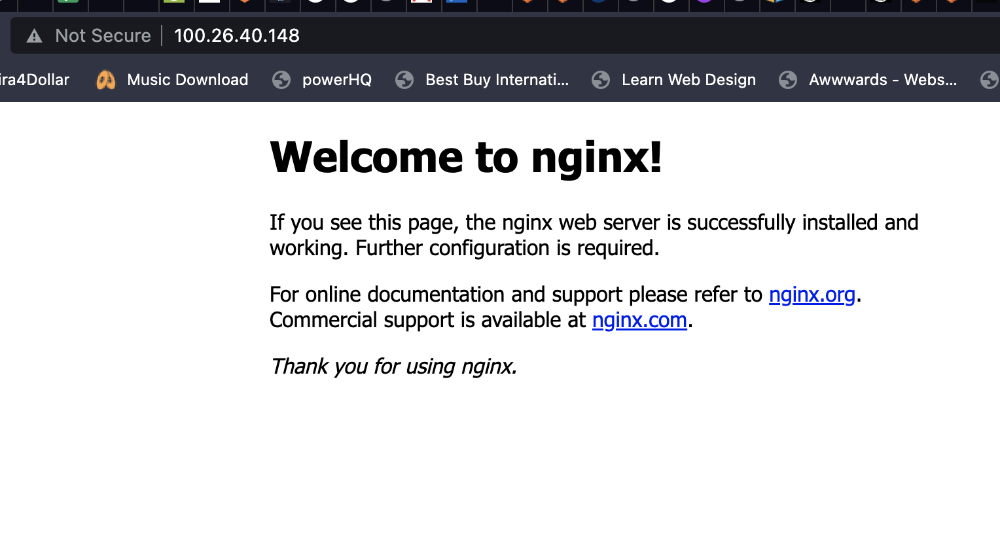

# LEMP STACK IMPLEMENTATION


LEMP is an open-source web application stack used to develop web applications. The term LEMP is an acronym that represents L for the Linux Operating system, Nginx (pronounced as engine-x) web server, M for MySQL database, and P for PHP scripting language.

## STEP 1: INSTALL THE NGINX WEB SERVER

===============

N stands for Nginx: An open source software for web serving, reverse proxying, caching, load balancing, media streaming, and more. When a web browser requests a web page that request is handled by the web server, here that web server is Nginx. Then the webserver passes that request to server-side technologies used in the LEMP stack for instance as a server-side scripting language like PHP to communicate with server and database.

Update Ubuntu server packages:

```
sudo apt update
```


Install Nginx

```
sudo apt install nginx
```


Verify that nginx has successfully installed:

```
sudo systemctl status nginx
```


Retrieve public IPV4 by using the ‘curl’ command:

```
curl -s http://169.254.169.254/latest/meta-data/public-ipv4
```
OR

Through the AWS Management Console.


Open TCP port 80 which is default port that web browsers use to access web pages in the Internet.


Now go to your browser and try to open your website URL using IP address:

```
http://<Public-IP-Address>:80
```



## STEP 2: INSTALLING MYSQL

===============

We will make use of MYSQL, which is a popular relational Database Management System, for the storage and data management of our website. 

Install MYSQL by running: 

```
sudo apt install mysql-server
```


After a successful installation, we can log into the database with:

```
sudo mysql
```

This will connect to the MySQL server as the administrative database user root, which is inferred by the use of sudo when running this command. You should see output like this:


It’s recommended that you run a security script that comes pre-installed with MySQL. This script will remove some insecure default settings and lock down access to your database system. Before running the script you will set a password for the root user, using mysql_native_password as default authentication method. We’re defining this user’s password as PassWord.1.

```
ALTER USER 'root'@'localhost' IDENTIFIED WITH mysql_native_password BY 'PassWord.1';
```

Exit the MySQL shell with:

```
mysql> exit
```

Start the interactive script by running:

```
sudo mysql_secure_installation
```

This will ask if you want to configure the VALIDATE PASSWORD PLUGIN.

**Note**: Enabling this feature is something of a judgment call. If enabled, passwords which don’t match the specified criteria will be rejected by MySQL with an error. It is safe to leave validation disabled, but you should always use strong, unique passwords for database credentials.

Answer **Y** for yes, or anything else to continue without enabling.

If you answer “yes”, you’ll be asked to select a level of password validation. Keep in mind that if you enter 2 for the strongest level, you will receive errors when attempting to set any password which does not contain numbers, upper and lowercase letters, and special characters, or which is based on common dictionary words e.g PassWord.1.

For the rest of the questions, press Y and hit the ENTER key at each prompt. This will prompt you to change the root password, remove some anonymous users and the test database, disable remote root logins, and load these new rules so that MySQL immediately respects the changes you have made.

When you’re finished, test if you’re able to log in to the MySQL console by typing:

```
sudo mysql -p
```


Notice the -p flag in this command, which will prompt you for the password used after changing the root user password.

To exit the MySQL console, type:

```
mysql> exit
```

## STEP 3: INSTALLING PHP

===============

PHP is a scripting language that works on the server-side and communicates with the database MySQL and does all operations which user requests, like fetching data, adding data, or manipulating data, or processing the data. PHP processes code and generates dynamic content for the web server. Nginx requires an external program to handle PHP processing and act as a bridge between the PHP interpreter itself and the web server.

While Apache embeds the PHP interpreter in each request, Nginx requires an external program to handle PHP processing and act as a bridge between the PHP interpreter itself and the web server. This allows for a better overall performance in most PHP-based websites, but it requires additional configuration. You’ll need to install php-fpm, which stands for “PHP fastCGI process manager”, and tell Nginx to pass PHP requests to this software for processing. Additionally, you’ll need php-mysql, a PHP module that allows PHP to communicate with MySQL-based databases. Core PHP packages will automatically be installed as dependencies.

To install these 2 packages at once, run:

```
sudo apt install php-fpm php-mysql
```


## STEP 4 — CONFIGURING NGINX TO USE PHP PROCESSOR

On Ubuntu 20.04, Nginx has one server block enabled by default and is configured to serve documents out of a directory at /var/www/html. While this works well for a single site, it can become difficult to manage if you are hosting multiple sites. Instead of modifying /var/www/html, we’ll create a directory structure within /var/www for the your_domain website, leaving /var/www/html in place as the default directory to be served if a client request does not match any other sites.

Create the root web directory for ***your_domain*** as follows:

```
sudo mkdir /var/www/projectLEMP
```

Next, assign ownership of the directory with the $USER environment variable, which will reference your current system user:

```
sudo chown -R $USER:$USER /var/www/projectLEMP
```

Then, open a new configuration file in Nginx’s sites-available directory using your preferred command-line editor. Here, we’ll use nano:

```
sudo nano /etc/nginx/sites-available/projectLEMP
```

This will create a new blank file. Paste in the following bare-bones configuration:

```
#/etc/nginx/sites-available/projectLEMP

server {
    listen 80;
    server_name projectLEMP www.projectLEMP;
    root /var/www/projectLEMP;

    index index.html index.htm index.php;

    location / {
        try_files $uri $uri/ =404;
    }

    location ~ \.php$ {
        include snippets/fastcgi-php.conf;
        fastcgi_pass unix:/var/run/php/php8.1-fpm.sock;
     }

    location ~ /\.ht {
        deny all;
    }

}
```

Activate the configuration by linking to config file to the Nginx’s sites-enabled directory. This will tell Nginx to use the configuration next time it is reloaded.

```
sudo ln -s /etc/nginx/sites-available/projectLEMP /etc/nginx/sites-enabled/
```

Test the configuration for syntax errors:

```
 sudo nginx -t
 ```


Disable default Nginx host that is currently configured to listen on port 80, for this run:

```
sudo unlink /etc/nginx/sites-enabled/default
```

Reload Nginx to apply the changes:

```
sudo systemctl reload nginx
```

The new website is now active, but the web root /var/www/projectLEMP is still empty. Create an index.html file in that location so that we can test that your new server block works as expected:


```
sudo echo 'Hello LEMP from hostname' $(curl -s http://169.254.169.254/latest/meta-data/public-hostname) 'with public IP' $(curl -s http://169.254.169.254/latest/meta-data/public-ipv4) > /var/www/projectLEMP/index.html
```

Now go to your browser and try to open your website URL using IP address:

```
http://<Public-IP-Address>:80
```


## STEP 5 — TESTING PHP WITH NGINX

At this point, your LAMP stack is completely installed and fully operational.

You can test it to validate that Nginx can correctly hand .php files off to your PHP processor.

You can do this by creating a test PHP file in your document root. Open a new file called info.php within your document root in your text editor:

```
sudo nano /var/www/projectLEMP/info.php
```

Type or paste the following lines into the new file. This is valid PHP code that will return information about your server:

```
<?php
phpinfo();
```

You can now access this page in your web browser by visiting the domain name or public IP address you’ve set up in your Nginx configuration file, followed by /info.php:

```
http://`server_domain_or_IP`/info.php
```


After checking the relevant information about your PHP server through that page, it’s best to remove the file you created as it contains sensitive information about your PHP environment and your Ubuntu server. You can use rm to remove that file:

```
sudo rm /var/www/your_domain/info.php
```

## STEP 6 — RETRIEVING DATA FROM MYSQL DATABASE WITH PHP

First, connect to the MySQL console using the root account:

```
sudo mysql
```

Create a new database called example_database

```
CREATE DATABASE <example_database>;
```

```
CREATE USER <example_user> @'%' IDENTIFIED WITH mysql_native_password BY 'password';
```

Give user permission over the example_database database:

```
GRANT ALL ON example_database.* TO <'example_user'>@'%';
```

To test if the new user has the proper permissions to log into the MySQL console again, this time use the custom user credentials:

```
mysql -u <example_user> -p
```

Query the database to confirm that you have access to the example_database database:

```
mysql> SHOW DATABASES;
```


Create a test table named todo_list From the MySQL console with statement:


```
CREATE TABLE example_database.todo_list (item_id INT AUTO_INCREMENT, content VARCHAR(255),PRIMARY KEY(item_id));
```

Insert a few rows of content in the test table. You might want to repeat the next command a few times, using different VALUES:

```
mysql> INSERT INTO example_database.todo_list (content) VALUES ("My first important item");
```

To confirm that the data was successfully saved to the table, run this command:

```
SELECT * FROM example_database.todo_list;
```


Exit mysql

```
mysql exit
```

Now you can create a PHP script that will connect to MySQL and query for your content. Create a new PHP file in your custom web root directory using your preferred editor.

```
vi /var/www/projectLEMP/todo_list.php
```

Enter the script below into todo_list.php. Modify the variables accordingly.

```
<?php
$user = "example_user";
$password = "password";
$database = "example_database";
$table = "todo_list";

try {
  $db = new PDO("mysql:host=localhost;dbname=$database", $user, $password);
  echo "<h2>TODO</h2><ol>";
  foreach($db->query("SELECT content FROM $table") as $row) {
    echo "<li>" . $row['content'] . "</li>";
  }
  echo "</ol>";
} catch (PDOException $e) {
    print "Error!: " . $e->getMessage() . "<br/>";
    die();
}
```

You can now access this page in your web browser by visiting the domain name or public IP address configured for your website, followed by /todo_list.php:


That means your PHP environment is ready to connect and interact with your MySQL server.
