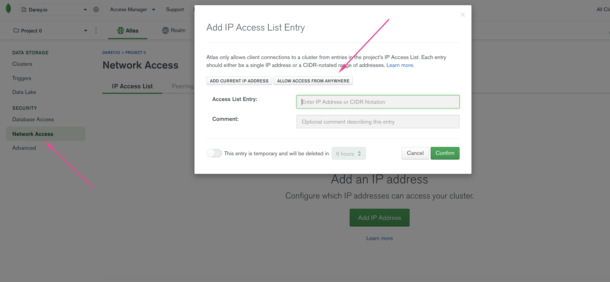
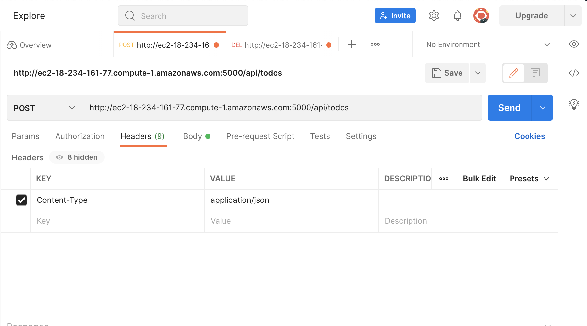
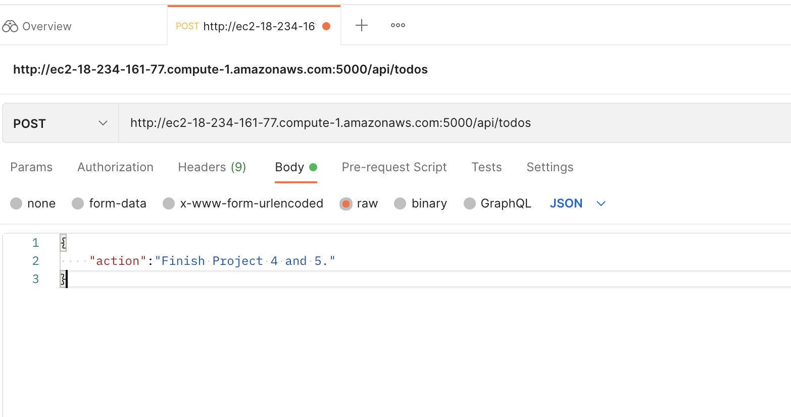
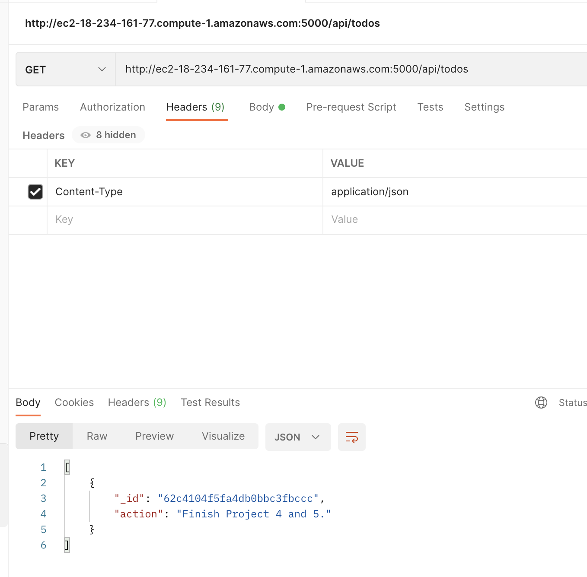
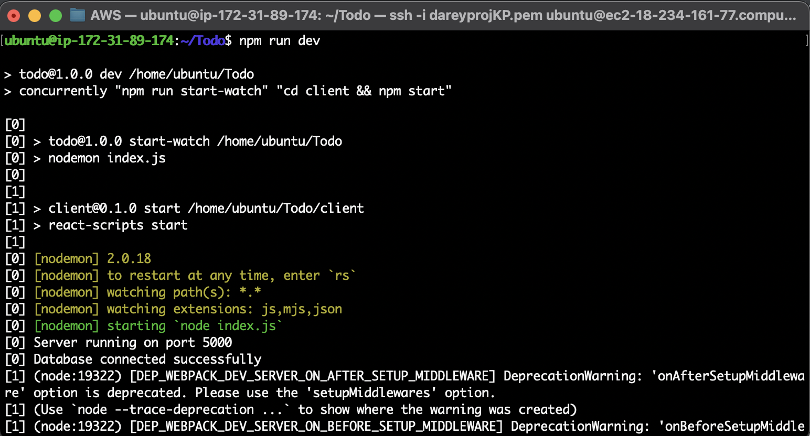
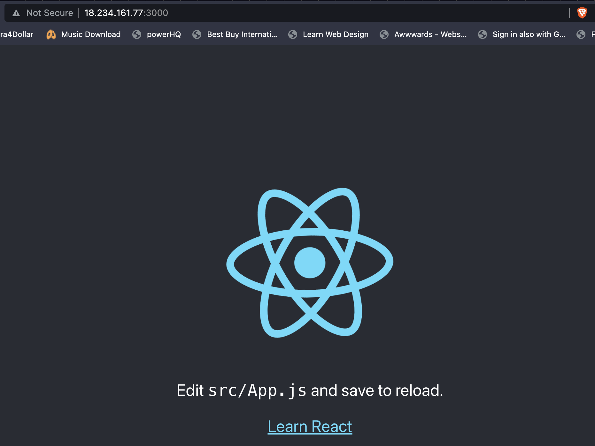
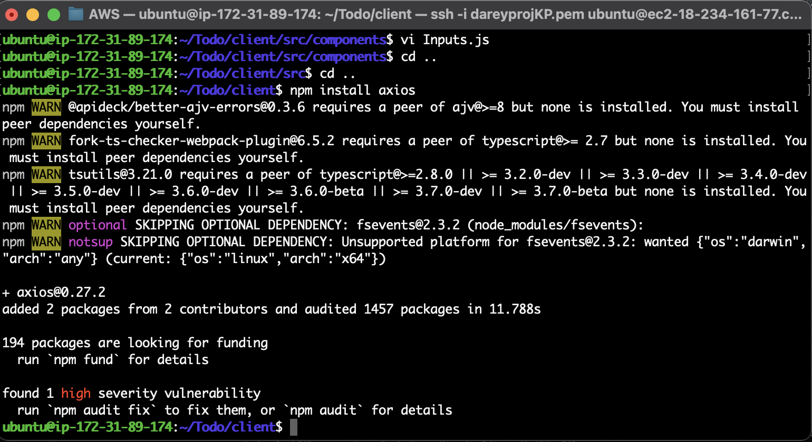

# MERN STACK IMPLEMENTATION

## SIMPLE TO-DO APPLICATION ON MERN WEB STACK

===============

In this project, I implemented a web solution based on MERN stack in AWS Cloud.

MERN Web stack consists of following components:

1. **MongoDB:** A document-based, No-SQL database used to store application data in a form of documents.
2. **ExpressJS:** A server side Web Application framework for Node.js.
3. **ReactJS:** A frontend framework developed by Facebook. It is based on JavaScript, used to build User Interface (UI) components.
4. **Node.js:** A JavaScript runtime environment. It is used to run JavaScript on a machine rather than in a browser.

## STEP 1: BACKEND CONFIGURATION

===============

Update ubuntu

```
sudo apt update
```

Upgrade ubuntu

```
sudo apt upgrade
```

Get the location of Node.js software from Ubuntu repositories.

```
curl -fsSL https://deb.nodesource.com/setup_18.x | sudo -E bash -
```


Install Node.js with the command below:

```
sudo apt-get install -y nodejs
```


The command above installs both nodejs and npm. NPM is a package manager for Node like apt for Ubuntu, it is used to install Node modules & packages and to manage dependency conflicts.

Verify the node installation with the command below:

```
node -v 
```

Verify the node installation with the command below:

```
npm -v 
```

Create a new directory for your To-Do project

```
mkdir Todo
```


Change your current directory to the newly created one:

```
cd Todo
```

Next, you will use the command `npm init` to initialise your project, so that a new file named `package.json` will be created. This file will normally contain information about your application and the dependencies that it needs to run. Follow the prompts after running the command. You can press Enter several times to accept default values, then accept to write out the `package.json` file by typing `yes`.

```
npm init
```

Run the command ls to confirm that you have `package.json` file created.

Next, we will Install `ExpressJs` and create the `Routes` directory.

## STEP 1.1: INSTALL EXPRESSJS

===============


Remember that Express is a framework for Node.js, therefore a lot of things developers would have programmed is already taken care of out of the box. Therefore it simplifies development, and abstracts a lot of low level details. For example, Express helps to define routes of your application based on HTTP methods and URLs.

To use express, install it using npm:

```
npm install express
```

Now create a file `index.js` with the command below:

```
touch index.js
```

Run ls to confirm that your index.js file is successfully created

Install the dotenv module:

```
npm install dotenv
```

Open the index.js file with the command below:

```
vim index.js
```

Type the code below into it and save. 

```
const express = require('express');
require('dotenv').config();

const app = express();

const port = process.env.PORT || 5000;

app.use((req, res, next) => {
res.header("Access-Control-Allow-Origin", "\*");
res.header("Access-Control-Allow-Headers", "Origin, X-Requested-With, Content-Type, Accept");
next();
});

app.use((req, res, next) => {
res.send('Welcome to Express');
});

app.listen(port, () => {
console.log(`Server running on port ${port}`)
});
```

We had specified to use port 5000 in the code. This will be required later when we go on the browser.

Create an inbound rule to open TCP port 5000: 


Now it is time to start our server to see if it works. Open your terminal in the same directory as your index.js file and type:

```
node index.js
```


If every thing goes well, you should see Server running on port 5000 in your terminal.


### CREATE ROUTES


There are three actions that our To-Do application needs to be able to do:

1. Create a new task
2. Display list of all tasks
3. Delete a completed task


Each task will be associated with some particular endpoint and will use different standard HTTP request methods: POST, GET, DELETE.

For each task, we need to create routes that will define various endpoints that the To-do app will depend on. So let us create a folder routes:

```
mkdir routes
```

Change directory to routes folder:

```
cd routes
```

Now, create a file `api.js` with the command below:

```
touch api.js
```

Open the file with the command below:

```
vim api.js
```

Copy below code into the file:

```
const express = require ('express');
const router = express.Router();

router.get('/todos', (req, res, next) => {

});

router.post('/todos', (req, res, next) => {

});

router.delete('/todos/:id', (req, res, next) => {

})

module.exports = router;
```

Next we create `Models` directory.

## STEP 1.2: MODELS

===============

Now comes the interesting part, since the app is going to make use of Mongodb which is a NoSQL database, we need to create a model.

A model is at the heart of JavaScript based applications, and it is what makes it interactive.

We will also use models to define the database schema . This is important so that we will be able to define the fields stored in each Mongodb document. (Seems like a lot of information, but not to worry, everything will become clear to you over time. I promise!!!)

In essence, the Schema is a blueprint of how the database will be constructed, including other data fields that may not be required to be stored in the database. These are known as virtual properties

To create a Schema and a model, install mongoose which is a Node.js package that makes working with mongodb easier.

Change directory back `Todo` folder and install Mongoose:

```
npm install mongoose
```

Create a new folder `models`:

```
mkdir models
```

Change directory into the newly created ‘models’ folder with:

```
cd models
```

Inside the models folder, create a file and name it todo.js:

```
touch todo.js
```

Open the file created folder then paste the code below in the file:

```
const mongoose = require('mongoose');
const Schema = mongoose.Schema;

//create schema for todo
const TodoSchema = new Schema({
action: {
type: String,
required: [true, 'The todo text field is required']
}
})

//create model for todo
const Todo = mongoose.model('todo', TodoSchema);

module.exports = Todo;
```

Now we need to update our routes from the file `api.js` in `routes` directory to make use of the new model:

```
const express = require ('express');
const router = express.Router();
const Todo = require('../models/todo');

router.get('/todos', (req, res, next) => {

//this will return all the data, exposing only the id and action field to the client
Todo.find({}, 'action')
.then(data => res.json(data))
.catch(next)
});

router.post('/todos', (req, res, next) => {
if(req.body.action){
Todo.create(req.body)
.then(data => res.json(data))
.catch(next)
}else {
res.json({
error: "The input field is empty"
})
}
});

router.delete('/todos/:id', (req, res, next) => {
Todo.findOneAndDelete({"_id": req.params.id})
.then(data => res.json(data))
.catch(next)
})

module.exports = router;
```

## STEP 1.3: MONGODB DATABASE

===============

We need a database where we will store our data. For this we will make use of mLab. mLab provides MongoDB database as a service solution (DBaaS), so to make life easy, you will need to sign up for a shared clusters free account, which is ideal for our use case.


Allow access to the MongoDB database from anywhere (Not secure, but it is ideal for testing).

**IMPORTANT NOTE**

In the image below, make sure you change the time of deleting the entry from 6 Hours to 1 Week.



Create a MongoDB database and collection inside mLab.


In the `index.js` file, we specified `process.env` to access environment variables, but we have not yet created this file. So we need to do that now.

Create a file in your Todo directory and name it `.env`.

```
touch .env
vi .env
```

Add the connection string to access the database in it, just as below:

```
DB = 'mongodb+srv://<username>:<password>@<network-address>/<dbname>?retryWrites=true&w=majority'
```

Ensure to update `<username>`, `<password>`, `<network-address>` and `<database>` according to your setup.

Here is how to get your connection string:


Now we need to update the `index.js` to reflect the use of `.env` so that Node.js can connect to the database.

Simply delete existing content in the file, and update it with the entire code below:

```
const express = require('express');
const bodyParser = require('body-parser');
const mongoose = require('mongoose');
const routes = require('./routes/api');
const path = require('path');
require('dotenv').config();

const app = express();

const port = process.env.PORT || 5000;

//connect to the database
mongoose.connect(process.env.DB, { useNewUrlParser: true, useUnifiedTopology: true })
.then(() => console.log(`Database connected successfully`))
.catch(err => console.log(err));

//since mongoose promise is depreciated, we overide it with node's promise
mongoose.Promise = global.Promise;

app.use((req, res, next) => {
res.header("Access-Control-Allow-Origin", "\*");
res.header("Access-Control-Allow-Headers", "Origin, X-Requested-With, Content-Type, Accept");
next();
});

app.use(bodyParser.json());

app.use('/api', routes);

app.use((err, req, res, next) => {
console.log(err);
next();
});

app.listen(port, () => {
console.log(`Server running on port ${port}`)
});
```

Using environment variables to store information is considered more secure and best practice to separate configuration and secret data from the application, instead of writing connection strings directly inside the `index.js` application file.


Start your server using the command:

```
node index.js
```

You shall see a message ‘Database connected successfully’, if so – we have our backend configured. Now we are going to test it.


We would make use of Postman to test the API endpoints and make sure they are working.

Download Postman and install it on your machine.

Open Postman and create a POST request to the API `http://:5000/api/todos`. This request sends a new task to your To-Do list so the application can store it in the database.

Note: make sure your set header key Content-Type as application/json.




Make a POST request like so:



Create a GET request to your API on `http://<PublicIP-or-PublicDNS>:5000/api/todos`. This request retrieves all existing records from out To-do application (backend requests these records from the database and sends it us back as a response to GET request).




## STEP 2: FRONTEND CREATION

===============

The aim is to create a user interface for a Web client (browser) to interact with the application via API. To start out with the frontend of the To-do app, use the `create-react-app` command to scaffold the app.

In the same root directory as your backend code, which is the `Todo` directory run the below code. This will create a new folder in your Todo directory called client, where you will add all the react code.

```
npx create-react-app client
```

This will create a new folder in your Todo directory called `client`, where you will add all the react code.

Before testing the react app, there are some dependencies that need to be installed.

1. Install concurrently. It is used to run more than one command simultaneously from the same terminal window.

```
npm install concurrently --save-dev
```

2. Install `nodemon`. It is used to run and monitor the server. If there is any change in the server code, nodemon will restart it automatically and load the new changes.

```
npm install nodemon --save-dev
```

3. In Todo folder open the package.json file. Change the highlighted part of the below screenshot and replace with the code below.

```
"scripts": {
"start": "node index.js",
"start-watch": "nodemon index.js",
"dev": "concurrently \"npm run start-watch\" \"cd client && npm start\""
},
```


**Configure Proxy in `package.json`:**

1. Change directory to `client`:

```
cd client
```

2. Open the `package.json` file:

```
vi package.json
```

3. Add the key value pair in the package.json file `"proxy": "http://localhost:5000"`:

The whole purpose of adding the proxy configuration in number 3 above is to make it possible to access the application directly from the browser by simply calling the server url like http://localhost:5000 rather than always including the entire path like http://localhost:5000/api/todos

Now, ensure you are inside the Todo directory, and simply do:

```
npm run dev
```



Your app should open and start running on localhost:3000. Make sure port 3000 is open on your EC2.





- ## Creating React Components

One of the advantages of react is that it makes use of components, which are reusable and also makes code modular. For our Todo app, there will be two stateful components and one stateless component.

From your Todo directory run:

```
cd client
```

Move to the `src` directory:

```
cd src
```

Inside your src folder create another folder called components

```
mkdir components
```

Move into the components directory with:

```
cd components
```

Inside `components` directory create three files `Input.js, ListTodo.js and Todo.js`.

```
touch Input.js ListTodo.js Todo.js
```

Open `Input.js` file:

```
vi Input.js
```

Copy and paste the following:

```
import React, { Component } from 'react';
import axios from 'axios';

class Input extends Component {

state = {
action: ""
}

addTodo = () => {
const task = {action: this.state.action}

    if(task.action && task.action.length > 0){
      axios.post('/api/todos', task)
        .then(res => {
          if(res.data){
            this.props.getTodos();
            this.setState({action: ""})
          }
        })
        .catch(err => console.log(err))
    }else {
      console.log('input field required')
    }

}

handleChange = (e) => {
this.setState({
action: e.target.value
})
}

render() {
let { action } = this.state;
return (
<div>
<input type="text" onChange={this.handleChange} value={action} />
<button onClick={this.addTodo}>add todo</button>
</div>
)
}
}

export default Input
```

To make use of Axios, which is a Promise based HTTP client for the browser and node.js, you need to cd into your client from your terminal and run yarn add axios or npm install axios.

Move to client folder and install Axios:

```
npm install axios
```



Move to ‘components’ directory:

```
cd src/components
```

After that open your `ListTodo.js`:

```
vi ListTodo.js
```

In the `ListTodo.js` copy and paste the following code:

```
import React from 'react';

const ListTodo = ({ todos, deleteTodo }) => {

return (
<ul>
{
todos &&
todos.length > 0 ?
(
todos.map(todo => {
return (
<li key={todo._id} onClick={() => deleteTodo(todo._id)}>{todo.action}</li>
)
})
)
:
(
<li>No todo(s) left</li>
)
}
</ul>
)
}

export default ListTodo
```

Then in your `Todo.js` file you write the following code:

```
import React, {Component} from 'react';
import axios from 'axios';

import Input from './Input';
import ListTodo from './ListTodo';

class Todo extends Component {

state = {
todos: []
}

componentDidMount(){
this.getTodos();
}

getTodos = () => {
axios.get('/api/todos')
.then(res => {
if(res.data){
this.setState({
todos: res.data
})
}
})
.catch(err => console.log(err))
}

deleteTodo = (id) => {

    axios.delete(`/api/todos/${id}`)
      .then(res => {
        if(res.data){
          this.getTodos()
        }
      })
      .catch(err => console.log(err))

}

render() {
let { todos } = this.state;

    return(
      <div>
        <h1>My Todo(s)</h1>
        <Input getTodos={this.getTodos}/>
        <ListTodo todos={todos} deleteTodo={this.deleteTodo}/>
      </div>
    )

}
}

export default Todo;
```

We need to make little adjustment to our react code. Delete the logo and adjust our `App.js` to look like this.

Move to the src folder.

Make sure that you are in the src folder and run:

```
vi App.js
```

Copy and paste the code below into it:

```
import React from 'react';

import Todo from './components/Todo';
import './App.css';

const App = () => {
return (
<div className="App">
<Todo />
</div>
);
}

export default App;
```

In the `src` directory open the `App.css`:


```
vi App.css
```

Then paste the following code into it:

```
.App {
text-align: center;
font-size: calc(10px + 2vmin);
width: 60%;
margin-left: auto;
margin-right: auto;
}

input {
height: 40px;
width: 50%;
border: none;
border-bottom: 2px #101113 solid;
background: none;
font-size: 1.5rem;
color: #787a80;
}

input:focus {
outline: none;
}

button {
width: 25%;
height: 45px;
border: none;
margin-left: 10px;
font-size: 25px;
background: #101113;
border-radius: 5px;
color: #787a80;
cursor: pointer;
}

button:focus {
outline: none;
}

ul {
list-style: none;
text-align: left;
padding: 15px;
background: #171a1f;
border-radius: 5px;
}

li {
padding: 15px;
font-size: 1.5rem;
margin-bottom: 15px;
background: #282c34;
border-radius: 5px;
overflow-wrap: break-word;
cursor: pointer;
}

@media only screen and (min-width: 300px) {
.App {
width: 80%;
}

input {
width: 100%
}

button {
width: 100%;
margin-top: 15px;
margin-left: 0;
}
}

@media only screen and (min-width: 640px) {
.App {
width: 60%;
}

input {
width: 50%;
}

button {
width: 30%;
margin-left: 10px;
margin-top: 0;
}
}
```

In the `src` directory open the `index.css`:

```
vim index.css
```

Copy and paste the code below:

```
body {
margin: 0;
padding: 0;
font-family: -apple-system, BlinkMacSystemFont, "Segoe UI", "Roboto", "Oxygen",
"Ubuntu", "Cantarell", "Fira Sans", "Droid Sans", "Helvetica Neue",
sans-serif;
-webkit-font-smoothing: antialiased;
-moz-osx-font-smoothing: grayscale;
box-sizing: border-box;
background-color: #282c34;
color: #787a80;
}

code {
font-family: source-code-pro, Menlo, Monaco, Consolas, "Courier New",
monospace;
}
```

Go to the `Todo` directory and run:

```
npm run dev
```


