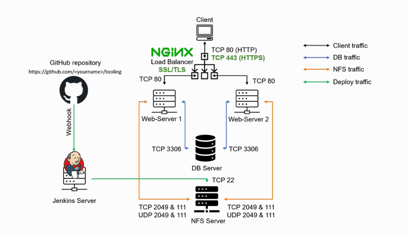

# Load Balancer Solution With Nginx and SSL/TLS

This project uses the same infrastructure as project 8 but in this case, the load balancer solution will be configured with Nginx instead of Apache.

In order to ensure that the application is secure in transit, SSL/TLS digital certificates will be used to identify and validate the website. In this project, the website will be registered with LetsEnrcypt Certificate Authority. To automate certificate issuance, a shell client recommended by LetsEncrypt - cetrbot will be used.

This project consists of two parts:

- Configure Nginx as a Load Balancer
- Register a new domain name and configure secured connection using SSL/TLS certificates.

The target architecture is as follows:

[Here](https://github.com/enyioman/project10/blob/main/project10.md) is the full documentation.