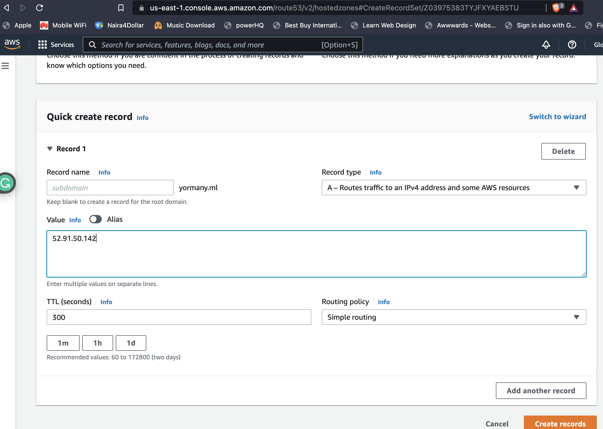
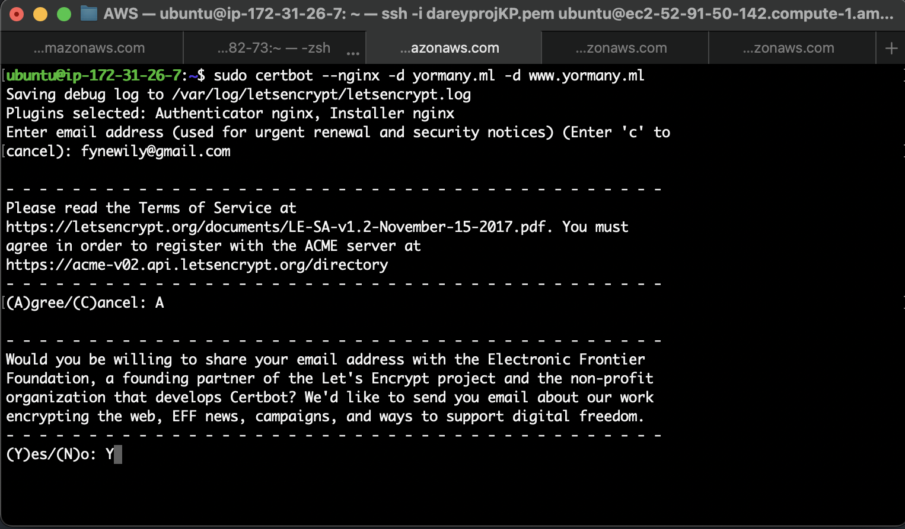

# Load Balancer Solution With Nginx and SSL/TLS

## Configure Nginx As A Load Balancer

In order to do this complete the following:

- Create an EC2 VM based on Ubuntu Server 20.04 LTS and open TCP port 80 for HTTP connections and TCP port 443.

Update the server repositry and install nginx:

```
sudo apt update && sudo apt install nginx
```

Edit the NGINX configuration file: 

```
sudo vi /etc/nginx/sites-available/load-balancer.conf
```

Add the following configuration:

```
upstream web {
    server <Web-Server-1-Private-IP>;
    server <Web-Server-2-Private-IP>;
  }

server {
    listen 80;

    server_name domain-name www.domain-name;

    location / {
      proxy_pass http://web;
    }
  }
```


Remove nginx default page and check that Nginx was correctly configured:

```
sudo rm -f /etc/nginx/sites-enabled/default
sudo nginx -t
```


Navigate to `/etc/nginx/sites-enabled' and link the earlier configure default page:

```
sudo ln -s ../sites-available/load-balancer.conf .
```


Restart NGINX service and check status:

```
sudo systemctl restart nginx
udo systemctl status nginx
```


## Register a new domain name and connect to route 53


- Register a doman with any service provider of your choice.
- Go unto the route 53 dashboard on AWS and create a hosted zone, connect this to your domain. This will tell route 53 to respond to DNS queries from your domain.
- Assign an Elastic IP to your Nginx LB server and associate the domain name with this Elastic IP, the purpose of this is to ensure that the public IP address is static because everytime you restart, stop or start your EC2 instance, you get a new public IP address. When you want to associate your domain name, it is better to have a static IP address that does not change after reboot, thus Elastic IP is the solution for this problem.





## Configure secured connection using SSL/certificates

Before installing certbot, ensure that the snapd service is active and running:

```
sudo apt update 
sudo apt install snapd 
sudo systemctl status snapd
```


Install certbot and dependencies by executing the following command:

```
sudo apt install certbot -y

sudo apt install python3-certbot-nginx -y
```




Execute the below commands to checked syntax and reload nginx:

```
sudo nginx -t && sudo nginx -s reload
```

Create a certificate for your domain to make it is secure:

```
sudo certbot --nginx -d yormany.ml -d www.yormany.ml
```

Enter a valid email and accept service agreement. To increase security select for incoming request from port 80 to be redirected to port 443.

The web solution should now be securely accessible at `https://<your-domain-name.com>`:


By default, LetsEncrypt certificate is valid for 90 days, so it is recommended to renew it at least every 60 days or more frequently. Best pracice is to have a scheduled job that to run renew command periodically. Configure a cronjob to run the command twice a day. To do so, edit the crontab file with the following command:

```
crontab -e
```


Insert the below command which will be executed every 12 minutes of every hour:

```
* */12 * * *   root /usr/bin/certbot renew > /dev/null 2>&1
```


