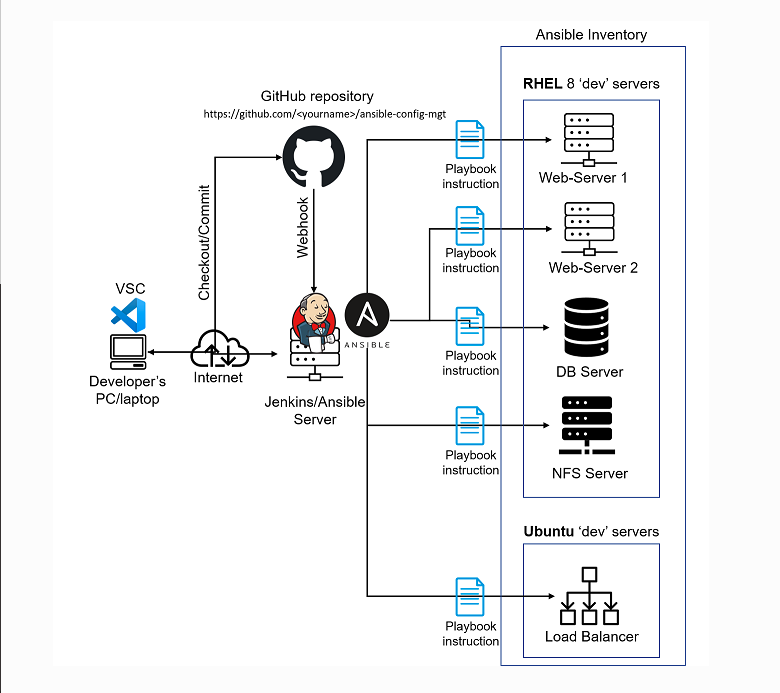

# Ansible Automation Project

Project 7-10 consisted of manual operations for setting up virtual servers, installing and configuring required softwares.

The aim of this project is to automate most of the tasks with Ansible Configuration Management.

## Task

- Install and configure Ansible client to act as a Jump Server/Bastion Host.
- Create a simple Ansible playbook to automate server configuration.

The architecture at the end of this project looks like the diagram below:

The full documentations is located [here](https://github.com/enyioman/project11/blob/main/project11.md).