# Ansible Configuration Management - Automate Project 7 to 10

## Step 1 - Install and configure Ansible on EC2 Instance

We'll be using our Jenkins server from the previous project.

- Create a repo and name it `ansible-config-mgt`.

Install Ansible:

```
sudo apt update 
sudo apt install ansible
```

Confirm Ansible installation:

```
ansible --version
```

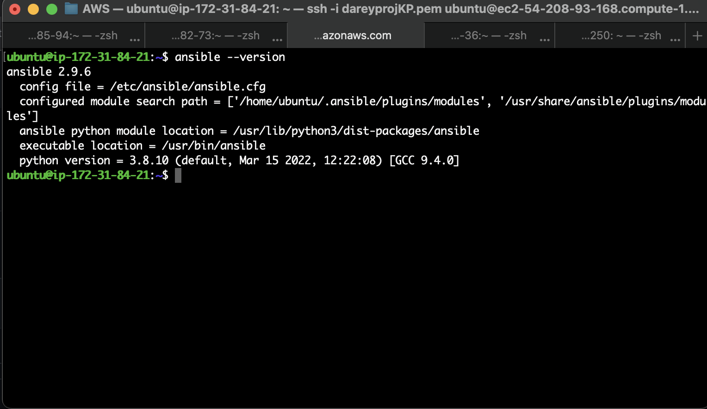

Configure Jenkins build job to save your repository content every time you change it.

- Create a new Freestyle project `ansible-mgt` in Jenkins and point it to your `ansible-config-mgt` repository.
- Configure Webhook in GitHub and set webhook to trigger `ansible-mgt` build
- Configure a Post-build job to save all (**) files.

Test your setup by making some change in master branch and make sure that builds starts automatically and Jenkins saves the files (build artifacts) in the following folder `/var/lib/jenkins/jobs/ansible/builds/<build_number>/archive/`.

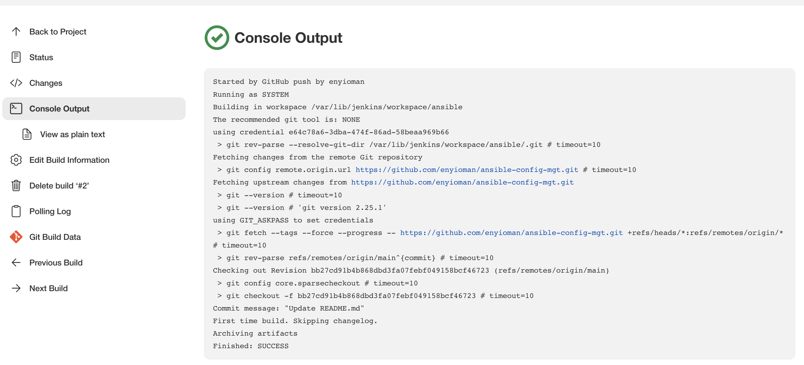

Archive confirmation:

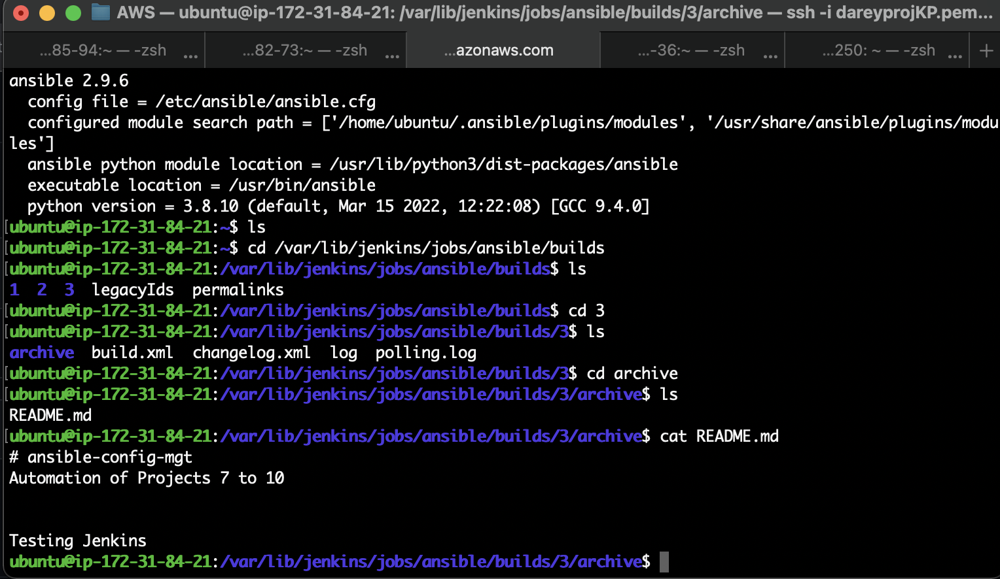

The architecture of the setup so far looks like the diagram below:

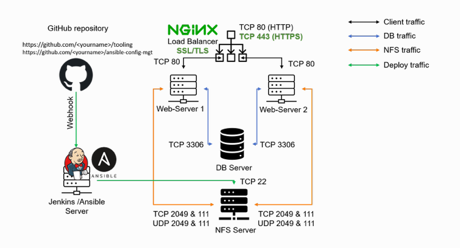

## Step 2 - Ansible Development

On Jenkins-Ansible server, create a folder named `ansible`.

- Change directory to ansible and clone repo with git clone `https://github.com/enyioman/ansible-config-mgt.git`.

- Change direcotry to `ansible-config-mgt`, create a new branch that will be used for development of a new feature. Our branch will be named `prj-11`.

- Checkout to the newly created feature branch `git checkout -b prj-11`.

- Create a directory and name it `playbooks`, which will be used to store all our playbook files. In the playbooks folder, create a file and name it `common.yml`.

- Create a directory and name it `inventory` - it will be used to keep your hosts organised. Within the inventory folder, create an inventory file (.yml) for each environment (Development, Staging, Testing and Production) `dev`, `staging`, `uat`, and `prod` respectively.

## Step 3 - Set up an Ansible Inventory

An Ansible inventory file defines the hosts and groups of hosts upon which commands, modules, and tasks in a playbook operate.

Ansible uses TCP port 22 by default, which means it needs to ssh into target servers from Jenkins-Ansible host - for this we have to copy our private (.pem) key to the server.

- Copy `.pem` key file from local machine to `jenkins-ansible` server.
- Import key to `ssh-agent`.

```
eval `ssh-agent -s`
ssh-add <path-to-private-key>
```

SSH into the Jenkins-Ansible server using ssh-agent afterwards and persist `ssh-agent`:

```
ssh -A ubuntu@<public-ip>
ssh-add -l
```

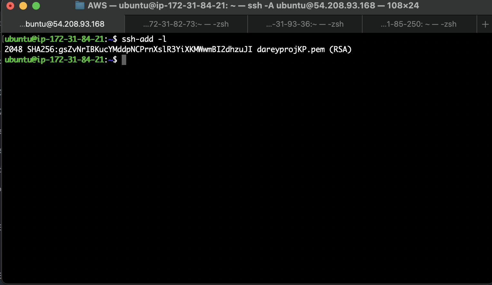


Save below inventory structure in the `inventory/dev` file to start configuring our development servers. Ensure to replace the IP addresses according to your own setup:

```
[nfs]
<NFS-Server-Private-IP-Address> ansible_ssh_user='ec2-user'

[webservers]
<Web-Server1-Private-IP-Address> ansible_ssh_user='ec2-user'
<Web-Server2-Private-IP-Address> ansible_ssh_user='ec2-user'

[db]
<Database-Private-IP-Address> ansible_ssh_user='ubuntu' 

[lb]
<Load-Balancer-Private-IP-Address> ansible_ssh_user='ubuntu'
```

## Step 4 - Create a Common Playbook

In `common.yml` playbook, we will write configuration for repeatable, re-usable and multi-machine tasks that is common to systems within the infrastructure. 

The below playbook is divided into two parts, each of them is intended to perform the same task: install wireshark utility (or make sure it is updated to the latest version) on the RHEL 8 and Ubuntu servers. It uses root user to perform this task and respective package manager: yum for RHEL 8 and apt for Ubuntu.


```
---
- name: update web, nfs and db servers
  hosts: webservers, nfs, db
  remote_user: ec2-user
  become: yes
  become_user: root
  tasks:
  - name: ensure wireshark is at the latest version
    yum:
      name: wireshark
      state: latest

- name: update LB server
  hosts: lb
  remote_user: ubuntu
  become: yes
  become_user: root
  tasks:
  - name: ensure wireshark is at the latest version
    apt:
      name: wireshark
      state: latest
```

## Step 5: Update GIT with the latest code

To Commit the code into GitHub execute the below command and make a pull request:

```
git status

git add <selected files>

git commit -m "commit message"

git push
```

Create a pull request and merge `branch` to `main`.


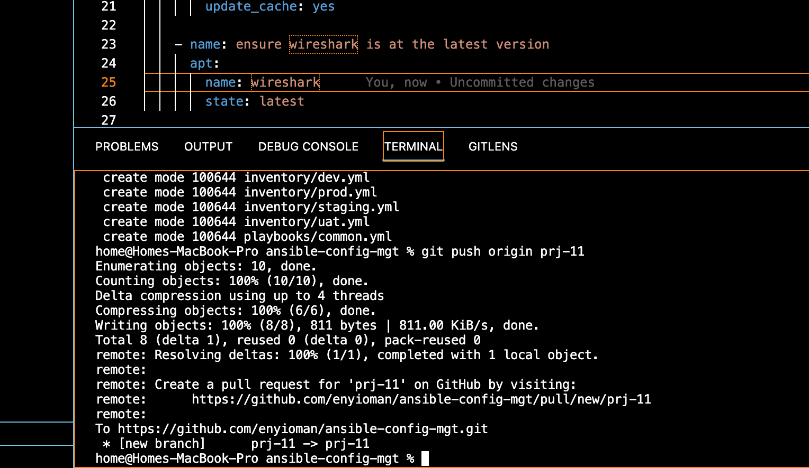


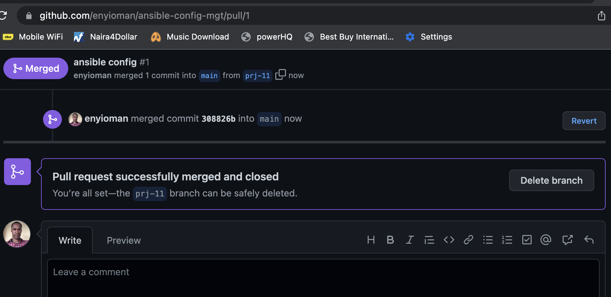


On the terminal, checkout from the `prj-11` into the `main`, and run `git pull`.

Verify that all artifacts are saved within the `Jenkins-Ansible` server:

```
/var/lib/jenkins/jobs/ansible/builds/<build_number>/archive/
```

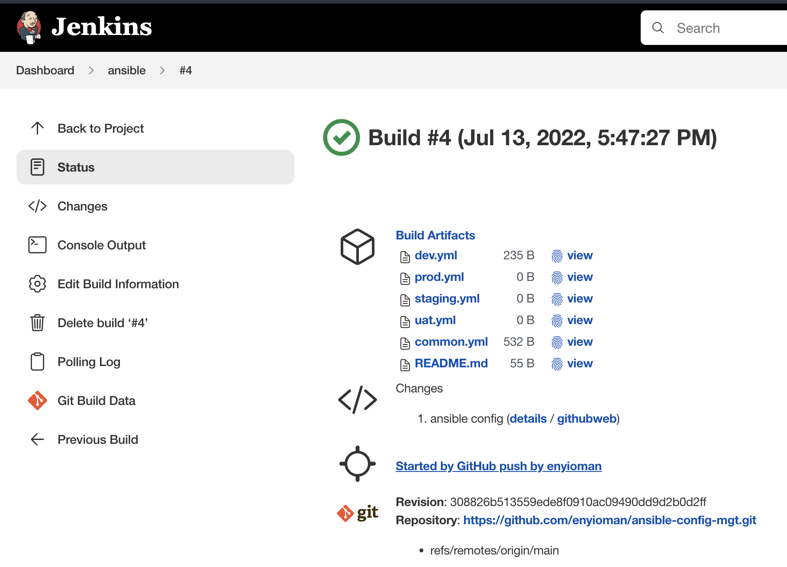


## Step 6 - Run first Ansible test

For ansible to access the other servers, we have to generate and share ansible private key with each server.

- On jenkins-ansible, edit sshd configuration `sudo vi /etc/ssh/sshd_config` to the following: 

```
Host jenkins_ansible
    Host name <Public ip>
    User ubuntu
    IdentityFile <path to pem>
    ForwardAgent yes
    ControlPath /tmp/ansible-ssh-%h-%p_%r
    ControlMaster auto
    ControlPersist 10m
```

Connect to the `Jenkins-Ansible` server through VSCode or your preferred code editor and run:

```
ansible-playbook -i /var/lib/jenkins/jobs/ansible/builds/<build-number>/archive/inventory/dev.yml /var/lib/jenkins/jobs/ansible/builds/<build-number>/archive/playbooks/common.yml
```

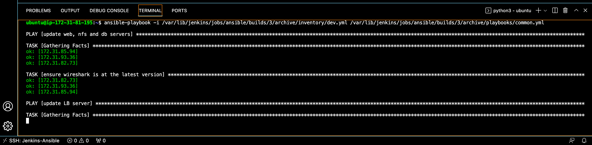

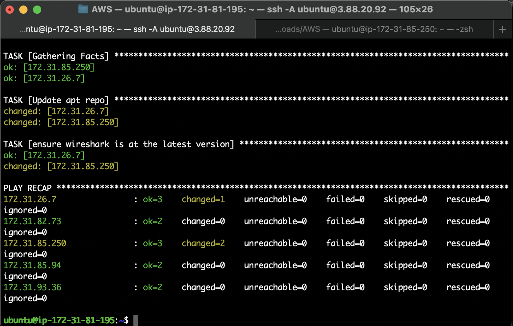

Confirm that wireshark was installed/updated:

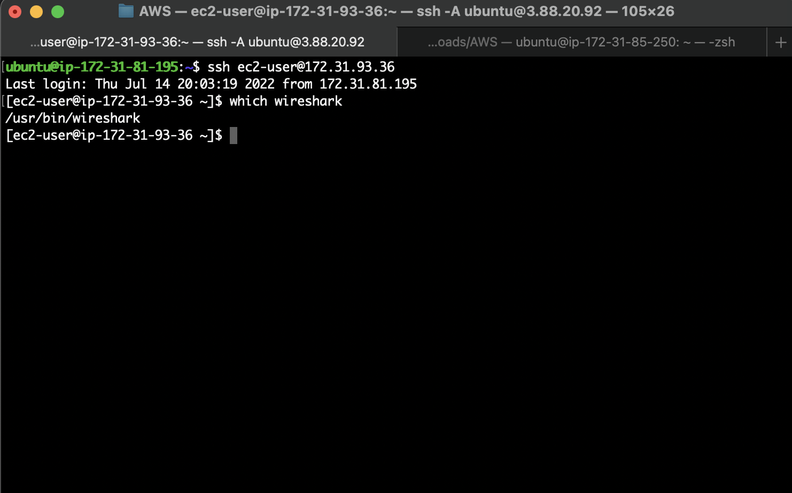

The architecture at the end of this project looks like the diagram below:


## Additional Task 

Ansible was updated with additional tasks to create a `sample` directory, `ansible.txt` file and change timezone in `playbook/common.yml`.

```
- name: create directory, file and set timezone on all servers
  hosts: webservers, nfs, db, lb
  become: yes
  tasks:
  
  - name: create a directory
    file:
      path: /home/sample
      state: directory
      
  - name: create a file 
    file: 
      path: /home/sample/ansible.txt
      state: touch
      
  - name: set timezone
    timezone:
      name: Africa/Lagos 
```

Repeat step 5 and run the ansible playbook command with the latest build number:

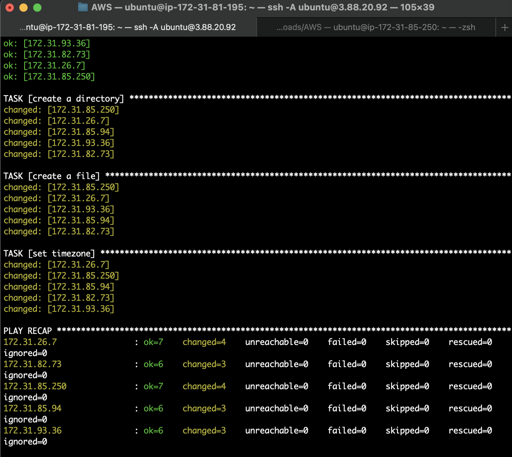


Next, SSH into any of the servers to confirm successful task execution.

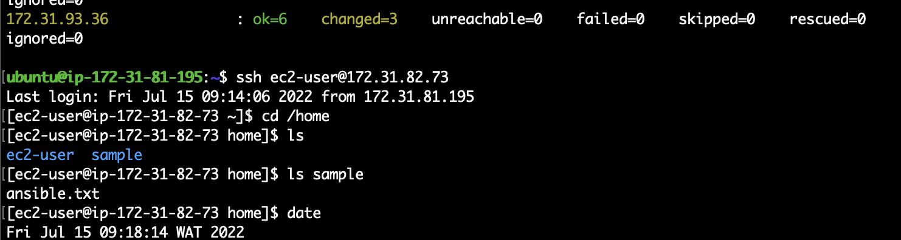
