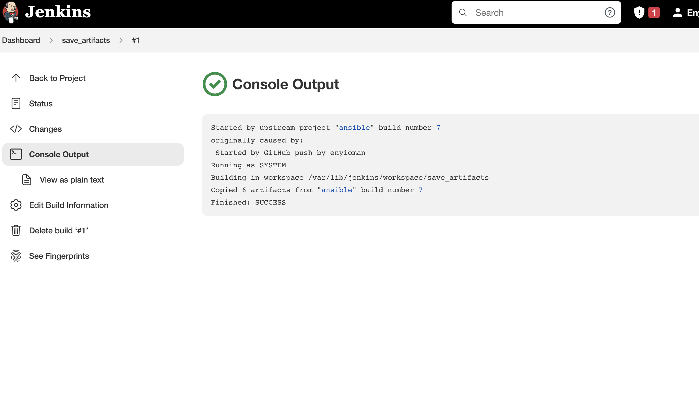
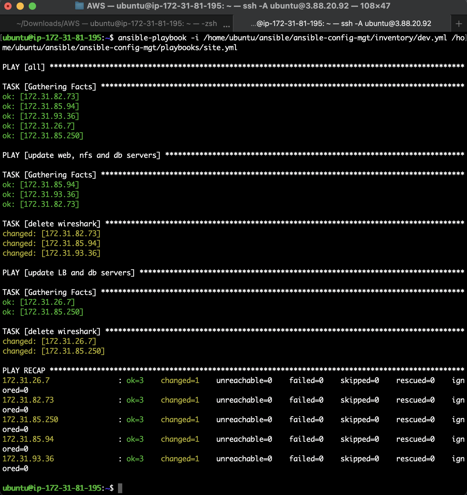

# Ansible Refactoring & Static Assignments (Imports and Roles)

## Code Refactoring

Refactoring is a general term in computer programming. It means making changes to the source code without changing expected behaviour of the software. The main idea of refactoring is to enhance code readability, increase maintainability and extensibility, reduce complexity, add proper comments without affecting the logic.

In this project, the primary objective is to improve the Ansible code by reorganizing things around a little bit but the overall state of the infrastructure remains the same.


## Step 1 - Jenkins job enhancement

With the configuration so far, every change made creates a separate directory on Jenkins, which can get tedious and also consume more space. In this step, a new Jenkins job will be created to enhance the configuration.

1. On the jenkins-ansible server, create a new directory called 'ansible-config-artifact'. This directory will store the artifacts from all subsequent builds:

```
sudo mkdir /home/ubuntu/ansible-config-artifact
```

Change permissions to this directory, so Jenkins could save files there:

```
chmod -R 0777 /home/ubuntu/ansible-config-artifact
```

2. On Jenkins web console -> `Manage Jenkins` -> `Manage Plugins` -> on Available tab search for `Copy Artifact` and install this plugin without restarting Jenkins.

3. Create a Freestyle project and name it `save_artifacts`. Configure the project to be triggered by completion of the existing ansible project.

The main idea of save_artifacts project is to save artifacts into `/home/ubuntu/ansible-config-artifact` directory. To achieve this, create a Build step and choose `Copy artifacts from other project`, specify ansible as a source project and `/home/ubuntu/ansible-config-artifact` as a target directory.


You can configure number of builds to keep in order to save space on the server, for example, you might want to keep only last 2 or 5 build results.

4. Test the set up by making some change in README.MD file inside the ansible-config-mgt repository (right inside main branch). If both Jenkins jobs have completed one after another - all the files will be inside /home/ubuntu/ansible-config-artifact directory and it will be updated with every commit to the main branch.




Now the Jenkins pipeline is neater.

## Step 2 - Refactor Ansible code by importing other playbooks into site.yml

Here, we're breaking tasks up into different files so as to organise sets of tasks and reuse them. Now, we'll try code re-use by importing other playbooks.

Checkout to a new branch called refactor:

```
git checkout -b refactor
```

1. Within `playbooks folder`, create a new file and name it `site.yml` which would be an entry point into the entire infrastructure configuration. Other playbooks will be included here as a reference. This means `site.yml` will become a parent to all other playbooks that will be developed.
2. Create a new folder in root of the repository and name it `static-assignments`. The `static-assignments` folder is where all other child playbooks will be stored. This is merely for easy organisation of our work.
3. Move `common.yml` file into the newly created static-assignments folder.


Our folder structure should look like this:

```
├── static-assignments
│   └── common.yml
├── inventory
    └── dev
    └── stage
    └── uat
    └── prod
└── playbooks
    └── site.yml
```


4. Inside `site.yml` file, import `common.yml` playbook with the following code:

```
---
- hosts: all
- import_playbook: ../static-assignments/common.yml
```

5. Run ansible-playbook command against the `dev` environment.

We would need to apply some tasks to our `dev` servers. Since wireshark is already installed, we can create another playbook under `static-assignments` and name it `common-del.yml`. In this playbook, we would configure deletion of wireshark utility:

```
---
- name: update web, nfs and db servers
  hosts: webservers, nfs, db
  remote_user: ec2-user
  become: yes
  become_user: root
  tasks:
  - name: delete wireshark
    yum:
      name: wireshark
      state: removed

- name: update LB server
  hosts: lb
  remote_user: ubuntu
  become: yes
  become_user: root
  tasks:
  - name: delete wireshark
    apt:
      name: wireshark-qt
      state: absent
      autoremove: yes
      purge: yes
      autoclean: yes
```

In `/etc/ansible/ansible.cfg` file uncomment `inventory string` and provide a full path to the `inventory directory = /home/ubuntu/ansible/ansible-config/inventory`, so Ansible could know where to find configured roles.


6. Update site.yml` with:

```
import_playbook: ../static-assignments/common-del.yml
```

instead of `common.yml` and run it against `dev` servers:

```
ansible-playbook -i /home/ubuntu/ansible/ansible-config-mgt/inventory/dev.yml /home/ubuntu/ansible/ansible-config-mgt/playbooks/site.yml
```




Confirmation of wireshark uninstallation:


## Step 3 - Configure UAT Webservers with a role ‘Webserver’

At this point, the dev environment is nice and clean. In order to keep it that way, configure 2 new Web Servers as uat. Tasks could be written to configure Web Servers in the same playbook, but it would be messy. Instead, it would be best to use a dedicated role to make the configuration reusable.

1. Launch 2 fresh EC2 instances using RHEL 8 image, which will serve as the `uat` servers, so name them accordingly - `Web1-UAT` and `Web2-UAT`.

2. To create a role, create a directory called `roles`, relative to the playbook directory.

Use an Ansible utility called `ansible-galaxy` inside `ansible-config-mgt/roles` directory (create roles directory upfront):

```
mkdir roles
cd roles
ansible-galaxy init webserver
```


The entire folder structure should look like below:


3. Update the inventory `ansible-config-mgt/inventory/uat.yml` file with IP addresses of the 2 UAT Web servers as follows:

```
<Web1-UAT-Server-Private-IP-Address> ansible_ssh_user='ec2-user' 
<Web2-UAT-Server-Private-IP-Address> ansible_ssh_user='ec2-user'
```


4. In `/etc/ansible/ansible.cfg` file uncomment `roles_path` string and provide a full path to our roles directory `roles_path = /home/ubuntu/ansible-config-mgt/roles`, so Ansible could know where to find configured roles.


It is time to start adding some logic to the webserver role. Go into `tasks` directory, and within the `main.yml` file, start writing configuration tasks to do the following:

1. Install and configure Apache (httpd service)
2. Clone Tooling website from GitHub https://github.com/enyioman/tooling.git.
3. Ensure the tooling website code is deployed to /var/www/html on each of 2 UAT Web servers.
4. Make sure httpd service is started.

```
--
# tasks file for weberver

- name: install apache
  become: true
  ansible.builtin.yum:
    name: "httpd"
    state: present

- name: install git
  become: true
  ansible.builtin.yum:
    name: "git"
    state: present

- name: clone a repo
  become: true
  ansible.builtin.git:
    repo: https://github.com/realayo/tooling.git
    dest: /var/www/html
    force: yes

- name: copy html content to one level up
  become: true
  command: cp -r /var/www/html/html/ /var/www/

- name: Start service httpd, if not started
  become: true
  ansible.builtin.service:
    name: httpd
    state: started

- name: recursively remove /var/www/html/html/ directory
  become: true
  ansible.builtin.file:
    path: /var/www/html/html
    state: absent
```

## Step 4 - Reference ‘Webserver’ role

1. Within the `static-assignments` folder, create a new assignment for `uat-webservers` in `uat-webservers.yml`. This is where you will reference the role:

```
---
- hosts: uat-webservers
  roles:
     - webserver
```

2. Since the entry point to our ansible configuration is site.yml file. We need to call our uat-webservers.yml role inside site.yml:

```
---
- hosts: all
- import_playbook: ../static-assignments/common.yml

- hosts: uat-webservers
- import_playbook: ../static-assignments/uat-webservers.yml
```

## Step 5 - Commit & Test

1. Commit your changes to the `refactor branch` and push to GitHub, create a pull request and merge with the main branch. The artifacts should be automatically copied to the `ansible-config-artifact` directory.

2. Test connection.


3. Run the playbook against `uat` inventory:

```
ansible-playbook -i /home/ubuntu/ansible/ansible-config-mgt/inventory/uat.yml /home/ubuntu/ansible/ansible-config-mgt/playbooks/site.yml
```


4. UAT Web servers are now configured and can be reached from any browser.


The architecture at the end of this project looks like this:


