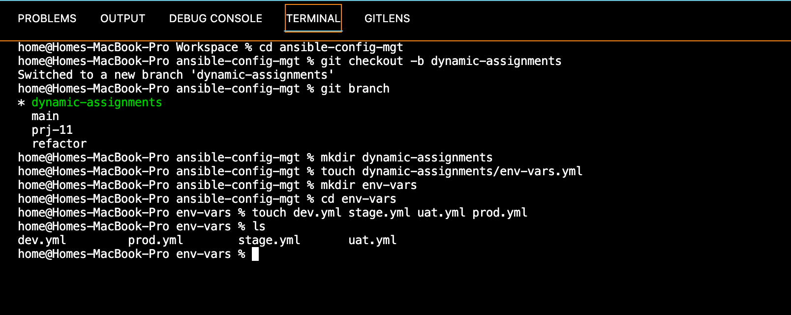
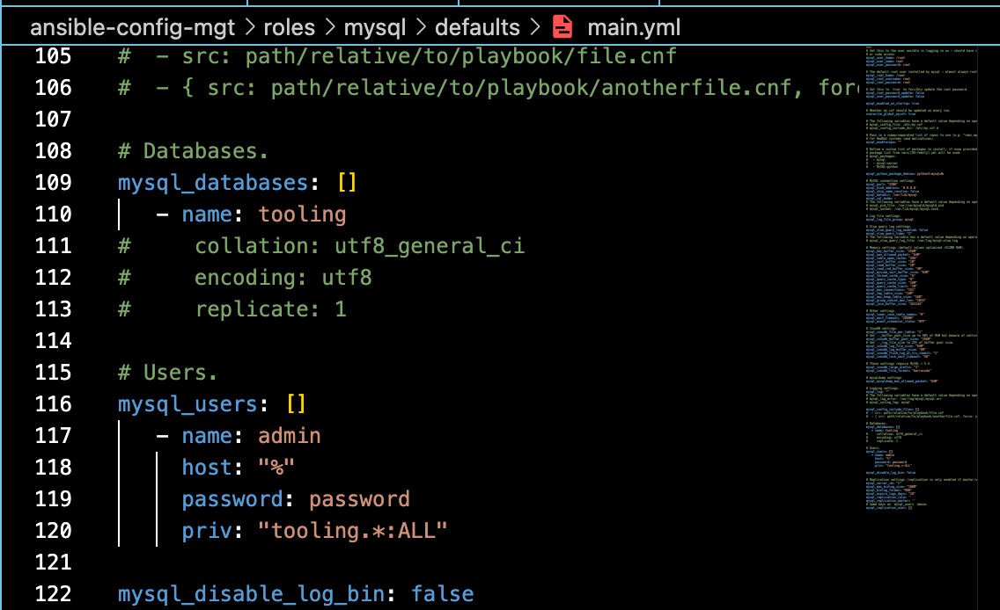
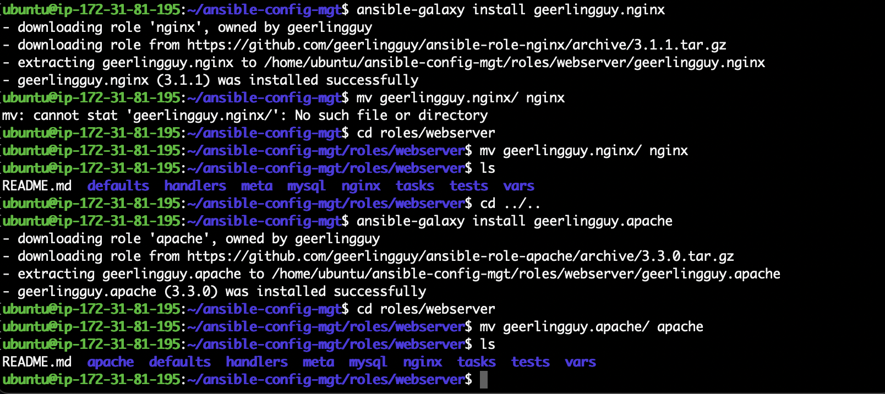
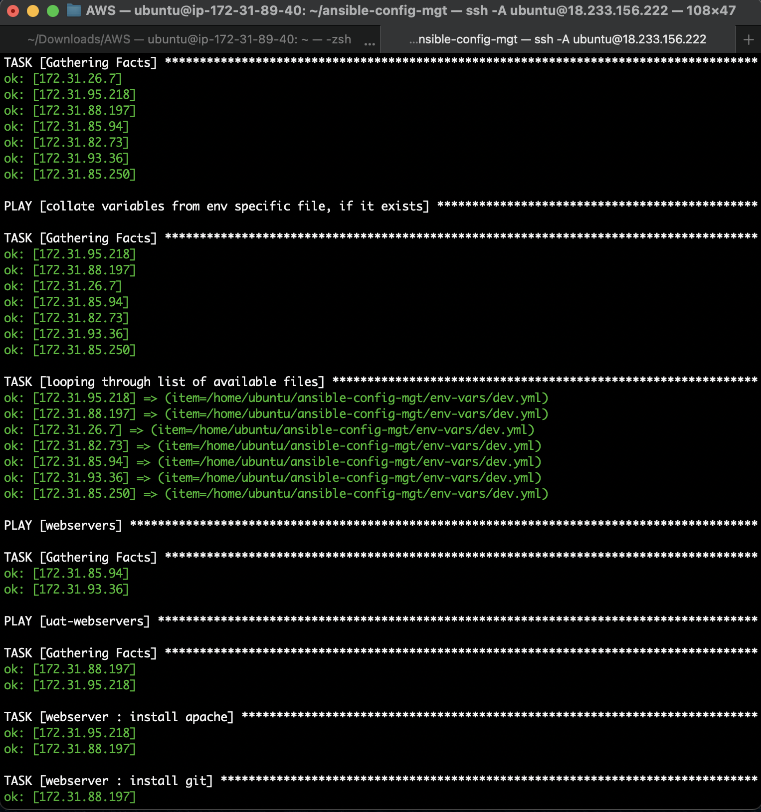
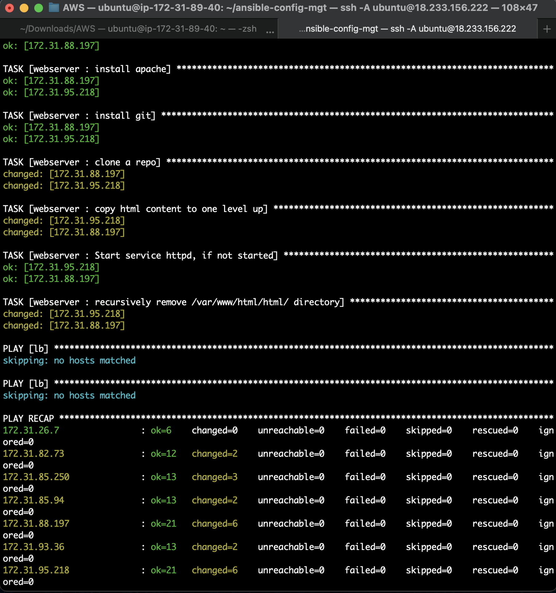

# Ansible Dynamic Assignments (Include) and Community Roles

This project will introduce dynamic assignments by using the include module. The static assignments from Project 12 use the import Ansible module. The module that enables dynamic assignments is include.


```
import = Static
include = Dynamic
```

When the import module is used, all statements are pre-processed at the time playbooks are parsed. When site.yml playbook is executed, Ansible will process all the playbooks referenced during the time it is parsing the statements. This also means that, during actual execution, if any statement changes, such statements will not be considered. Hence, it is static.

On the other hand, when include module is used, all statements are processed only during execution of the playbook. After the statements are parsed, any changes to the statements encountered during execution will be used.

Note: For most projects, static assignments are preferred as they are more reliable. Dynamic assignments can be challenging in the debugging process. However, they can be useful for environment specific variables as in this project.

## Introducing Dynamic Assignment Into Our structure

1. In our https://github.com//ansible-config-mgt GitHub repository create a new branch called `dynamic-assignments`.

2. Create a new folder, name it `dynamic-assignments`. Then inside this folder, create a new file and name it `env-vars.yml`.

> Since we will be using the same Ansible to configure multiple environments, and each of these environments will have certain unique attributes, such as servername, ip-address etc., we will need a way to set values to variables per specific environment. We will create a folder to keep each environment’s variables file.

3. Create a new folder called `env-vars`, then for each environment, create new YAML files which we will use to set variables.

4. Our repository folder structure should look something like this:

```
├── dynamic-assignments
│   └── env-vars.yml
├── env-vars
    └── dev.yml
    └── stage.yml
    └── uat.yml
    └── prod.yml
├── inventory
    └── dev
    └── stage
    └── uat
    └── prod
├── playbooks
    └── site.yml
└── static-assignments
    └── common.yml
    └── webservers.yml
```

In env-vars.yml file, paste the following code:

```
---
- name: collate variables from env specific file, if it exists
  hosts: all
  tasks:
    - name: looping through list of available files
      include_vars: "{{ item }}"
      with_first_found:
        - files:
            - dev.yml
            - stage.yml
            - prod.yml
            - uat.yml
          paths:
            - "{{ playbook_dir }}/../env-vars"
      tags:
        - always
```



Three things to note from the above code:

The `include_vars` syntax has been used instead of `include`. This is because Ansible developers decided to separate different features of the module. From Ansible version 2.8, the `include` module is deprecated and variants of `include_*` must be used. These are:

`include_role` `include_tasks` `include_vars`

In the same version, variants of import were also introduced, such as:

`import_role import_tasks`

Special variables `{{ playbook_dir }}` and `{{ inventory_file }}` are used in the above code. `{{ playbook_dir }}` will help Ansible to determine the location of the running playbook, and from there navigate to other path on the filesystem. `{{ inventory_file }}` on the other hand will dynamically resolve to the name of the inventory file being used, then append `.yml`, so that it picks up the required file within the `env-vars` folder.

The variables are included using a loop. `with_first_found` implies that, looping through the list of files, the first one found is used. This is good practice so that the default values can be set in case an environment specific env file does not exist.


## Update site.yml with dynamic assignments

In this step, we'll update site.yml file to make use of the dynamic assignment:

```
---
- hosts: all
- name: this contains dynamic variables
  import_playbook: ../dynamic-assignments/env-vars.yml
 
- name: include env files
  import_playbook: ../static-assignments/common.yml
  tags:
    - always

- hosts: webservers
- name: Webserver assignment
  import_playbook: ../static-assignments/webservers.yml

- hosts: uat-webservers
- import_playbook: ../static-assignments/uat-webservers.yml

- hosts: db
- name: import database file
  import_playbook: ../static-assignments/db.yml
  tags:
    - always

- hosts: lb
- name: Loadbalancers assignment
  import_playbook: ../static-assignments/loadbalancers.yml
  when: load_balancer_is_required 
```


## Community Roles

It is time to create a role for MySQL database - it should install the MySQL package, create a database and configure users. There are tons of roles that have already been developed by other open source engineers. These roles are actually production ready, and dynamic to accomodate most of Linux flavours. With Ansible Galaxy again, we can simply download a ready to use ansible role.

## Download Mysql Ansible Role

To preserve your GitHub in actual state after you install a new role – make a commit and push to master your ‘ansible-config-mgt’ directory. Of course you must have git installed and configured on Jenkins-Ansible server and, for more convenient work with codes, you can configure Visual Studio Code to work with this directory.

1. On `Jenkins-Ansible` server make sure that git is installed with `git --version`, in `ansible-config-mgt` directory and run:

```
git init
git pull https://github.com/<your-name>/ansible-config-mgt.git
git remote add origin https://github.com/<your-name>/ansible-config-mgt.git
git branch roles-feature
git switch roles-feature
```

We will be using a MySQL role developed by geerlingguy.

2. Inside `roles` directory on the server, create your new MySQL role:

```
ansible-galaxy install geerlingguy.mysql
```

3. Rename the folder to mysql:

```
mv geerlingguy.mysql/ mysql
```

4. Edit roles configuration to use correct credentials for MySQL required for the tooling website.





5. Push changes to github:


```
git add .
git commit -m "Commit new role files into GitHub"
git push --set-upstream origin roles-feature
```

## Load Balancer Roles

We want to be able to choose which Load Balancer to use, Nginx or Apache, so we need to have two roles respectively - `nginx` and `apache`.

To install nginx role:

```
ansible-galaxy install nginxinc.nginx

mv nginxinc.nginx nginx
```

To install apache role:

```
ansible-galaxy install geerlingguy.apache

mv geerlingguy.apache/ apache
```



Since you cannot use both Nginx and Apache load balancer, you need to add a condition to enable either one – this is where you can make use of variables.

Under `static-assignment` folder, create `loadbalancers.yml` file and copy the script below:

```
- hosts: lb
  roles:
    - { role: nginx, when: enable_nginx_lb and load_balancer_is_required }
    - { role: apache, when: enable_apache_lb and load_balancer_is_required }
```

Updated the `site.yml` file with the below script:

```
 - name: Loadbalancers assignment
       hosts: lb
         - import_playbook: ../static-assignments/lb.yml
        when: load_balancer_is_required 
```

In env-vars/uat.yml, enter the following:

```
enable_nginx_lb: true
load_balancer_is_required: true
```

In nginx/defaults/main.yml add:

```
enable_nginx_lb: false

load_balancer_is_required: false
```

And in apache/defaults/main.yml append:

```
enable_apache_lb: false

load_balancer_is_required: false
```

Update `inventory/prod.yml` and `inventory/uat.yml` with the necessary server details and run the playbook.

```
ansible-playbook -i /home/ubuntu/ansible-config-mgt/inventory/prod.yml /home/ubuntu/ansible-config-mgt/playbooks/site.yml
```




