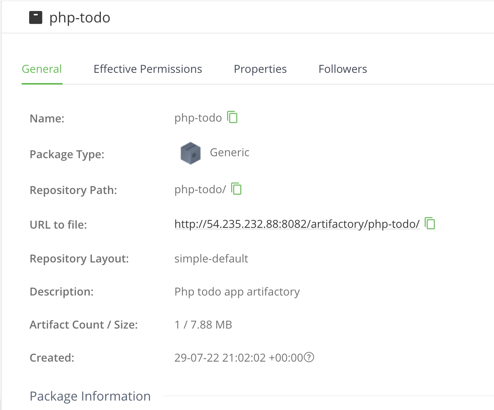

# Continuous Integration with Jenkins | Ansible | Artifactory | SonarQube | PHP 

## Step 1: Simulating a typical CI/CD Pipeline for a PHP Based application


As part of the ongoing infrastructure development with Ansible started from Project 11, we will create a pipeline that simulates continuous integration and delivery. Target end to end CI/CD pipeline is represented by the diagram below. It is important to note that both Tooling and TODO Web Applications are based on an interpreted (scripting) language (PHP). It means that it can be deployed directly onto a server and will work without compiling the code to a machine language.


This project will require a lot of servers to simulate all the different environments from dev/ci all the way to production.

Only create servers based on the current environment that is being worked on at the moment.

The initial focus in this project will be on these three environments:

- CI
- Dev
- Pentest

### Step 1.1: Set Up

Ansible inventory should look like this:

```
├── ci
├── dev
├── pentest
├── preprod
├── prod
├── sit
└── uat
```

**ci inventory**

```
[jenkins]
<Jenkins-Private-IP-Address>

[nginx]
<Nginx-Private-IP-Address>

[sonarqube]
<SonarQube-Private-IP-Address>

[artifact_repository]
<Artifact_repository-Private-IP-Address>
```

**dev**

```
[tooling]
<Tooling-Web-Server-Private-IP-Address>

[todo]
<Todo-Web-Server-Private-IP-Address>

[nginx]
<Nginx-Private-IP-Address>

[db:vars]
ansible_user=ec2-user
ansible_python_interpreter=/usr/bin/python

[db]
<DB-Server-Private-IP-Address>
```

**pentest**

```
[pentest:children]
pentest-todo
pentest-tooling

[pentest-todo]
<Pentest-for-Todo-Private-IP-Address>

[pentest-tooling]
<Pentest-for-Tooling-Private-IP-Address>
```

### Step 1.2: Add two more roles to your Ansible playbook

- Sonarqube: Sonarqube is an open-source platform developed by SonarSource for continuous inspection of code quality to perform automatic reviews with static analysis of code to detect bugs, code smells, and security vulnerabilities (source: https://en.wikipedia.org/wiki/SonarQube)

- Artifactory: JFrog Artifactory is a universal DevOps solution providing end-to-end automation and management of binaries and artifacts through the application delivery process that improves productivity across your development ecosystem. (source: https://www.jfrog.com/confluence/display/JFROG/JFrog+Artifactory)


### Step 1.3: Configure Ansible for Jenkins development

In previous projects, we have been launching Ansible commands manually from a CLI. Now, with Jenkins, we will start running Ansible from Jenkins UI.

- Navigate to Jenkins UI and install Blue Ocean plugin

- Click Open Blue Ocean from the left pane

- Once you're in the Blue Ocean UI, click Create Pipeline

- Select GitHub

- On the Connect to GitHub step, click 'Create an access token here' to create your access token

- Type in the token name of your choice, leave everything as in and click Generate token

- Copy the generated token and paste in the field provided in Blue Ocean and click connect

- Select your organization (typically your GitHub name)

- Select the repo to create the pipeline from (ansible-config-mgt)

- Blue Ocean would take you to where to create a pipeline, since we are not doing this now, click Administration from the top bar to exit Blue Ocean.

### Create Jenkinsfile

- Inside the Ansible project, create a `deploy` folder

- In the deploy folder, create a file named `Jenkinsfile`

- Add the following snippet into the newly created file named `Jenkinsfile`.

```
pipeline {
  agent any
    stages {
      stage('Build') {
        steps {
          script {
            sh 'echo "Building Stage"'
          }
        }
      }
    }   
}
```

The above pipeline job has only one stage (Build) and the stage contains only one step which runs a shell script to echo "Building stage".

- Go back to Ansible project in Jenkins and click Configure

- Scroll down to Build Configuration and for script path, enter the path to the Jenkinsfile (deploy/Jenkinsfile in our case)

- Go back to the pipeline and click Build Now

- Open Blue Ocean again to see the build in action.


- Since our pipeline is multibranch, we could build all the branches in the repo independently. To see this in action,

- Create a new git branch and name it features/jenkinspipeline-stages.


- Add a new build stage `Test`.

```
pipeline {
  agent any
    stages {
      stage('Build') {
        steps {
          script {
            sh 'echo "Building Stage"'
          }
        }
      }

        stage('Test') {
          steps {
            script {
              sh 'echo "Testing Stage"'
              }
          }
        }
    }
}
```

- To make the new branch show in Jenkins UI, click `Administration` to exit Blue Ocean, click the project and click `Scan Repository Now` from the left pane.

- Refresh the page and you should see the new branch.

- Open Blue Ocean and you should see the new branch.


- For every job created in Jenkins, it creates a workspace for each job, thus if Jenkins perform a lot of job lots of workspace will be created which will affect storage. To avoid this type of issue, its a good practice to ensure that at the beginning of the Jenkinsfile you clean the workspace and at the end also.

Update Jenkinsfile with the below code:

```
pipeline {
    agent any

  stages {
    stage("Initial cleanup") {
          steps {
            dir("${WORKSPACE}") {
              deleteDir()
            }
          }
        }
    stage('Build') {
      steps {
        script {
          sh 'echo "Building Stage"'
        }
      }
    }

    stage('Test') {
      steps {
        script {
          sh 'echo "Testing Stage"'
        }
      }
    }

    stage('Package'){
      steps {
        script {
          sh 'echo "Packaging App" '
        }
      }
    }

    stage('Deploy'){
      steps {
        script {
          sh 'echo "Deploying to Dev"'
        }
      }

    }
    
    stage("clean Up"){
       steps {
        cleanWs()
     }
    }
     
    }
}
```

- Verify in Blue Ocean that all the stages are working, then merge the feature branch to the main branch.

- Eventually, the main branch should have a successful pipeline like this in Blue Ocean.

The final pipeline should look like this:


### Step 1.4: Running Ansible Playbook from Jenkins

- Install Ansible on your Jenkins server:

```
sudo apt install ansible -y
```

### Install Ansible plugin in Jenkins UI

- Go to `Manage Jenkins`

- Click `Manage Plugins`

- Click `Available` tab and in the search bar, enter `Ansible` and click the check box next to the plugin

- Scroll down and click `Install without restart`

- Once ansible plugin has been installed, go to `Manage Jenkins`

- Click on `Global Configuration Tools`

- Scroll down to Ansible and click on it, in the Name box, type ansible and in the Path to ansible Executables directory box, type the path to ansible (you can check this using command which ansible on the Linux terminal), in our case, it's /usr/bin


- Create `Jenkinsfile` from scratch (delete all the current stages in the file)

- Add a new stage to clone the GitHub repository.

```
stage('SCM Checkout') {
  steps {
            git(branch: 'main', url: 'https://github.com/TheCountt/config-ansible-mgt.git')
    }
}
```

- In the deploy folder, create a file name ansible.cfg file and copy the content below inside the file. By default when we install ansible, we have the default configuration file in /etc/ansible/ansible.cfg, now we are creating our own config file.

```
[defaults]
timeout = 160
callback_whitelist = profile_tasks
log_path=~/ansible.log
host_key_checking = False
gathering = smart
ansible_python_interpreter=/usr/bin/python3
allow_world_readable_tmpfiles=true

[ssh_connection]
ssh_args = -o ControlMaster=auto -o ControlPersist=30m -o ControlPath=/tmp/ansible-ssh-%h-%p-%r -o ServerAliveInterval=60 -o ServerAliveCountMax=60 -o ForwardAgent=yes
```


Add the next stage, to run the playbook. For this, we need to click on Pipeline Syntax at bottom left of Jenkins UI and input appropriate value and generate a pipeline script. You can watch this [video](https://www.youtube.com/watch?v=PRpEbFZi7nI&ab_channel=JavaHomeCloud) as a guide.


```
stage('Execute Ansible') {
    steps {
        ansiblePlaybook colorized: true, credentialsId: 'privateKEY', disableHostKeyChecking: true, installation: 'ansible', inventory: 'inventory/${inventory_file}', playbook: 'playbooks/site.yml'}
    }
  }
}
```

- This build stage requires a credentails file - private key - which can be created by following these steps:

- Click `Manage Jenkins` and scroll down a bit to `Manage Credentials`.
- Under `Stores` go to `Jenkins` on the right, click on `Jenkins`.
- Under `System`, click the `Global credentials (unrestricted)`.
- Click `Add Credentials` on the left.
- For credentials kind, choose `SSH username with private key`.
- Enter the ID as private-key Enter the username Jenkins would use (ubuntu/ec2-user).
- Enter the secret key (the contents of your privatekey.pem file from AWS or any cloud provider).
- Click `OK` to save.


We will add a stage that cleans the workspace after every build.

```
stage('Clean up') {
  steps {
    cleanWs(cleanWhenAborted: true, cleanWhenFailure: true, cleanWhenNotBuilt: true, cleanWhenUnstable: true, deleteDirs: true)
  }
}
```

- Commit and push changes.


### Parameterizing Jenkinsfile for Ansible Development

To deploy to other environments, we have to use parameters.

Update Jenkinsfile to add parameters:

```
pipeline{
 agent any
 environment {
    ANSIBLE_CONFIG="${WORKSPACE}/deploy/ansible.cfg"
  }
   parameters {
    string(name: 'inventory_file', defaultValue: '${inventory_file}', description: 'selecting the environment')
   }
}
```

Overall, the Jenkinsfile in the deploy folder(deploy/Jenkinsfile) should like this:

```
pipeline{
 agent any
 environment {
    ANSIBLE_CONFIG="${WORKSPACE}/deploy/ansible.cfg"
  }
   parameters {
    string(name: 'inventory_file', defaultValue: '${inventory_file}', description: 'selecting the environment')
        }
 stages{
    stage("Initial cleanup") {
        steps {
          dir("${WORKSPACE}") {
            deleteDir()
          }
        }
      }
    stage('SCM Checkout') {
       steps{
          git branch: 'main', url: 'https://github.com/TheCountt/config-mgt-ansible.git'
       }
     }
    stage('Prepare Ansible For Execution') {
      steps {
        sh 'echo ${WORKSPACE}'
      }
   }
    stage('Execute Ansible Playbook') {
      steps {
          ansiblePlaybook colorized: true, credentialsId: 'privateKEY', disableHostKeyChecking: true, installation: 'ansible', inventory: 'inventory/${inventory_file}', playbook: 'playbooks/site.yml', skippedTags: 'skipped', tags: 'run'
      }
    }
    stage('Clean Workspace after build'){
      steps{
        cleanWs(cleanWhenAborted: true, cleanWhenFailure: true, cleanWhenNotBuilt: true, cleanWhenUnstable: true, deleteDirs: true)
      }
    }
 }
}
```


## Step 2: CI/CD Pipeline for a TODO Application

### Step 2.1: Configure Artifactory

1. Create an Ansible role to install Artifactory(You may install manually first on artifactory server: https://www.howtoforge.com/tutorial/ubuntu-jfrog/).

2. Run the role against the Artifactory server.

### Step 2.2: Prepare Jenkins

1. Fork the php-todo repository (https://github.com/darey-devops/php-todo.git) into Jenkins Server.

2. On you Jenkins server, install PHP, its dependencies(Feel free to do this manually at first, then update your Ansible accordingly later).

```
 sudo apt install -y zip libapache2-mod-php phploc php-{xml,bcmath,bz2,intl,gd,mbstring,mysql,zip}

 sudo apt install composer

 sudo php /tmp/composer-setup.php sudo mv composer.phar /usr/bin/composer

 sudo mv composer.phar /usr/bin/composer
```

3. Configure the php.ini file, you can get the path to the file by running:

```
php --ini | grep xdebug
```

4. Once you get the path to the file, open with a text editor and paste in:

```
xdebug.mode = coverage
```

5. Install nodejs and npm:

```
sudo apt-get update -y
sudo apt-get install nodejs -y
sudo apt install npm -y
```

6. Install typescript using node package manager(npm):

```
npm install -g typescript
```

7. Restart php7.4-fpm

```
sudo systemmctl restart php7.4-fpm
```

### Install the following plugins on Jenkins UI

- Plot plugin: to display tests reports and code coverage information.

- Artifactory plugin: to easily deploy artifacts to Artifactory server.

1. Go to the artifactory URL(http://artifactory-server-ip:8082) and create a local generic repository named php-todo(Default username and password is admin. After logging in, change the password).

2. Configure Artifactory in Jenkins UI.

3. Click Manage Jenkins, click Configure System.

4. Scroll down to JFrog, click Add Artifactory Server.

5. Enter the Server ID.

6. Enter the URL as:

```
http://<artifactory-server-ip>:8082/artifactory
```

7. Enter the Default Deployer Credentials(the username and the changed password of artifactory).


### Step 2.3: Integrate Artifactory repository with Jenkins

1. On Jenkins server, install `mysql-client`.
2. Create a dummy `Jenkinsfile` in `php-todo` repo.
3. In Blue Ocean, create multibranch php-todo pipeline(follow the previous steps earlier).
4. Spin up an instance for a database, install and configure mysql-server( This is where data pertaining to the artifactory repository will be stored).

5. Create a database and user on the database server.

```
CREATE DATABASE homestead;
CREATE USER 'homestead'@'%' IDENTIFIED BY 'sePret^i';
GRANT ALL PRIVILEGES ON * . * TO 'homestead'@'%';
FLUSH PRIVILEGES;
```
Update the DB parameters in roles -> mysql -> defaults -> main.yml. Ensure the Ip address used in the database is the ip for Jenkins server.


6. Check if the database created on the database server can be reached from the Jenkins server. On the jenkins server, run command:

```
mysql -u <DB_user> -h <DB-private-ip-address> -p
```

7. Update the `.env.sample` file with your db connectivity details.


8. Update Jenkinsfile with proper configuration:

```
pipeline {
  agent any

  stages {

   stage("Initial cleanup") {
        steps {
          dir("${WORKSPACE}") {
            deleteDir()
          }
        }
      }

  stage('Checkout SCM') {
    steps {
          git branch: 'main', url: 'https://github.com/darey-devops/php-todo.git'
    }
  }

  stage('Prepare Dependencies') {
    steps {
           sh 'mv .env.sample .env'
           sh 'composer install'
           sh 'php artisan migrate'
           sh 'php artisan db:seed'
           sh 'php artisan key:generate'
        }
      }
    }
  }
```


9. Update Jenkinsfile to include unit tests.

```
stage('Execute Unit Tests') {
    steps {
           sh './vendor/bin/phpunit'
    }
}
```


### Step 2.4: Code Quality Analysis

Most commonly used tool for php code quality analysis is phploc.

- Install phploc on the Ansible-Jenkins server:

```
sudo apt-get install -y phploc
```

- Update the jenkins file with the below. The output of the data will be saved in build/logs/phploc.csv file:

```
stage('Code Analysis') {
    steps {
        sh 'phploc app/ --log-csv build/logs/phploc.csv'
    }
}
```


Plot the data using plot Jenkins plugin

This plugin provides generic plotting (or graphing) capabilities in Jenkins. It will plot one or more single values variations across builds in one or more plots. Plots for a particular job (or project) are configured in the job configuration screen, where each field has additional help information. Each plot can have one or more lines (called data series). After each build completes the plots’ data series latest values are pulled from the CSV file generated by phploc.


```
stage('Plot Code Coverage Report') {
  stage('Plot Code Coverage Report') {
      steps {

            plot csvFileName: 'plot-396c4a6b-b573-41e5-85d8-73613b2ffffb.csv', csvSeries: [[displayTableFlag: false, exclusionValues: 'Lines of Code (LOC),Comment Lines of Code (CLOC),Non-Comment Lines of Code (NCLOC),Logical Lines of Code (LLOC)                          ', file: 'build/logs/phploc.csv', inclusionFlag: 'INCLUDE_BY_STRING', url: '']], group: 'phploc', numBuilds: '100', style: 'line', title: 'A - Lines of code', yaxis: 'Lines of Code'
            plot csvFileName: 'plot-396c4a6b-b573-41e5-85d8-73613b2ffffb.csv', csvSeries: [[displayTableFlag: false, exclusionValues: 'Directories,Files,Namespaces', file: 'build/logs/phploc.csv', inclusionFlag: 'INCLUDE_BY_STRING', url: '']], group: 'phploc', numBuilds: '100', style: 'line', title: 'B - Structures Containers', yaxis: 'Count'
            plot csvFileName: 'plot-396c4a6b-b573-41e5-85d8-73613b2ffffb.csv', csvSeries: [[displayTableFlag: false, exclusionValues: 'Average Class Length (LLOC),Average Method Length (LLOC),Average Function Length (LLOC)', file: 'build/logs/phploc.csv', inclusionFlag: 'INCLUDE_BY_STRING', url: '']], group: 'phploc', numBuilds: '100', style: 'line', title: 'C - Average Length', yaxis: 'Average Lines of Code'
            plot csvFileName: 'plot-396c4a6b-b573-41e5-85d8-73613b2ffffb.csv', csvSeries: [[displayTableFlag: false, exclusionValues: 'Cyclomatic Complexity / Lines of Code,Cyclomatic Complexity / Number of Methods ', file: 'build/logs/phploc.csv', inclusionFlag: 'INCLUDE_BY_STRING', url: '']], group: 'phploc', numBuilds: '100', style: 'line', title: 'D - Relative Cyclomatic Complexity', yaxis: 'Cyclomatic Complexity by Structure'      
            plot csvFileName: 'plot-396c4a6b-b573-41e5-85d8-73613b2ffffb.csv', csvSeries: [[displayTableFlag: false, exclusionValues: 'Classes,Abstract Classes,Concrete Classes', file: 'build/logs/phploc.csv', inclusionFlag: 'INCLUDE_BY_STRING', url: '']], group: 'phploc', numBuilds: '100', style: 'line', title: 'E - Types of Classes', yaxis: 'Count'
            plot csvFileName: 'plot-396c4a6b-b573-41e5-85d8-73613b2ffffb.csv', csvSeries: [[displayTableFlag: false, exclusionValues: 'Methods,Non-Static Methods,Static Methods,Public Methods,Non-Public Methods', file: 'build/logs/phploc.csv', inclusionFlag: 'INCLUDE_BY_STRING', url: '']], group: 'phploc', numBuilds: '100', style: 'line', title: 'F - Types of Methods', yaxis: 'Count'
            plot csvFileName: 'plot-396c4a6b-b573-41e5-85d8-73613b2ffffb.csv', csvSeries: [[displayTableFlag: false, exclusionValues: 'Constants,Global Constants,Class Constants', file: 'build/logs/phploc.csv', inclusionFlag: 'INCLUDE_BY_STRING', url: '']], group: 'phploc', numBuilds: '100', style: 'line', title: 'G - Types of Constants', yaxis: 'Count'
            plot csvFileName: 'plot-396c4a6b-b573-41e5-85d8-73613b2ffffb.csv', csvSeries: [[displayTableFlag: false, exclusionValues: 'Test Classes,Test Methods', file: 'build/logs/phploc.csv', inclusionFlag: 'INCLUDE_BY_STRING', url: '']], group: 'phploc', numBuilds: '100', style: 'line', title: 'I - Testing', yaxis: 'Count'
            plot csvFileName: 'plot-396c4a6b-b573-41e5-85d8-73613b2ffffb.csv', csvSeries: [[displayTableFlag: false, exclusionValues: 'Logical Lines of Code (LLOC),Classes Length (LLOC),Functions Length (LLOC),LLOC outside functions or classes ', file: 'build/logs/phploc.csv', inclusionFlag: 'INCLUDE_BY_STRING', url: '']], group: 'phploc', numBuilds: '100', style: 'line', title: 'AB - Code Structure by Logical Lines of Code', yaxis: 'Logical Lines of Code'
            plot csvFileName: 'plot-396c4a6b-b573-41e5-85d8-73613b2ffffb.csv', csvSeries: [[displayTableFlag: false, exclusionValues: 'Functions,Named Functions,Anonymous Functions', file: 'build/logs/phploc.csv', inclusionFlag: 'INCLUDE_BY_STRING', url: '']], group: 'phploc', numBuilds: '100', style: 'line', title: 'H - Types of Functions', yaxis: 'Count'
            plot csvFileName: 'plot-396c4a6b-b573-41e5-85d8-73613b2ffffb.csv', csvSeries: [[displayTableFlag: false, exclusionValues: 'Interfaces,Traits,Classes,Methods,Functions,Constants', file: 'build/logs/phploc.csv', inclusionFlag: 'INCLUDE_BY_STRING', url: '']], group: 'phploc', numBuilds: '100', style: 'line', title: 'BB - Structure Objects', yaxis: 'Count'
    }
}
```


Click on the Plots button on the left pane. If everything was configured properly, you should see something like this:


Package the artifacts

```
stage ('Package Artifact') {
  steps {
          sh 'zip -qr ${WORKSPACE}/php-todo.zip ${WORKSPACE}/*'
    }
}
```


Publish packaged artifact into Artifactory

```
stage ('Deploy Artifact') {
  steps {
          script { 
               def server = Artifactory.server 'artifactory-server'
               def uploadSpec = """{
                  "files": [{
                     "pattern": "php-todo.zip",
                     "target": "php-todo"
                  }]
               }"""

               server.upload(uploadSpec) 
             }
  }
}
```





TO BE CONTINUED...

