# AWS Cloud Solution For 2 Company Websites Using Reverse Proxy Technology


## STEP 1: Setting Up a Sub-account And Creating A Hosted Zone

- Properly configure the AWS account and Organization Unit. Use this [video](https://www.youtube.com/watch?v=9PQYCc_20-Q&ab_channel=CloudAcademy) to implement the setup.
- Create an AWS Master account. (Also known as Root Account).
- Within the Root account, create a sub-account and name it DevOps. (A different email address is required to complete this).
- Within the Root account, create an AWS Organization Unit (OU). Name it Dev. (The Dev resources will be launched in there).

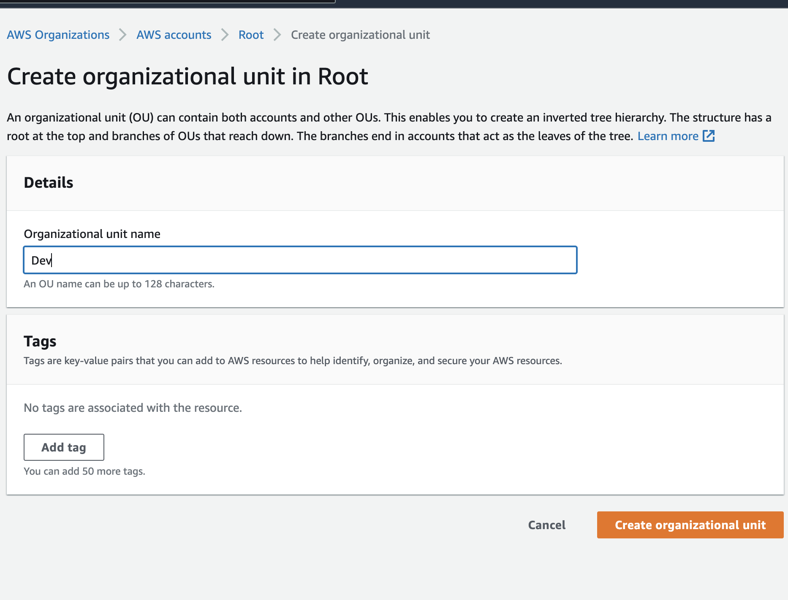

- Move the DevOps account into the Dev OU.

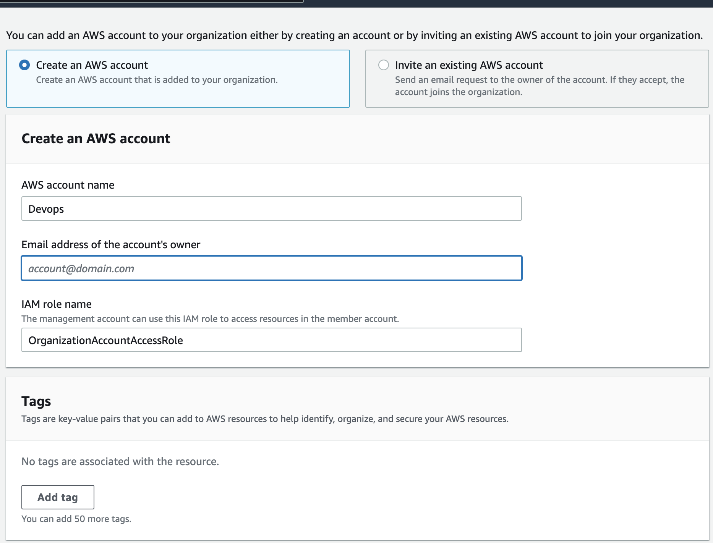

- Login to the newly created AWS account

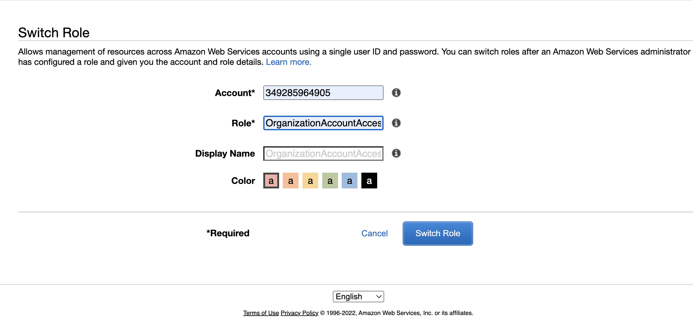

- Creating a hosted zone in the Route 53 console and mapping it to the domain name acquired from freenom.

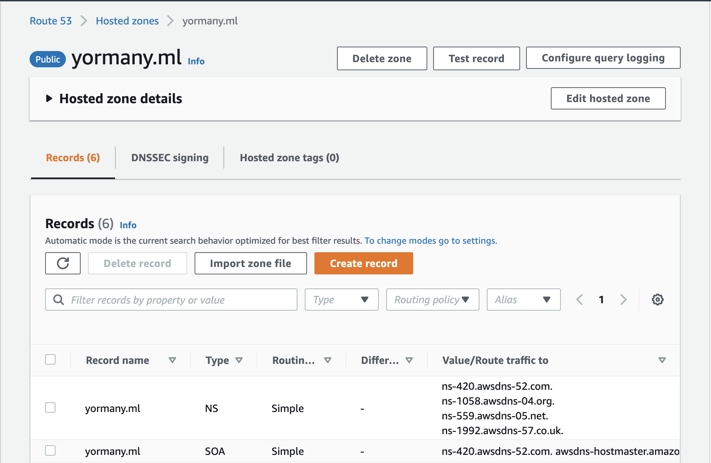

### TLS Certificates From Amazon Certificate Manager (ACM)

TLS certificates are required to handle secured connectivity to the Application Load Balancers (ALB).

- Navigate to AWS ACM
- Request a public wildcard certificate for the domain name previously registered
- Use DNS to validate the domain name
- Tag the resource

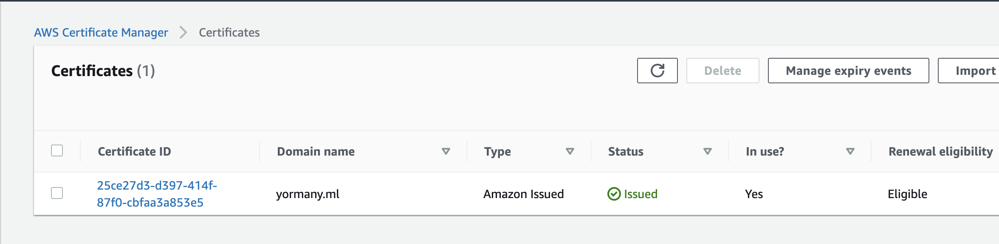


## STEP 2: Setting Up a Virtual Private Network (VPC)

1. Create a VPC and also enbale DNS Hostname resolution for the VPC.

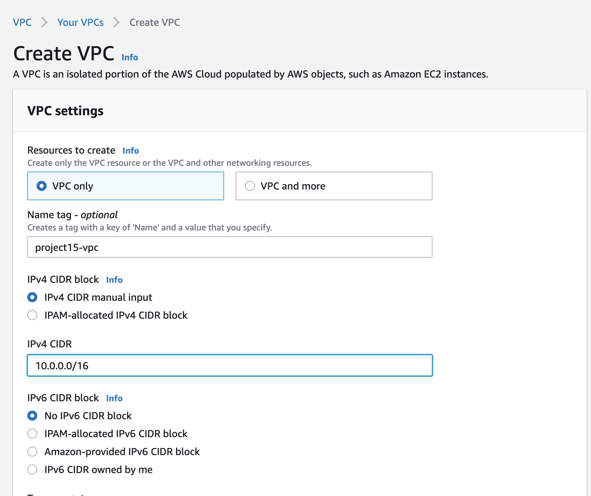

2. Create subnets as shown in the architecture.

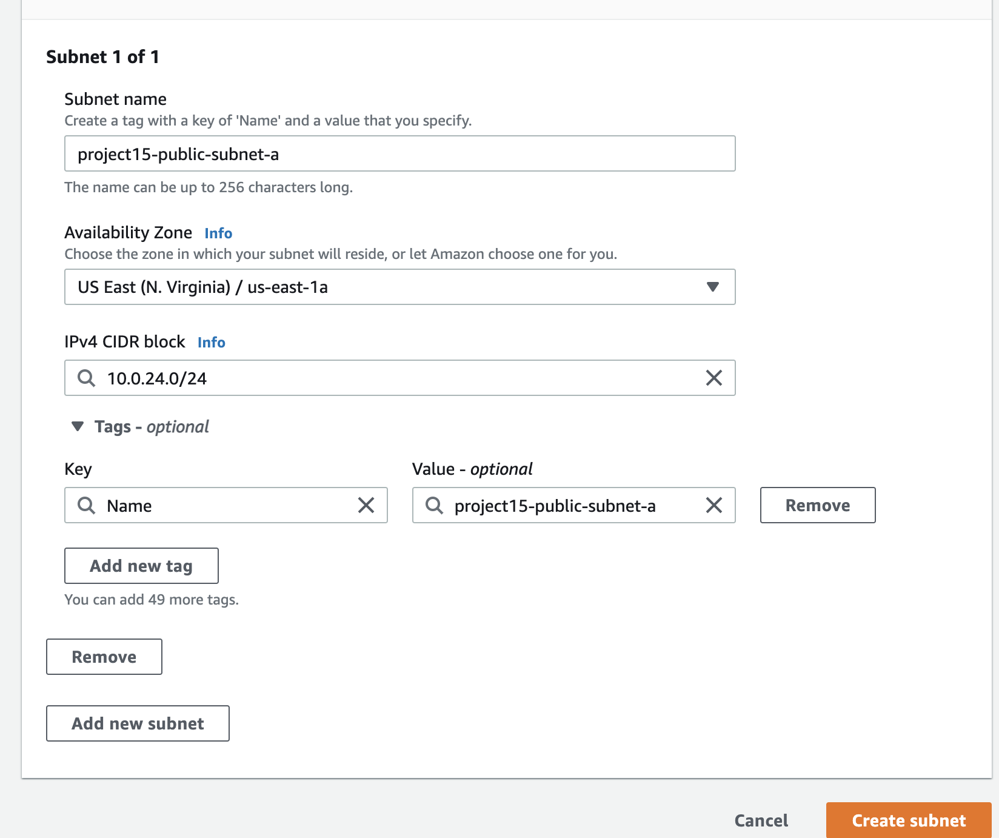

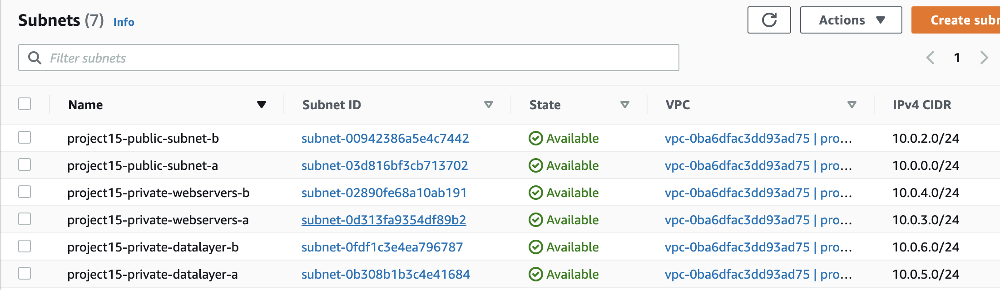

3. Create 2 route tables and associate each with public and private subnets accordingly. 


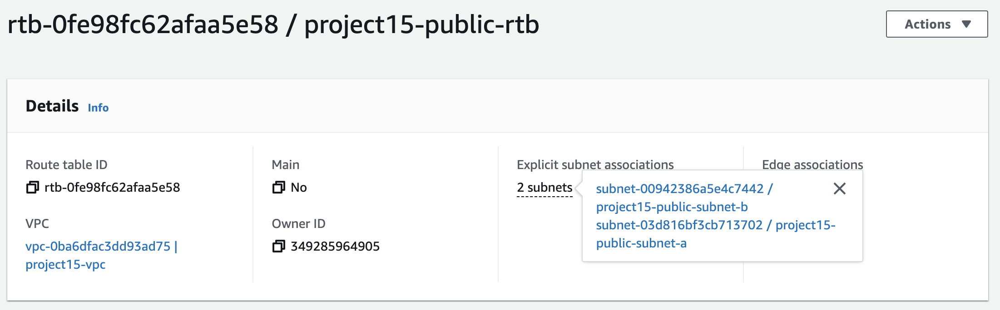

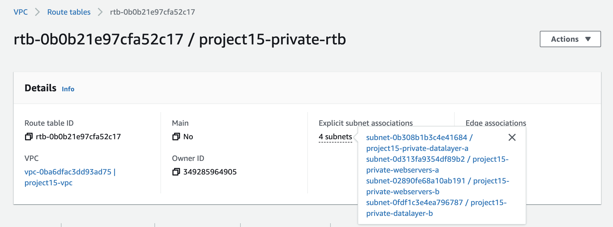


4. Create an Internet Gateway and attach it to the VPC.

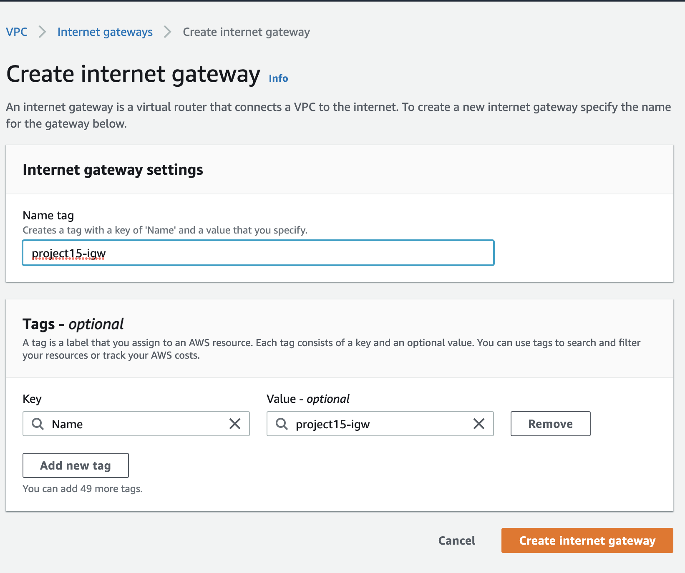

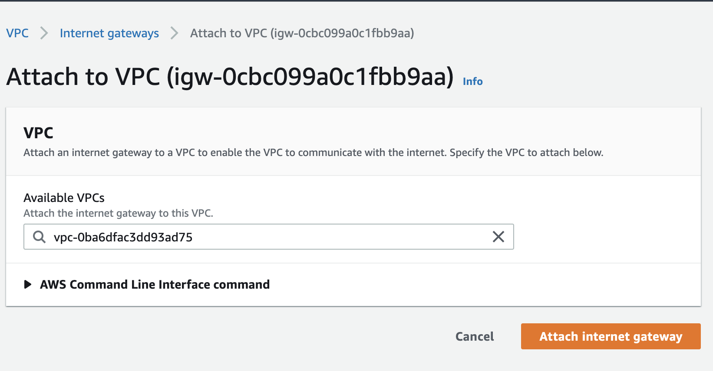

5. Edit a route in public route table, and associate it with the Internet Gateway. (This is what allows a public subnet to be accessible from the Internet). Specify 0.0.0.0/0 in the Destination box, and select the internet gateway ID in the Target list.

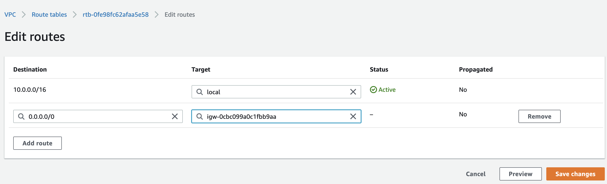


6. Create 3 Elastic IPs.

7. Create a Nat Gateway and assign one of the Elastic IPs (The other 2 will be used by Bastion hosts). Add a new route on the private route table to configure destination as 0.0.0.0/0 and target as NAT Gateway.

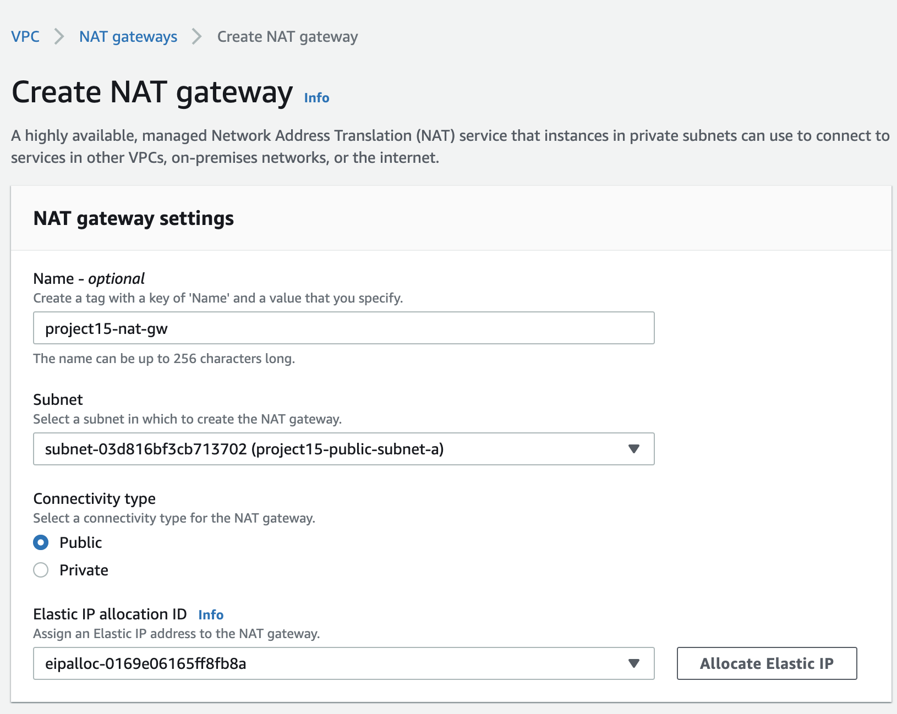

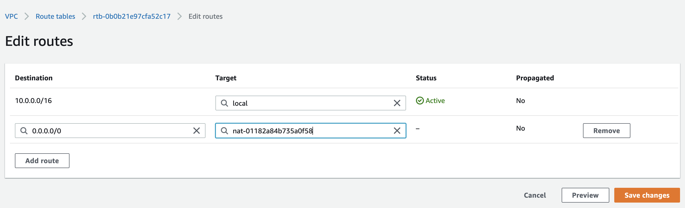

8. Create a Security Group for:

- Nginx Servers: Access to Nginx should only be allowed from a External Application Load balancer (ALB). At this point, a load balancer has not been created, therefore the rules will be updatedlater. For now, just create it and put some dummy records as a place holder.

- Bastion Servers: Access to the Bastion servers should be allowed only from workstations that need to SSH into the bastion servers. Hence, use the workstation public IP address. To get this information, simply go to terminal and type curl www.canhazip.com.

- External Application Load Balancer: The External ALB will be available from the Internet and also will allow SSH from the bastion host.

- Internal Application Load Balancer: This ALB will only allow HTTP and HTTPS traffic from the Nginx Reverse Proxy Servers.

- Webservers: The security group should allow SSH from bastion host, HTTP and HTTPS from the internal ALB only.

- Data Layer: Access to the Data layer, which is comprised of Amazon Relational Database Service (RDS) and Amazon Elastic File System (EFS) must be carefully designed - webservers need to mount the file system and connect to the RDS database, bastion host needs to have SQL access to the RDS to use the MYSQL client.


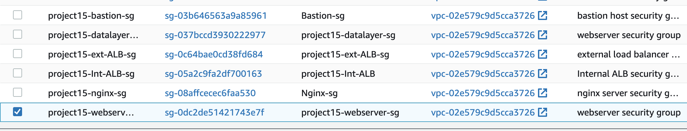

## STEP 3: Create EFS

1. Create an EFS filesystem.
2. Create an EFS mount target per AZ in the VPC, associate it with both subnets dedicated for data layer. Mount the EFS in both AZ in the same private subnets as the webservers (private-subnet-01 and private-subnet-02).
3. Associate the Security groups created earlier for data layer.
4. Create two separate EFS access points- one for wordpress and one for tooling. (Give it a name and leave all other settings as default). Set the POSIX user and Group ID to root(0) and permissions to 0755.


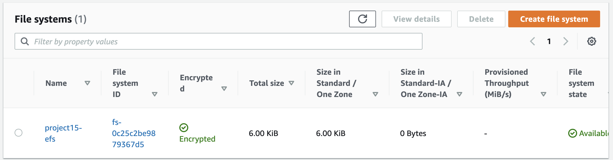

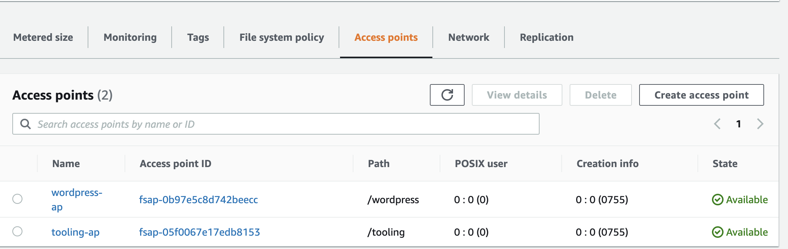


## STEP 4: Create RDS

Create a KMS key from Key Management Service (KMS) to be used to encrypt the database instance.

- On KMS Console, choose Symmetric and Click Next. Assign an Alias.

- Select user with admin privileges as the key administrator.

- Click Create Key.


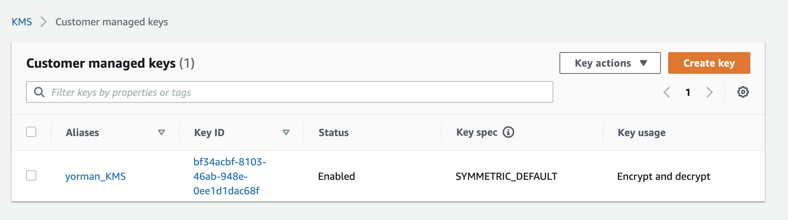


## STEP 5:  Create DB Subnet Group

On the RDS Management Console, create a DB subnet group with the two datalayer private subnets in the two Availability Zones.

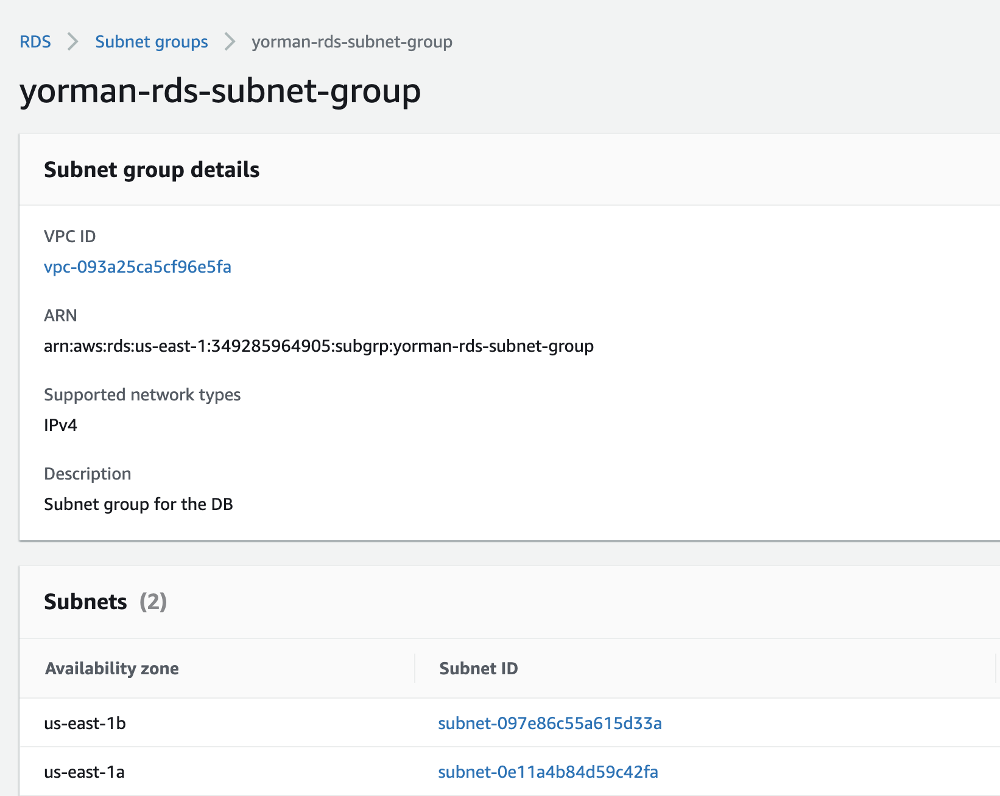


### Create RDS

- Click on Create Database
- Select MySQL
- Choose Free Tier from the Templates
- Enter a name for the DB
- Create Master username and passsword
- Select the VPC, select the subnet group that was created earlier and the database security group
- Scroll down to Additional configuration
- Enter initial database name
- Scroll down and click Create database

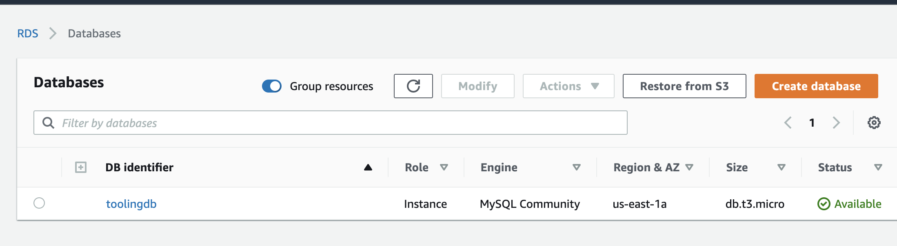


## STEP 6: Create Compute Resources

Configure compute resources inside the VPC. The recources related to compute are:

- EC2 Instances
- Launch Templates
- Target Groups
- Autoscaling Groups
- TLS Certificates
- Application Load Balancers (ALB)

Configure the Public Subnets as follows so the instances can be assigned a public IPv4 address:

- In the left navigation pane, choose Subnets.
- Select the public subnet for the VPC. By default, the name created by the VPC wizard is Public subnet.
- Choose Actions, Modify auto-assign IP settings.
Select the Enable auto-assign public IPv4 address check box, and then choose Save.
- Launch templates.

First create three EC2 instance for Nginx server, Bastion server and Webserver.
- Launch 3 EC2 instances (Red Hat Free Tier).


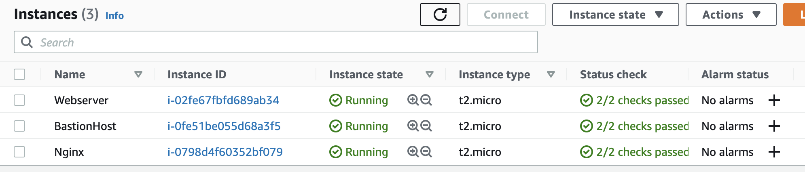

### Install the following packages:


```
yum install -y https://dl.fedoraproject.org/pub/epel/epel-release-latest-8.noarch.rpm 
yum install -y dnf-utils http://rpms.remirepo.net/enterprise/remi-release-8.rpm 
yum install wget vim python3 telnet htop git mysql net-tools chrony -y 
systemctl start chronyd
systemctl enable chronyd
```

- Disable senten so that our servers can function properly on all the redhat instance (Nginx & Webserver only):

```
setsebool -P httpd_can_network_connect=1
setsebool -P httpd_can_network_connect_db=1
setsebool -P httpd_execmem=1
setsebool -P httpd_use_nfs 1
```

- Install Amazon efs utils for mounting targets on the elastic file system (Nginx & webserver only):

```
git clone https://github.com/aws/efs-utils
cd efs-utils
yum install -y make
yum install -y rpm-build
make rpm 
yum install -y  ./build/amazon-efs-utils*rpm
```

- Install self-signed certificate on Nginx. The reason we are installing this is because the load balancer will be sending traffic to the webserver via port 443 and also listen on port 443 thus for the connection to be secured we need a self signed certificate on the nginx instance.

```
sudo mkdir /etc/ssl/private
sudo chmod 700 /etc/ssl/private
openssl req -x509 -nodes -days 365 -newkey rsa:2048 -keyout /etc/ssl/private/ACS.key -out /etc/ssl/certs/ACS.crt
sudo openssl dhparam -out /etc/ssl/certs/dhparam.pem 2048
```

- Confirm that the ACS.crt and ACS.key files exist.


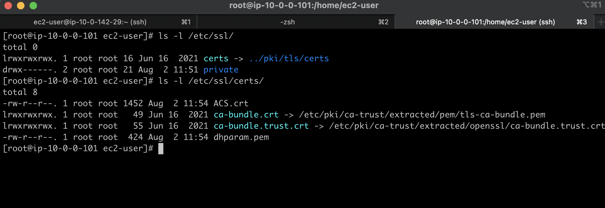


- Install self signed certificate for the Webserver:

```
yum install -y mod_ssl
openssl req -newkey rsa:2048 -nodes -keyout /etc/pki/tls/private/ACS.key -x509 -days 365 -out /etc/pki/tls/certs/ACS.crt
vi /etc/httpd/conf.d/ssl.conf
```

Edit the ssl.conf to conform with the key and crt file we created.


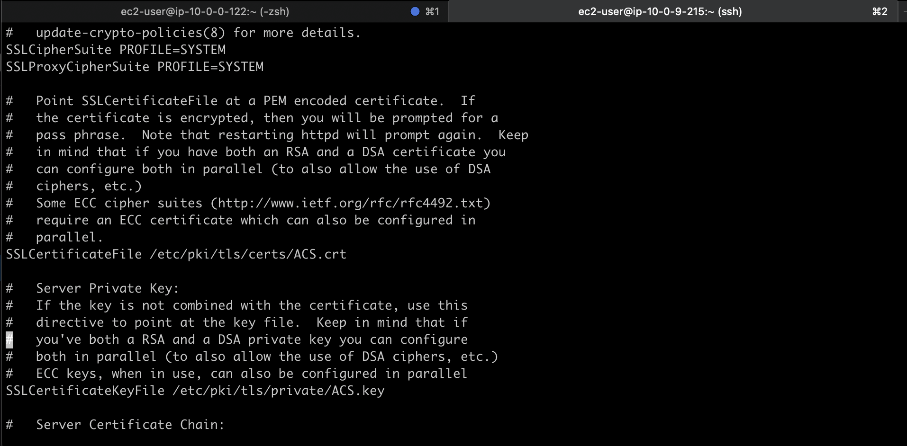


### Create AMIs from the Nginx, Bastion and Webserver Instances

Create an AMI from all instances.

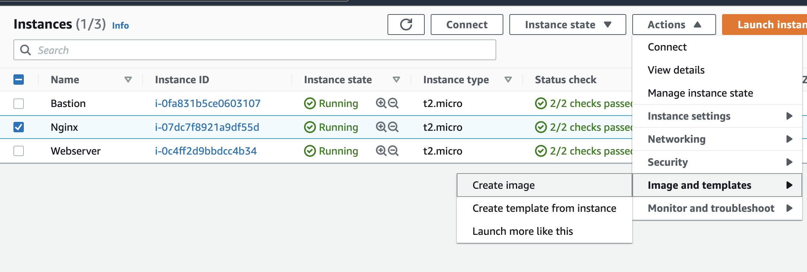

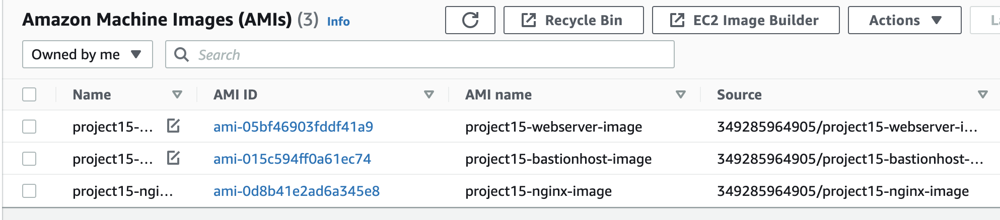

## STEP 7: Create Launch Templates

For bastion host launch template: 

- Set up a launch template with the Bastion AMI.
- Ensure the Instances are launched into the public subnet.
- Enter the userdata to update yum package repository and install ansible and mysql.

```
#!/bin/bash 
yum install -y mysql 
yum install -y git tmux 
yum install -y ansible
```

For Nginx Server Launch Template:

- Set up a launch template with the Nginx AMI.
- Ensure the instances are launched into the public subnet.
- Assign appropriate security group.
- Enter the following userdata:

```
#!/bin/bash
yum install -y nginx
systemctl start nginx
systemctl enable nginx
git clone https://github.com/enyioman/ACS-project-config.git
mv ACS-project-config/reverse.conf /etc/nginx/
mv /etc/nginx/nginx.conf /etc/nginx/nginx.conf-distro
cd /etc/nginx/
touch nginx.conf
sed -n 'w nginx.conf' reverse.conf
systemctl restart nginx
rm -rf reverse.conf
rm -rf ACS-project-config
```

The reverse.conf file was modified to use the custom server name and internal load balancer DNS name. Since the Nginx servers will be acting as reverse proxy and directing traffic to the internal load balancer, this configuration is necessary.

```
user nginx;
worker_processes auto;
error_log /var/log/nginx/error.log;
pid /run/nginx.pid;

# Load dynamic modules. See /usr/share/doc/nginx/README.dynamic.
include /usr/share/nginx/modules/*.conf;

events {
    worker_connections 1024;
}

http {
    log_format  main  '$remote_addr - $remote_user [$time_local] "$request" '
                      '$status $body_bytes_sent "$http_referer" '
                      '"$http_user_agent" "$http_x_forwarded_for"';

    access_log  /var/log/nginx/access.log  main;

    sendfile            on;
    tcp_nopush          on;
    tcp_nodelay         on;
    keepalive_timeout   65;
    types_hash_max_size 2048;

    
    default_type        application/octet-stream;

    # Load modular configuration files from the /etc/nginx/conf.d directory.
    # See http://nginx.org/en/docs/ngx_core_module.html#include
    # for more information.
    include /etc/nginx/conf.d/*.conf;

     server {
        listen       80;
        listen       443 http2 ssl;
        listen       [::]:443 http2 ssl;
        root          /var/www/html;
        server_name  *.yormany.ml;
        
        
        ssl_certificate /etc/ssl/certs/ACS.crt;
        ssl_certificate_key /etc/ssl/private/ACS.key;
        ssl_dhparam /etc/ssl/certs/dhparam.pem;

      

        location /healthstatus {
        access_log off;
        return 200;
       }
    
         
        location / {
            proxy_set_header             Host $host;
            proxy_pass                   https://internal-project15-private-alb-458093750.us-east-1.elb.amazonaws.com;
           }
    }
}
```

For Tooling Server Launch Template: 

- Set up a launch template with the Webserver AMI.
- Ensure the Instances are launched into the private subnet.
- Assign appropriate security group.
- Enter the following userdata. Ensure you modify the EFS mount point.

```
#!/bin/bash
mkdir /var/www/
sudo mount -t efs -o tls,accesspoint=fsap-056fe1371c5d5f2c0 fs-0c25c2be9879367d5:/ /var/www/
yum install -y httpd 
systemctl start httpd
systemctl enable httpd
yum module reset php -y
yum module enable php:remi-7.4 -y
yum install -y php php-common php-mbstring php-opcache php-intl php-xml php-gd php-curl php-mysqlnd php-fpm php-json
systemctl start php-fpm
systemctl enable php-fpm
git clone https://github.com/enyioman/tooling.git
mkdir /var/www/html
cp -R tooling/html/*  /var/www/html/
cd tooling
mysql -h toolingdb.c9tkkvrdsgea.us-east-1.rds.amazonaws.com -u admin -p toolingdb < tooling-db.sql
cd /var/www/html/
touch healthstatus
sed -i "s/$db = mysqli_connect('mysql.tooling.svc.cluster.local', 'admin', 'password', 'toolingdb');/$db = mysqli_connect('toolingdb.c9tkkvrdsgea.us-east-1.rds.amazonaws.com', 'admin', 'password', 'toolingdb');/g" functions.php
chcon -t httpd_sys_rw_content_t /var/www/html/ -R
systemctl restart httpd
```

For Wordpress Server Launch Template

- Set up a launch template with the Webserver AMI.
- Ensure the Instances are launched into the private subnet.
- Assign appropriate security group.
- Use the following userdata. Ensure you modify the RDS endpoint and EFS mount point.

```
#!/bin/bash
mkdir /var/www/
sudo mount -t efs -o tls,accesspoint=fsap-087ead6ff2a98bc10 fs-0c25c2be9879367d5:/ /var/www/
yum install -y httpd 
systemctl start httpd
systemctl enable httpd
yum module reset php -y
yum module enable php:remi-7.4 -y
yum install -y php php-common php-mbstring php-opcache php-intl php-xml php-gd php-curl php-mysqlnd php-fpm php-json
systemctl start php-fpm
systemctl enable php-fpm
wget http://wordpress.org/latest.tar.gz
tar xzvf latest.tar.gz
rm -rf latest.tar.gz
cp wordpress/wp-config-sample.php wordpress/wp-config.php
mkdir /var/www/html/
cp -R /wordpress/* /var/www/html/
cd /var/www/html/
touch healthstatus
sed -i "s/localhost/toolingdb.c9tkkvrdsgea.us-east-1.rds.amazonaws.com/g" wp-config.php 
sed -i "s/admin/g" wp-config.php 
sed -i "s/password/g" wp-config.php 
sed -i "s/tooling/g" wp-config.php 
chcon -t httpd_sys_rw_content_t /var/www/html/ -R
systemctl restart httpd
```

## STEP 8: Configure Target Groups

Create three Target Group for Nginx server, WordPress server and Tooling server respectively with the same settings:

- Select Instances as the target type.
- Ensure the protocol HTTPS on secure TLS port 443.
- Ensure that the health check path is `/healthstatus`.


## STEP 9: Configure Load Balancer

For External Load Balancer

- Select internet facing option.
- Ensure that it listens on HTTPS protocol (TCP port 443).
- Ensure the ALB is created within the appropriate VPC, AZ and the right subnets.
- Choose the certificate already created from ACM.
- Select Security Group for the external load balancer.
- Select Nginx Instances as the target group.

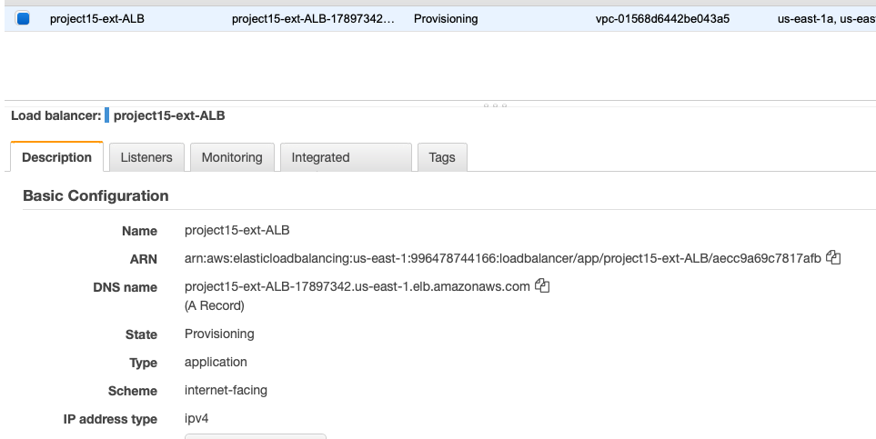

Create four A records that points to the external load balancer as follows:

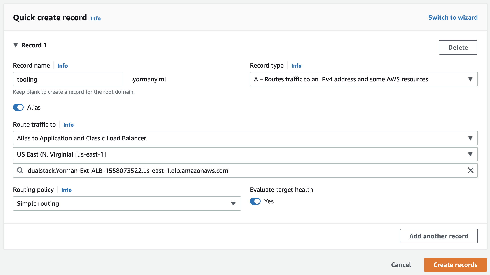


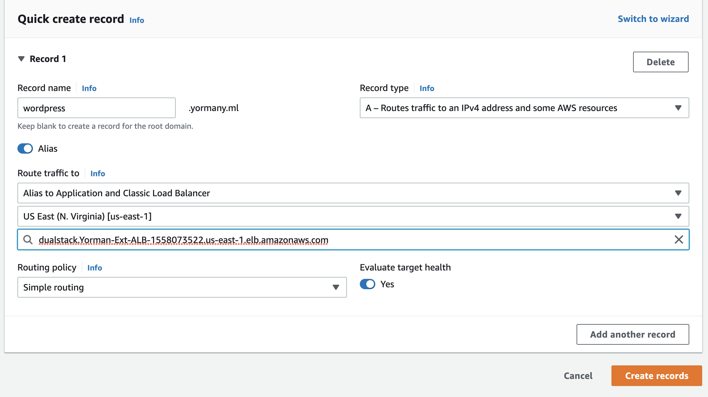

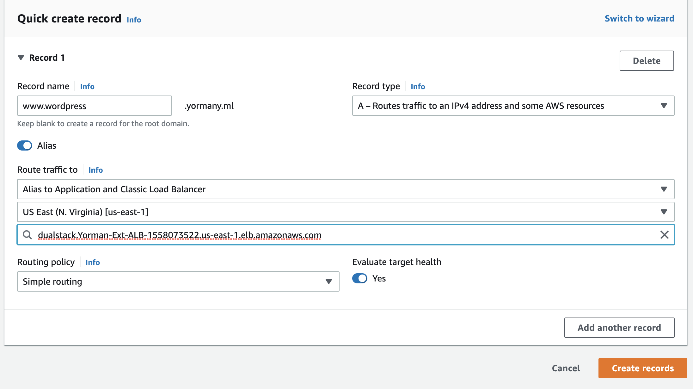


For Internal Load Balancer

- Set the internal ALB option.
- Ensure that it listens on HTTPS protocol (TCP port 443).
- Ensure the ALB is created within the appropriate VPC, AZ and Subnets.
- Choose the certificate already created from ACM.
- Select Security Group for the internal load balancer.
- Select webserver Instances as the target group.
- Ensure that health check passes for the target group.

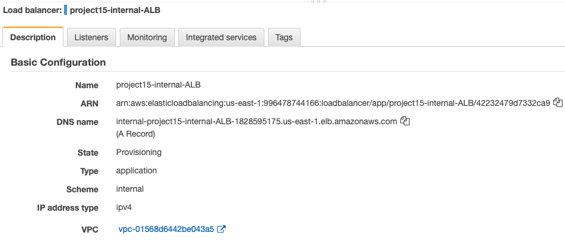

To configure the Internal Load Balancer to forward traffic to Wordpress webserver, add a new rule and configure to forward the traffic to Wordpress Target Group as below:

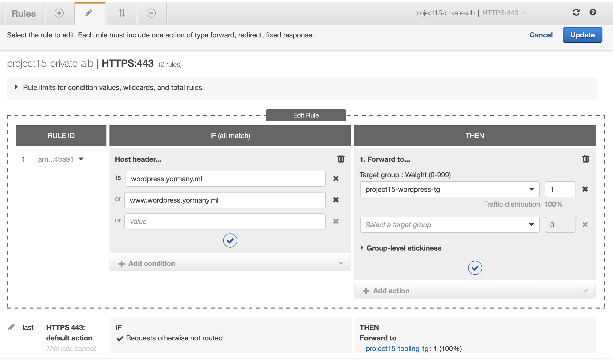

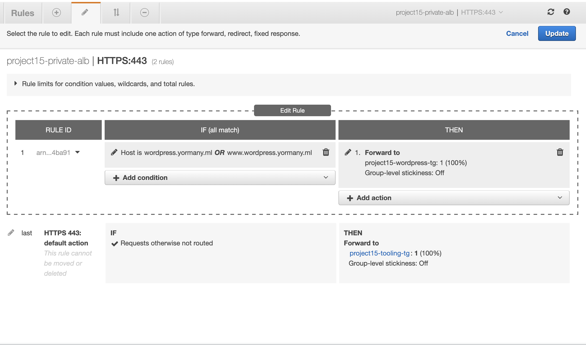


## STEP 10: Configure AutoScaling Group

Create Bastion Auto Scaling Group

- Choose the bastion launch template and the two public subnets.
- Pick the no load balancer option.
- Set Target Tracking Scaling Policy with CPU at 90%.
- Set SNS Topic notifications.
- Create the Auto Scaling Group.

Create the Nginx Auto Scaling Group

- Choose the Nginx launch template and the two public subnets.
- Select existing load balancer and choose the Nginx Target Group.
- Set Target Tracking Scaling Policy with CPU at 90%.
- Set SNS Topic notifications.
- Create the Auto Scaling Group.

Create WordPress Auto Scaling Group:

- Choose the WordPress launch template and two private subnets (1 and 2).
- Select existing load balancer and choose the WordPress Target Group.
- Set Target Tracking Scaling Policy with CPU at 90%.
- Set SNS Topic notifications.
- Create the Auto Scaling Group.

Create Tooling Auto Scaling Group

- Choose the tooling launch template and two private subnets (1 and 2).
- Select existing load balancer and choose the Tooling Target Group.
- Set Target Tracking Scaling Policy with CPU at 90%
- Set SNS Topic notifications.
- Create the Auto Scaling Group.

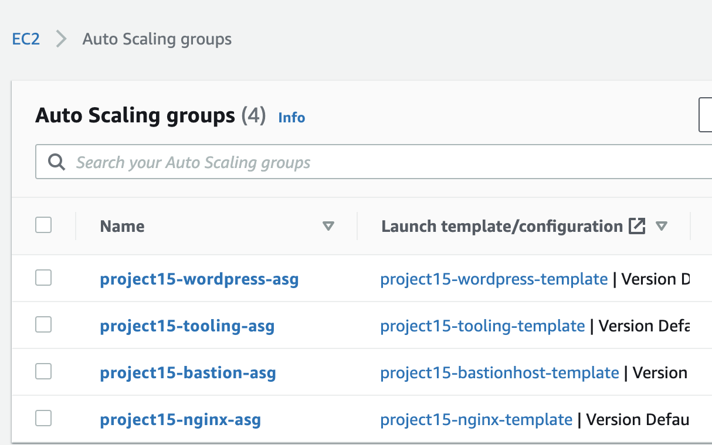

## STEP 11: Configure the database

Connect to the bastion server through SSH, then to the Webserver. Now connect to the RDS database:

```
mysql -h toolingdb.c9tkkvrdsgea.us-east-1.rds.amazonaws.com -u admin -p 
```

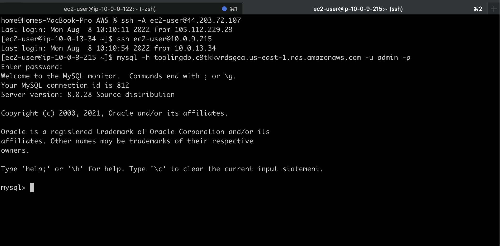
                                                    

In MySQL, create a database called `toolingdb`:

```
CREATE DATABASE toolingdb; 
CREATE DATABASE wordpressdb;                                             
```

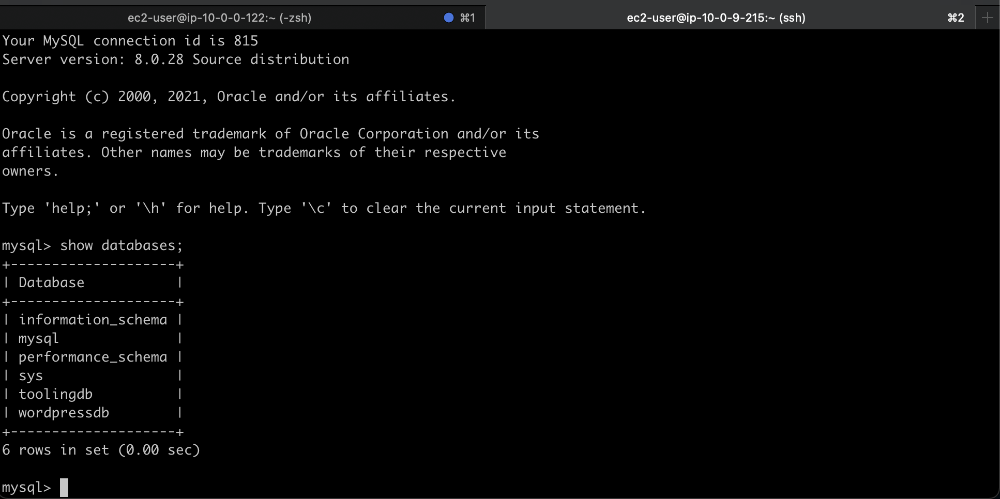

