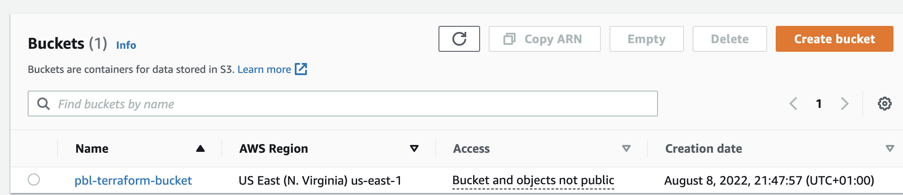
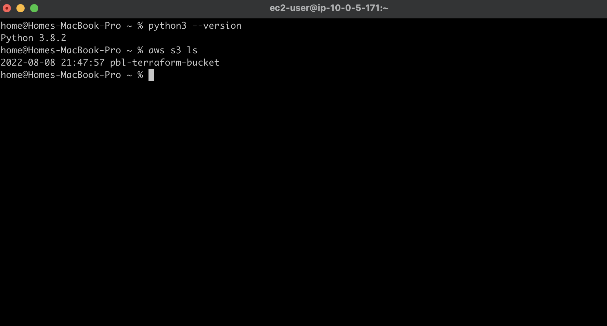
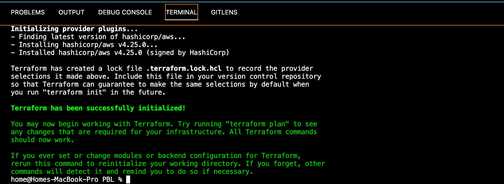
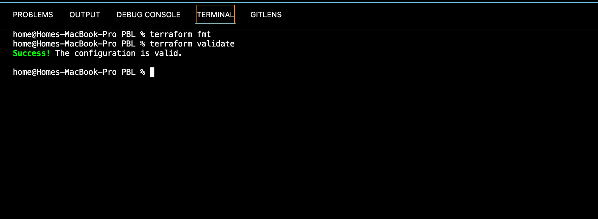
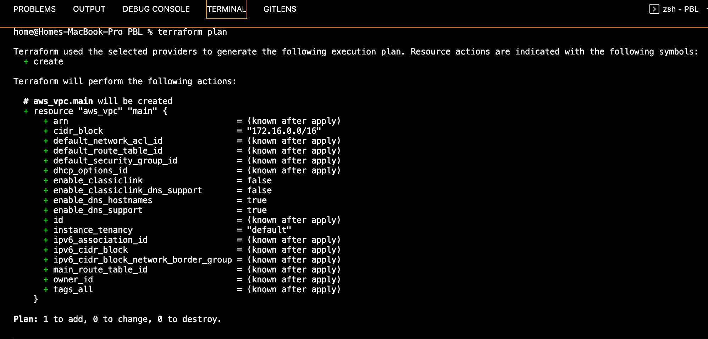
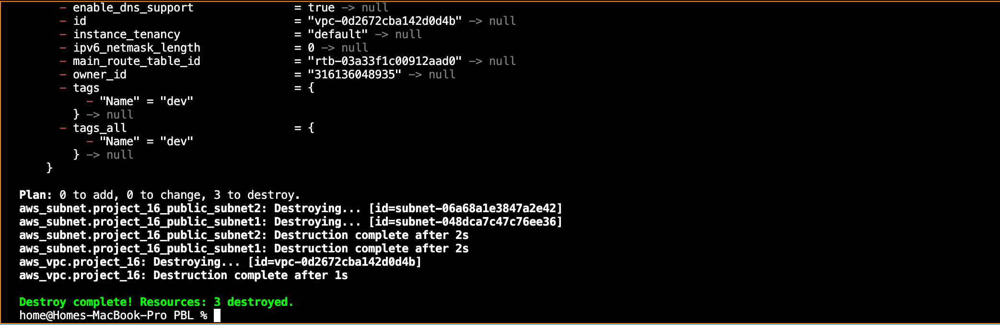
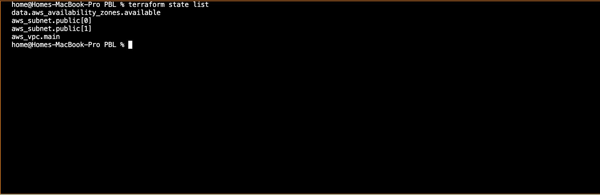
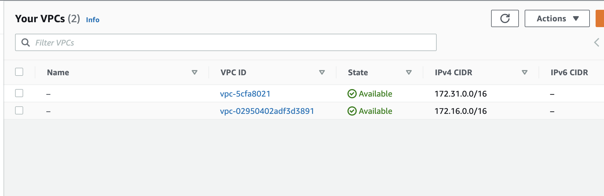
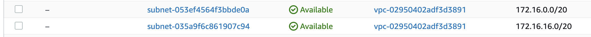

## STEP 1: Setting Up AWS CLI And S3 Bucket

- Create an IAM user, name it `terraform` (ensure that the user has only programmatic access to your AWS account) and grant this user `AdministratorAccess` permissions.


- Copy/save the secret access key and access key ID. 

- Configure programmatic access from your workstation to connect to AWS using the access keys copied above and a Python SDK (boto3). You must have Python 3.6 or higher on your workstation. I used `awscli` for the above step, by using `aws configure`.

- Create an S3 bucket to store Terraform state file. We will use this bucket from Project-17 onwards.





- Install terraform from https://www.terraform.io/downloads

- Test AWS CLI by running the following commands on terminal to print the newly created buckets:

```
>>import boto3
>>s3 = boto3.resource('s3')
>>for bucket in s3.buckets.all():
    print(bucket.name)
```

Or use:

```
aws s3 ls
```



- Create a folder called PBL, and create a file in the folder, name it main.tf.

- Add AWS as a provider, and a resource to create a VPC in the main.tf file.

- Provider block informs Terraform that we intend to build infrastructure within AWS.

- Add the following code in the main.tf file:

```
provider "aws" {
  region = "us-east-1"
}

# Create VPC
resource "aws_vpc" "main" {
  cidr_block                     = "172.16.0.0/16"
  enable_dns_support             = "true"
  enable_dns_hostnames           = "true"
  enable_classiclink             = "false"
  enable_classiclink_dns_support = "false"
}
```

Run `terraform init` to initialize the Terraform configuration and download necessary plugins for Terraform to work. Since we only have provider in our `main.tf` file. Terraform will just download plugin for AWS provider.



- Run the below commands to improve the format and validate the code:

```
terraform fmt

terraform validate
```




- Run `terraform plan`, it will display actions the terraform will take.



Observations:

- A new file is created `terraform.tfstate`, This is how Terraform keeps itself up to date with the exact state of the infrastructure. It reads this file to know what already exists, what should be added, or destroyed based on the entire terraform code that is being developed.

- If you also observed closely, you would realise that another file gets created during planning and apply. But this file gets deleted immediately: `terraform.tfstate.lock.info`. This is what Terraform uses to track who is running its code against the infrastructure at any point in time. This is very important for teams working on the same Terraform repository at the same time. The lock prevents a user from executing Terraform configuration against the same infrastructure when another user is doing the same – to avoid duplicates and conflicts.

According to our architectural design, we require 6 subnets: 2 public subnets, 2 private subnets for webservers, and 2 private subnets for data layer. Add below configuration to the main.tf file:

```
# Create public subnets1
    resource "aws_subnet" "public1" {
    vpc_id                     = aws_vpc.main.id
    cidr_block                 = "172.16.0.0/24"
    map_public_ip_on_launch    = true
    availability_zone          = "us-east-1a"

}

# Create public subnet2
    resource "aws_subnet" "public2" {
    vpc_id                     = aws_vpc.main.id
    cidr_block                 = "172.16.1.0/24"
    map_public_ip_on_launch    = true
    availability_zone          = "us-east-1b"
}
```

- We are creating 2 subnets, therefore declaring 2 resource blocks – one for each of the subnets.

We are using the vpc_id argument to interpolate the value of the VPC id by setting it to aws_vpc.main.id. This way, Terraform knows inside which VPC to create the subnet.

Observations:

- Hard coded values: Remember our best practice hint from the beginning? Both the availability_zone and cidr_block arguments are hard coded. We should always endeavour to make our work dynamic.

- Multiple Resource Blocks: Notice that we have declared multiple resource blocks for each subnet in the code. This is bad coding practice. We need to create a single resource block that can dynamically create resources without specifying multiple blocks. Imagine if we wanted to create 10 subnets, our code would look very clumsy. So, we need to optimize this by introducing a count argument.


Run terraform destroy to destroy the infrastructure.



## FIXING THE PROBLEMS BY CODE REFACTORING

We will now refactor the code to make it dynamic. To do this we will introduce variables.

- Starting with the provider block, declare a variable named region, give it a default value, and update the provider section by referring to the declared variable.

```
variable "region" {
        default = "us-east-1"
}

provider "aws" {
        region = var.region
}
```

- Do the same to cidr value in the vpc block, and all the other arguments.

```
variable "region" {
        default = "us-east-1"
    }

variable "vpc_cidr" {
    default = "172.16.0.0/16"
}

variable "enable_dns_support" {
    default = "true"
}

variable "enable_dns_hostnames" {
    default ="true" 
}

variable "enable_classiclink" {
    default = "false"
}

variable "enable_classiclink_dns_support" {
    default = "false"
}

provider "aws" {
region = var.region
}

# Create VPC
resource "aws_vpc" "main" {
cidr_block                     = var.vpc_cidr
enable_dns_support             = var.enable_dns_support 
enable_dns_hostnames           = var.enable_dns_support
enable_classiclink             = var.enable_classiclink
enable_classiclink_dns_support = var.enable_classiclink

}
```

Moving on, Terraform has a functionality that allows us to pull data which exposes information to us. For example, every region has Availability Zones (AZ). Different regions have from 2 to 4 Availability Zones. With over 20 geographic regions and over 70 AZs served by AWS, it is impossible to keep up with the latest information by hard coding the names of AZs. Hence, we will explore the use of Terraform’s Data Sources to fetch information outside of Terraform. In this case, from AWS.

Lets fix availability_zone section

1. First we will create a data source to fetch the list of AZs.

```
# Get list of availability zones
data "aws_availability_zones" "available" {
    state = "available"
}
```

2. We will introduce the count argument to the subnet section. This argument will tell Terraform how many AZs to fetch.

```
# Create public subnet1
resource "aws_subnet" "public" { 
    count                   = 2
    vpc_id                  = aws_vpc.main.id
    cidr_block              = "172.16.1.0/24"
    map_public_ip_on_launch = true
    availability_zone       = data.aws_availability_zones.available.names[count.index]

}
```

Explanation:

- The count tells us that we need 2 subnets. Therefore, Terraform will invoke a loop to create 2 subnets.

- The data resource will return a list object that contains a list of AZs. Internally, Terraform will receive the data like this `["us-east-1a", "us-east-1b"]`.

- The count.index will return the index of the current iteration. So, if we have 2 iterations, the first iteration will return 0 and the second iteration will return 1.

We can also make cidr_block dynamic too;

- We will introduce a function cidrsubnet() to make this happen. It accepts 3 parameters. cidrsubnet(prefix, newbits, netnum)

- The prefix parameter must be given in CIDR notation, same as for VPC.
- The newbits parameter is the number of additional bits with which to extend the prefix. For example, if given a prefix ending with /16 and a newbits value of 4, the resulting subnet address will have length /20.
- The netnum parameter is a whole number that can be represented as a binary integer with no more than newbits binary digits, which will be used to populate the additional bits added to the prefix.

```
# Create public subnet1
resource "aws_subnet" "public" { 
    count                   = 2
    vpc_id                  = aws_vpc.main.id
    cidr_block              = cidrsubnet(var.vpc_cidr, 4 , count.index)
    map_public_ip_on_launch = true
    availability_zone       = data.aws_availability_zones.available.names[count.index]

}
```

We can also make the count argument dynamic too by using length() function which basically determines the length of a given list, map, or string.

Since data.aws_availability_zones.available.names returns a list like ["us-east-1a", "us-east-1b", "us-east-1c"] we can pass it into a lenght function and get number of the AZs.

The count argument now looks like this: length(data.aws_availability_zones.available.names) but then, this will make the number of subnets created to be equal to the number of AZs fetched. But remember we only need 2. We can fix this by creating a variable that stors the number of subnets.

```
variable "preferred_number_of_public_subnets" {
  default = 2
}
```

Now the subnet section look like this:

```
# Create public subnets
resource "aws_subnet" "public" {
  count  = var.preferred_number_of_public_subnets == null ? length(data.aws_availability_zones.available.names) : var.preferred_number_of_public_subnets   
  vpc_id = aws_vpc.main.id
  cidr_block              = cidrsubnet(var.vpc_cidr, 4 , count.index)
  map_public_ip_on_launch = true
  availability_zone       = data.aws_availability_zones.available.names[count.index]

}
```

- The first part `var.preferred_number_of_public_subnets == null` checks if the value of the variable is set to null or has some value defined.
- The second part `? and length(data.aws_availability_zones.available.names)` means, if the first part is true, then use this. In other words, if preferred number of public subnets is null (Or not known) then set the value to the data returned by lenght function.
- The third part `: and var.preferred_number_of_public_subnets` means, if the first condition is false, i.e preferred number of public subnets is not null then set the value to whatever is definied in var.preferred_number_of_public_subnets.

Now our `main.tf` looks thus:

```
# Get list of availability zones
data "aws_availability_zones" "available" {
state = "available"
}

variable "region" {
      default = "us-east-1"
}

variable "vpc_cidr" {
    default = "172.16.0.0/16"
}

variable "enable_dns_support" {
    default = "true"
}

variable "enable_dns_hostnames" {
    default ="true" 
}

variable "enable_classiclink" {
    default = "false"
}

variable "enable_classiclink_dns_support" {
    default = "false"
}

  variable "preferred_number_of_public_subnets" {
      default = 2
}

provider "aws" {
  region = var.region
}

# Create VPC
resource "aws_vpc" "main" {
  cidr_block                     = var.vpc_cidr
  enable_dns_support             = var.enable_dns_support 
  enable_dns_hostnames           = var.enable_dns_support
  enable_classiclink             = var.enable_classiclink
  enable_classiclink_dns_support = var.enable_classiclink

}

# Create public subnets
resource "aws_subnet" "public" {
  count  = var.preferred_number_of_public_subnets == null ? length(data.aws_availability_zones.available.names) : var.preferred_number_of_public_subnets   
  vpc_id = aws_vpc.main.id
  cidr_block              = cidrsubnet(var.vpc_cidr, 4 , count.index)
  map_public_ip_on_launch = true
  availability_zone       = data.aws_availability_zones.available.names[count.index]

}
```

## Introducing `variables.tf` & `terraform.tfvars`

Instead of having a long list of variables in `main.tf` file, we can actually make our code a lot more readable and better structured by moving out some parts of the configuration content to other files.

We can create a file called `variables.tf` and put all the variables declaration we need in it. Also we will create a `terraform.tfvars` file and put all the values of the variables in it.


The `variables.tf` will contain the content below:

```
variable "region" {
      default = "eu-west-2"
}

variable "vpc_cidr" {
    default = "172.16.0.0/16"
}

variable "enable_dns_support" {
    default = "true"
}

variable "enable_dns_hostnames" {
    default ="true" 
}

variable "enable_classiclink" {
    default = "false"
}

variable "enable_classiclink_dns_support" {
    default = "false"
}

  variable "preferred_number_of_public_subnets" {
      default = null
}
```

The `terraform.tfvars` file will contain the content below:

```
region = "us-west-2"

vpc_cidr = "172.16.0.0/16" 

enable_dns_support = "true" 

enable_dns_hostnames = "true"  

enable_classiclink = "false" 

enable_classiclink_dns_support = "false" 

preferred_number_of_public_subnets = 2
```

The `main.tf` will have the content below:

```
# Get list of availability zones
data "aws_availability_zones" "available" {
state = "available"
}

provider "aws" {
  region = var.region
}

# Create VPC
resource "aws_vpc" "main" {
  cidr_block                     = var.vpc_cidr
  enable_dns_support             = var.enable_dns_support
  enable_dns_hostnames           = var.enable_dns_support
  enable_classiclink             = var.enable_classiclink
  enable_classiclink_dns_support = var.enable_classiclink
}

# Create public subnets
resource "aws_subnet" "public" {
  count  = var.preferred_number_of_public_subnets == null ? length(data.aws_availability_zones.available.names) : var.preferred_number_of_public_subnets   
  vpc_id = aws_vpc.main.id
  cidr_block              = cidrsubnet(var.vpc_cidr, 4 , count.index)
  map_public_ip_on_launch = true
  availability_zone       = data.aws_availability_zones.available.names[count.index]

}
```

Run the below commands:

```
terraform plan 

terraform apply
```

Confirm creation of the resources:








