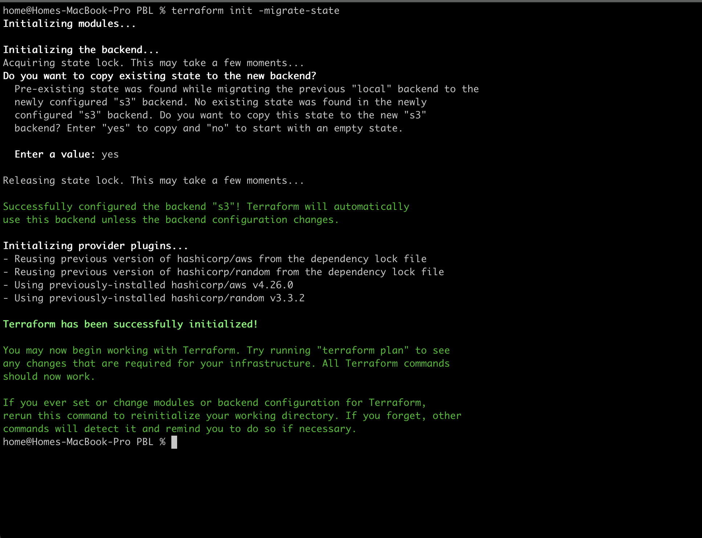

# AUTOMATING INFRASTRUCTURE WITH IAC USING TERRAFORM PART 3 – REFACTORING


## STEP 1: Refactoring

- Create a directory called modules
- Within the modules directory create directories named VPC, Security, EFS, RDS, ALB, Autoscaling, Compute.
- Within this directory created, we are going to copy files related to the named directory e.g For the VPC directory, the files needed to setup our VPC are internet-gateway, Nat-gateway, Routes etc. Also create variables.tf file in all the created directories, so the content of the directory will have a variables.tf file and other files related to the name of the directories.

The content of the modules directory will be like the screenshot below:


- Ensure to run terraform init anytime time you create modules.

To make use of the content within modules, you need to use the keyword module and the directory name you are referencing, and state the source where the directory is, just like what you have in the screenshot below:

Once done, execute `terraform plan` and then `terraform apply`.


## STEP 2: Configuring A Backend With An S3 Bucket

So far, we have been using the default backend, which is the local backend – it requires no configuration, and the state file is stored locally. This mode can be suitable for learning purposes, but it is not a robust solution, so it is better to store it in some more reliable and durable storage.

The second problem with storing this file locally is that, in a team of multiple DevOps engineers, other engineers will not have access to a state file stored locally on your computer.

To solve this, we will need to configure a backend where the state file can be accessed remotely with other DevOps team members in mind. There are plenty of different standard backends supported by Terraform that you can choose from. Since we are already using AWS – we can choose an S3 bucket as a backend.

Another useful option that is supported by S3 backend is State Locking – it is used to lock your state for all operations that could write state. This prevents others from acquiring the lock and potentially corrupting your state. State Locking feature for S3 backend is optional and requires another AWS service – DynamoDB.

Create an S3 bucket to store Terraform state file with a unique name. This should be done within the `main.tf` file:

```
resource "aws_s3_bucket" "terraform-state" {
  bucket        = "pbl182022"
  force_destroy = true
}
resource "aws_s3_bucket_versioning" "version" {
  bucket = aws_s3_bucket.terraform-state.id
  versioning_configuration {
    status = "Enabled"
  }
}
resource "aws_s3_bucket_server_side_encryption_configuration" "first" {
  bucket = aws_s3_bucket.terraform-state.id
  rule {
    apply_server_side_encryption_by_default {
      sse_algorithm = "AES256"
    }
  }
}
```

Create a DynamoDB table to handle locks and perform consistency checks. In previous projects, locks were handled with a local file as shown in `terraform.tfstate.lock.info`. Since we now have a team mindset, causing us to configure S3 as our backend to store state file, we will do the same to handle locking. Therefore, with a cloud storage database like DynamoDB, anyone running Terraform against the same infrastructure can use a central location to control a situation where Terraform is running at the same time from multiple different people.

```
resource "aws_dynamodb_table" "terraform_locks" {
  name         = "terraform-locks"
  billing_mode = "PAY_PER_REQUEST"
  hash_key     = "LockID"
  attribute {
    name = "LockID"
    type = "S"
  }
}
```

- Terraform expects that both S3 bucket and DynamoDB resources are already created before we configure the backend. So, let us run `terraform apply` to provision resources.

- Create a file and name it `backend.tf` and reference the bucket name, then configure the backend. We need to ensure that we run `terraform init` before we can make use of the backend. The purpose of this is to migrate our state file and other files from local storage to S3.

```
terraform {
  backend "s3" {
    bucket         = "pbl182022"
    key            = "global/s3/terraform.tfstate"
    region         = "us-east-1"
    dynamodb_table = "terraform-locks"
    encrypt        = true
  }
}
```



Check AWS Console to confirm S3 configuration.


When we run terraform plan or apply, a new lock ID would be generated while running the plan. The DynamoDB is handling the lockID, it will be present until the plan or apply finishes.


We have successfully refactored our project to use modules, introduced backend as S3 and also used DynamoDB to store our state lockfiles.

Run `terraform destroy`, but before we run it, we should take note that terraform will destroy the S3 bucket and if it destroys it, terraform will go into an undefined state and delete the files you have there so avoid this by commenting out your S3 backend then run `terraform init -migrate-state`. It will copy your state file back from S3 to your local storage. Note that to use S3 as a backend, you need to enable versioning on the bucket.


[Here](https://github.com/enyioman/terraform-project18) is the repo.