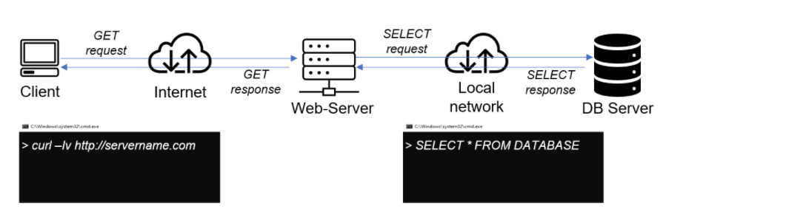

# Client-Server Architecture Project

A Client/Server Architecture Using A MySQL Relational Database Management System. The steps below were followed in implementing the architecture:

- Created and configured two Linux-based virtual servers (EC2 instances in AWS).
- Installed MySQL Client software on mysql client Linux Server.
- Created ‘Inbound rules’ in ‘mysql server’ Security Groups.
- Connected remotely to mysql server Database Engine without using SSH.

Here's the architecture. Full documentation is in `project5.md`

