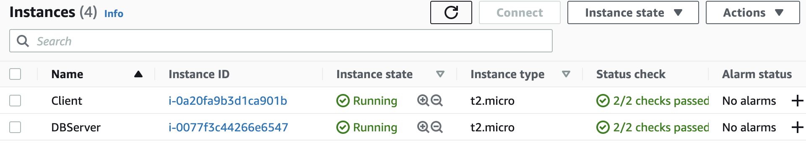
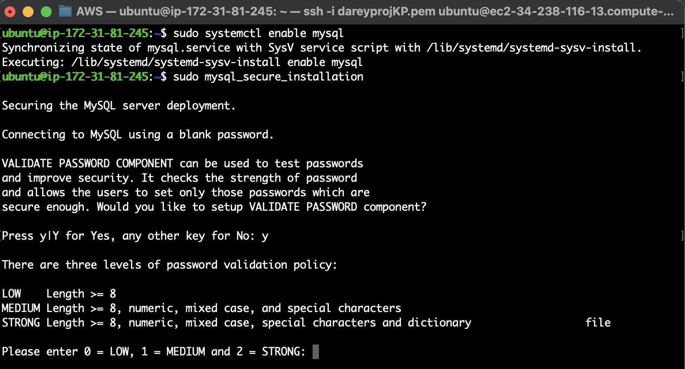
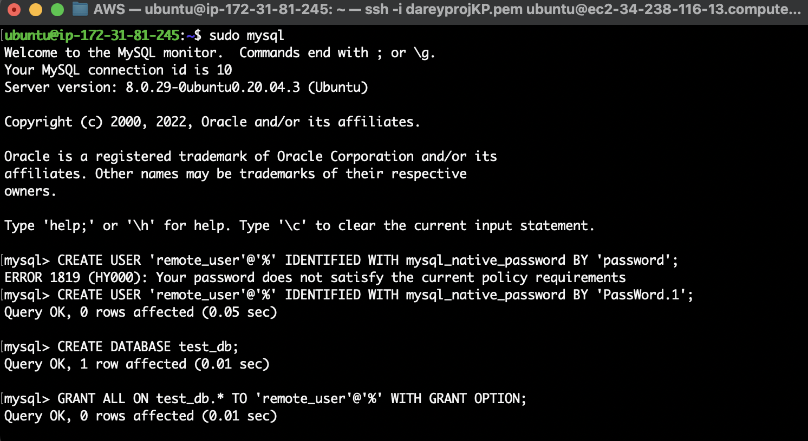
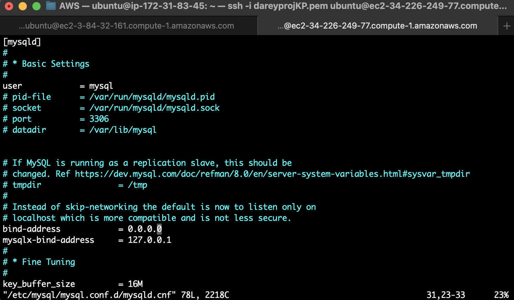
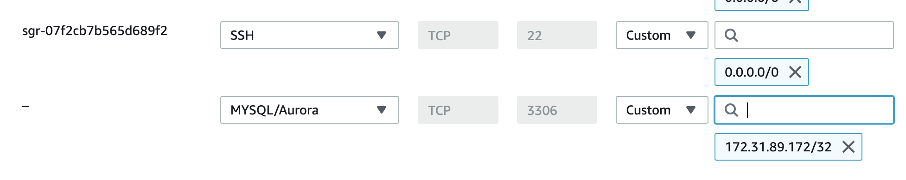
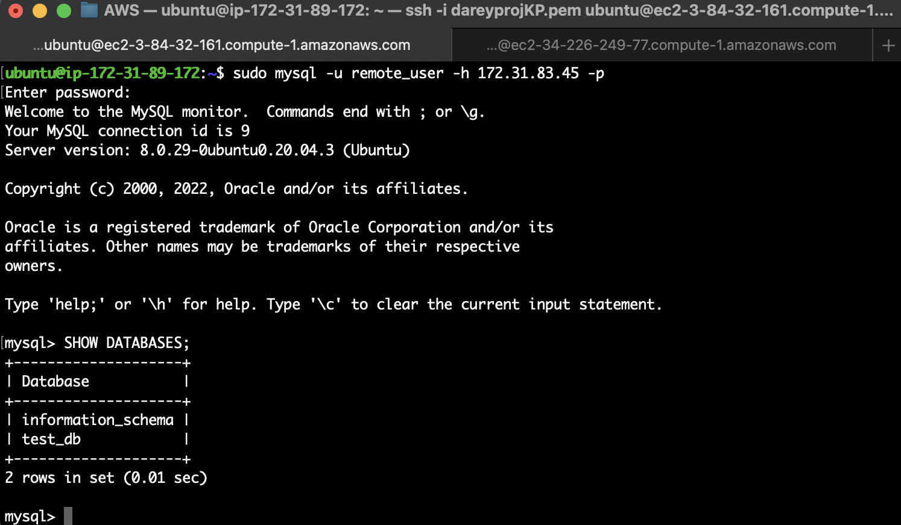

# CLIENT-SERVER ARCHITECTURE PROJECT

The task of the project is to implement a Client Server Architecture using MySQL Database Management System (DBMS).

Client-Server refers to an architecture in which two or more computers are connected together over a network to send and receive requests between one another.

In their communication, each machine has its own role: the machine sending requests is usually referred as "Client" and the machine responding (serving) is called "Server".

A machine that is trying to access a Web site using Web browser or simply ‘curl’ command is a client and it sends HTTP requests to a Web server (Apache, Nginx, IIS or any other) over the Internet.

If we extend this concept further and add a Database Server to our architecture, which we can depict as shown below:


Create and configure two linux-based virtual servers (EC2 instances in AWS) and connect to them.




## Database Server

On MYSQL server:

Update the server:

```
sudo apt update -y
```

Install MySQL server software:

```
sudo apt install mysql-server
```

Enable MySQL:

```
sudo systemctl enable mysql
```



Run the MySQL security script:

```
sudo mysql_secure_installation
```

Run the MySQL command:

```
sudo mysql
```



Create a remote user for the database:

```
mysql> CREATE USER 'remote_user'@'%' IDENTIFIED BY 'password';
```

Create a database:

```
mysql> CREATE DATABASE <dbname>;
```

Grant privileges:

```
mysql> GRANT ALL ON <dbname>.* TO 'remote_user'@'%' WITH GRANT OPTION;
mysql> FLUSH PRIVILEGES;
```

Configure MySQL server to allow connections from remote hosts:

```
sudo vi /etc/mysql/mysql.conf.d/mysqld.cnf 
```

Change the bind address to allow traffic from 0.0.0.0.




Restart the MySQL service to activate the new configurations:

```
sudo systemctl restart mysql
```

## CLIENT SERVER

Update the Server:

```
sudo apt update -y
```

Install MySQL Client Server software:

```
sudo apt install mysql-client -y
```

Update the Security Group of the DB server to allow traffic from the client's private IP address at port 3306.



From mysql client Linux Server connect remotely to mysql server Database Engine:

```
sudo mysql -u remote_user -h <remote private ip address> -p
```

Confirm successfull connection to the remote MySQL server and perform SQL queries:

```
Show databases;
```

The screenshot below shows a fully functional MYSQL Client-Server set up.

