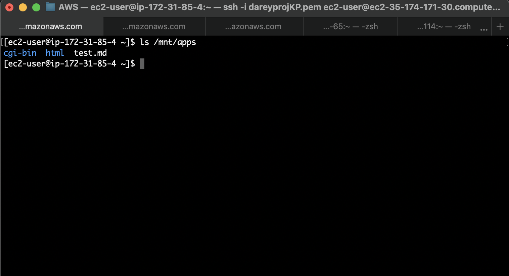
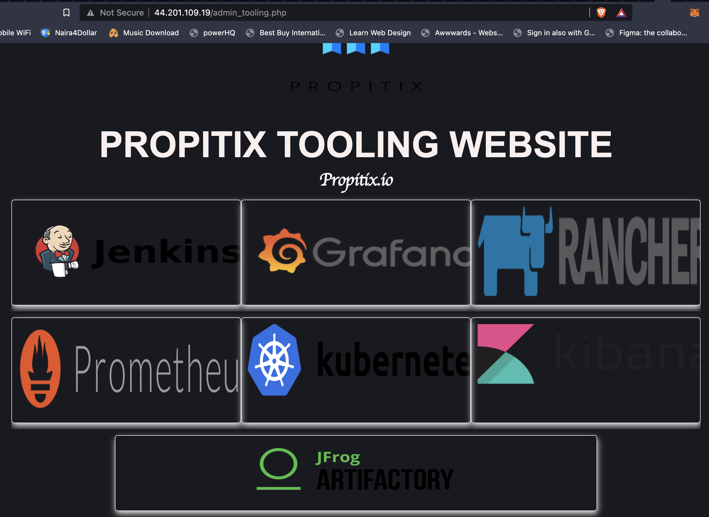

# IMPLEMENTATION OF WEB APPLICATION ARCHITECTURE WITH A SINGLE DATABASE AND NFS SERVER


The solution consists of the following components:

1. Infrastructure: AWS
2. Web Server : Red Hat Enterprise Linux 8
3. Database Server: Ubuntu 20.04 + MySQL
4. Storage Server: Red Hat Enterprise Linux 8 + NFS Server
5. Programming Language: PHP
6. Code Repository: GitHub


## PREPARE THE NFS SERVER

- Launch an EC2 instance with RHEL that will serve as "NFS Server".
- Attach three volumes with the same availability.
- Inspect what block devices are attached to the server.

```
lsblk
```

Use gdisk utility to create a single partition on each of the 3 disks.

```
sudo gdisk /dev/xvdf

sudo gdisk /dev/xvdg

sudo gdisk /dev/xvdh
```


Install lvm2:

```
sudo yum install lvm2
```

Use the pvcreate utility to mark each of 3 disks as physical volumes (PVs) to be used by LVM:

```
sudo pvcreate /dev/xvdf1
sudo pvcreate /dev/xvdg1
sudo pvcreate /dev/xvdh1
```

Add all 3 PVs to a volume group:

```
sudo vgcreate webdata-vg /dev/xvdh1 /dev/xvdg1 /dev/xvdf1
```

Verify that the VG has been created successfully:

```
sudo vgs
```


Create 3 logical volumes. apps-lv, and logs-lv. apps-lv will be used to store data for the Website while, logs-lv will be used to store data for logs.

```
sudo lvcreate -n apps-lv -L 9G webdata-vg
sudo lvcreate -n logs-lv -L 9G webdata-vg
sudo lvcreate -n opt-lv -L 9G webdata-vg
```

Verify that the Logical Volume had been created successfully:


```
sudo lvs
```


Confirm the whole set:

```
sudo vgdisplay -v #view complete setup - VG, PV, and LV

sudo lsblk 
```


Use `mkfs.xfs` to format the logical volumes with xfs filesystem with the commands below:

```
sudo mkfs -t xfs /dev/webdata-vg/apps-lv
sudo mkfs -t xfs /dev/webdata-vg/logs-lv
sudo mkfs -t xfs /dev/webdata-vg/opt-lv
```

Create mount points on /mnt directory for the logical volumes:

```
sudo mkdir /mnt/apps

sudo mkdir /mnt/apps

sudo mkdir /mnt/opt 
```

Mount logical volumes:

```
sudo mount /dev/webdata-vg/apps-lv /mnt/apps

sudo mount /dev/webdata-vg/logs-lv /mnt/logs

sudo mount /dev/webdata-vg/opt-lv /mnt/opt
```

Confirm mount:

```
df -h
```


Retrieve the UUID of the devices and update the `ftsab` file:


```
sudo blkid

sudo vi /etc/fstab
```

Confirm the mount is okay and then reload:

```
sudo mount -a

sudo systemctl daemon-reload
```

Install and configure the NFS to start on reboot, then confirm that it is running:

```
sudo yum -y update
sudo yum install nfs-utils -y
sudo systemctl start nfs-server.service
sudo systemctl enable nfs-server.service
sudo systemctl status nfs-server.service
```

Set up permission that will allow the web servers to read, write and execute files on the NFS:

```
sudo chown -R nobody: /mnt/apps
sudo chown -R nobody: /mnt/logs
sudo chown -R nobody: /mnt/opt

sudo chmod -R 777 /mnt/apps
sudo chmod -R 777 /mnt/logs
sudo chmod -R 777 /mnt/opt

sudo systemctl restart nfs-server.service
```

To Configure access to NFS for clients within the same subnet get the subnet CIDR of the NFS server.

Open the exports file located in the etc directory:

```
sudo vi /etc/exports
```

Enter the below:

```
/mnt/apps <Subnet-CIDR>(rw,sync,no_all_squash,no_root_squash)
/mnt/logs <Subnet-CIDR>(rw,sync,no_all_squash,no_root_squash)
/mnt/opt <Subnet-CIDR>(rw,sync,no_all_squash,no_root_squash)
```

Run the below command:

```
sudo exportfs -arv
```

Check which port is used by NFS and open it within the Security Groups:

```
rpcinfo -p | grep nfs
```


In order for NFS server to be accessible from the client, open the following ports and allow access from the web CIDR: TCP 111, UDP 111, UDP 2049, and EFS 2049.


# CONFIGURE THE DATABASE SERVER

Create a new EC2 Instance for Database server and install mysql server.


Install mysql-server:

```
sudo apt install mysql-server

sudo systemctl start mysql 

sudo systemctl enable mysql 

sudo systemctl status mysql

sudo mysql_secure_installation
```

Create a database called tooling, a database user (webaccess) and grant permission to webaccess user on tooling database to do anything only from the webservers subnet CIDR:

```
CREATE USER 'webaccess'@'172.31.80.0/20' IDENTIFIED BY 'password';

 grant all privileges on tooling.* to 'webaccess' @'172.31.80.0/20';

 flush privileges;
 ```


Set the bind address to 0.0.0.0 in mysql.cnf:


```
sudo vi /etc/mysql/mysql.conf.d/mysqld.cnf 
```

Restart mysql:

```
sudo systemctl restart mysql
```


Open Mysql/Aurora port in the security group.

# CONFIGURE THE WEB SERVERS


During this process you will do the following:

1. Configure NFS client on 3 web servers.
2. Deploy a Tooling application to your Web Servers into a shared NFS folder.
3. Configure the Web Servers to work with a single MySQL database.

Launch 3 new EC2 instance with RHEL 8 Operating System, update the respositries and install NFS:

```
sudo yum install nfs-utils nfs4-acl-tools -y
sudo systemctl start nfs-server
sudo systemctl enable nfs-server
sudo systemctl status nfs-server 
```

Create `www` directory:

```
sudo mkdir /var/www
```

Mount /var/www:

```
sudo mount -t nfs -o rw,nosuid <NFS-Server-Private-IP-Address>:/mnt/apps /var/www
```

Verify that NFS was mounted succesfully:

```
df -h
```


To ensure that the changes will persist on Web Server after reboot open the fstab file:

```
sudo vi /etc/fstab
```

Enter in the below and save:

```
<NFS-Server-Private-IP-Address>:/mnt/apps /var/www nfs defaults 0 0
```


Reload server with below command:


```
sudo systemctl daemon-reload
```

Repeat the steps above on the other two Web Servers

Install Remi’s repository, Apache and PHP:


```
sudo yum install httpd -y

sudo dnf install https://dl.fedoraproject.org/pub/epel/epel-release-latest-8.noarch.rpm

sudo dnf install dnf-utils http://rpms.remirepo.net/enterprise/remi-release-8.rpm

sudo dnf module reset php

sudo dnf module enable php:remi-7.4

sudo dnf install php php-opcache php-gd php-curl php-mysqlnd

sudo systemctl start php-fpm

sudo systemctl enable php-fpm

sudo setsebool -P httpd_execmem 1
```

To verify whether NFS was mounted correctly create a new file called `test.md` from your web server and check whether it is visible within your NFS server:

```
sudo touch /var/www/test.md
```





The log file for Apache is located on the Web Server. The folder contains content and once mounted this will be deleted. In order to avoid this move the content and create a new httpd with the below command:


```
sudo mv /var/log/httpd /var/log/httpd.bak

sudo mkdir /var/log/httpd
```


Mount to the NFS server’s export for logs to var/log/httpd, updated the fstab to ensure changes will persist on web server after reboot and reloaded.

```
sudo mount -t nfs -o rw,nosuid <NFS Private IP address>:/mnt/logs /var/log/httpd
```

To make sure changes persist after reboot update the fstab:

```
sudo vi /etc/fstab

#Update with the below

72.31.30.141:/mnt/logs /var/log/httpd nfs defaults 0 0
```

Reload the system:

```
sudo systemctl daemon-reload 
```

Copy the content of httpd.bak into httpd folder since mount has already taken place:

```
sudo cp -R /var/log/httpd.bak/. /var/log/httpd
```

Install git and clone tooling source code:

```
sudo yum install git

git clone https://github.com/EstherAlo/tooling.git
```

Deploy The tooling website’s code on the Webserver and the `html` folder from the repository unto `/var/www/html`:

```
sudo cp -R ~/tooling/html/. /var/www/html
```

Disable Apache default page and restarte httpd:

```
sudo mv /etc/httpd/conf.d/welcome.conf /etc/httpd/conf.d/welcome.conf_backup

sudo systemctl restart httpd.
```


If unable to restart httpd do the below:

Disable SELinux `sudo setenforce 0` and to make this change permanent – open config file `/etc/sysconfig/selinux` and set `SELINUX=disabled`. Restart and check apache status.


```
sudo setenforce 0

sudo vi /etc/sysconfig/selinux 
```

Update the website configuration to connect to the database (in `/var/www/html/functions.php` file).


Install mysql client:


```
sudo yum install mysql -y
```

Update the website’s configuration with tooling script to connect to the database /var/www/html/functions.php file:

```
sudo vi /var/www/html/functions.php file
```

Apply tooling-db.sql script within the tooling directory to the webserver using below command:

```
mysql -h <databse-private-ip> -u <db-username> -p tooling < tooling-db.sql
```

Access website with the the public ip address of all webservers and login.





Tooling site accessed from the second server:


