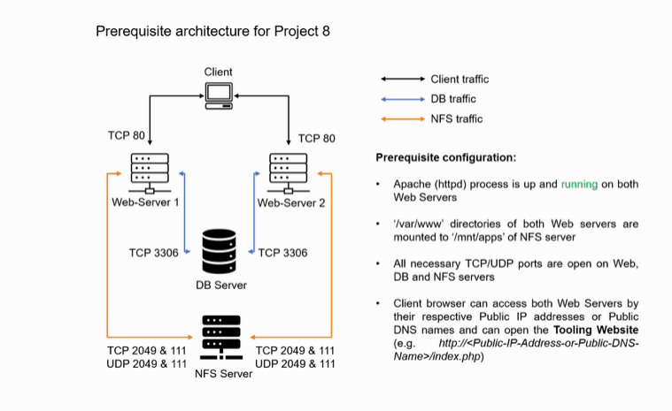

# Load Balancer Solution With Apache

This project builds upon project 7 further by adding a Load Balancer to distribute the load evenly between the Web Servers. The users will access the application by using a single public IP address/DNS name of the Load Balancer instead of using separate IP addresses/ DNS names of each Web Server. This ensures a single point of entry to the application through the Load Balancer and also helps to create a better user experience by distributing the traffic evenly between the Web Servers. Apache Web Server was configured as the Load Balancer.

A Load Balancer (LB) distributes clients’ requests among underlying Web Servers and makes sure that the load is distributed in an optimal way.

Below is the architecture of the solution.

Full documentation is in `project8.md`.