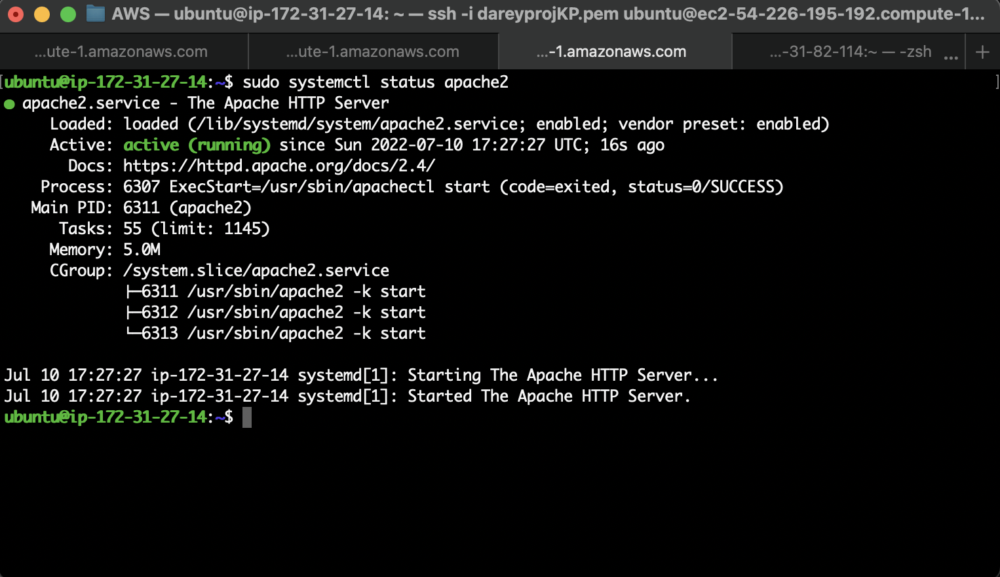
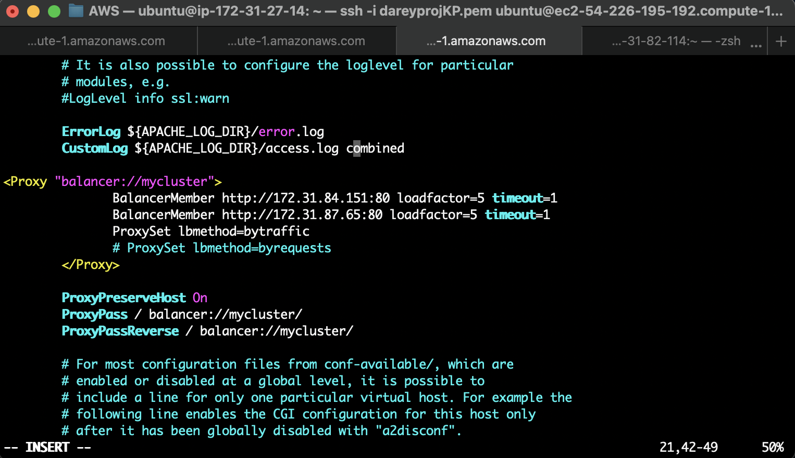
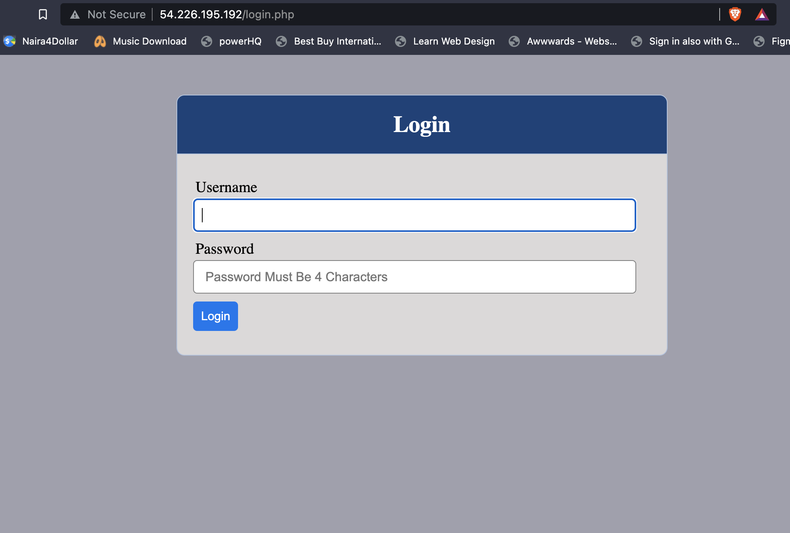

# LOAD BALANCER SOLUTION WITH APACHE 

## Configure Apache As A Load Balancer

1. Create a new RHEL8 ec2 instance for the load balancer.
2. Open TCP Port 80 in Inbound rules for the load balancer security group.
3. Install Apache Load Balancer on Project-8-apache-lb server and configure it to point traffic coming to LB to both Web Servers:

```
#Install apache2
sudo apt update
sudo apt install apache2 -y
sudo apt-get install libxml2-dev
```

Enable the following modules:

```
udo a2enmod rewrite
sudo a2enmod proxy
sudo a2enmod proxy_balancer
sudo a2enmod proxy_http
sudo a2enmod headers
sudo a2enmod lbmethod_bytraffic
```

Restart apache2 service:

```
sudo systemctl restart apache2
```

Ensure that Apache2 is up and running:

```
sudo systemctl status apache2
```



Configure Apache Load Balancer to point traffic coming to LB to both Web Servers:

```
sudo vi /etc/apache2/sites-available/000-default.conf
```

Add this configuration into this section `<VirtualHost *:80>  </VirtualHost>`:

```
<Proxy "balancer://mycluster">
               BalancerMember http://<WebServer1-Private-IP-Address>:80 loadfactor=5 timeout=1
               BalancerMember http://<WebServer2-Private-IP-Address>:80 loadfactor=5 timeout=1
               ProxySet lbmethod=bytraffic
               # ProxySet lbmethod=byrequests
        </Proxy>

        ProxyPreserveHost On
        ProxyPass / balancer://mycluster/
        ProxyPassReverse / balancer://mycluster/

#Restart the apache server
sudo systemctl restart apache2
```



Restart the apache server:

```
sudo systemctl restart apache2
```

Access the load balancer IP address and verify it routes to the webservers.





## Optional Step – Configure Local DNS Names Resolution

Sometimes it is tedious to remember and switch between IP addresses, especially if you have a lot of servers under your management. What we can do, is to configure local domain name resolution. The easiest way is to use /etc/hosts file, although this approach is not very scalable, but it is very easy to configure and shows the concept well. So let us configure IP address to domain name mapping for our LB.

Open this file on your LB server:

```
sudo vi /etc/hosts
```

Add records into this file with Local IP address and arbitrary name for your Web Servers:

```
<WebServer1-Private-IP-Address> Web1
<WebServer2-Private-IP-Address> Web2
```

Now we can edit the `/etc/apache2/sites-available/000-default.conf` file and add the following configuration:

```
BalancerMember http://Web1:80 loadfactor=5 timeout=1
BalancerMember http://Web2:80 loadfactor=5 timeout=1
```
