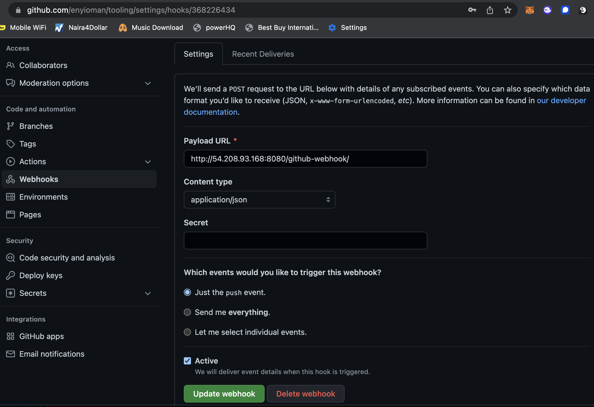
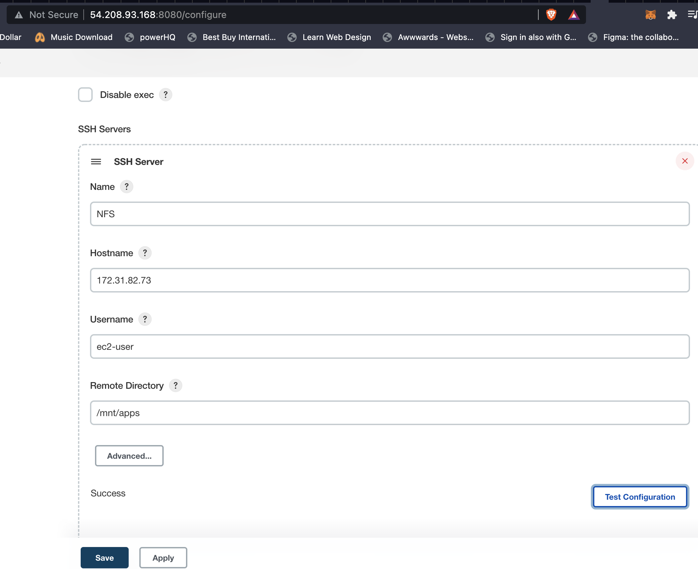

# CONTINUOUS INTERGRATION PIPELINE FOR TOOLING WEBSITE

Task: Enhance the architecture prepared in Project 8 by adding a Jenkins server, configure a job to automatically deploy source codes changes from Git to NFS server.


The running servers so far on AWS:


## Step 1: Install Jenkins Server

Spin up an AWS EC2 server based on Ubuntu Server 20.04 LTS.

Install JDK (since Jenkins is a Java-based application):

```
sudo apt update
sudo apt install default-jdk-headless
```

Install Jenkins:

```
wget -q -O - https://pkg.jenkins.io/debian-stable/jenkins.io.key | sudo apt-key add -
sudo sh -c 'echo deb https://pkg.jenkins.io/debian-stable binary/ > \
    /etc/apt/sources.list.d/jenkins.list'
sudo apt update
sudo apt-get install jenkins
```

Confirm that Jenkins is up and running:

```
sudo systemctl status jenkins
```


Jenkins default server uses TCP port 8080 so create a new Inbound in the EC2 Security Group.


Access Jenkins through `http://<Jenkins-Server-Public-IP-Address-or-Public-DNS-Name>:8080` to setup jenkins with the admin password and also install the suggested plugins and createe a user.

Run the command below to retrieve the admin password:

```
sudo cat /var/lib/jenkins/secrets/initialAdminPassword
```


## Step 2: Configure Jenkins to retrieve source code from GitHub using WebHooks

Enable WebHooks in GitHub repo settings:

- Click on the tooling repo
- Click settings
- Click WebHooks from the left pane
- Click add webhook
- Enter `<Jenkins-server-public-ip>:8080/github-webhook/`
- For content type, select application/json
- Leave everything else and click add webhook




Go to Jenkins web console, click “New Item” and create a “Freestyle project”.

- Under Source Code Management, select Git
- Paste the repo URL, and add your GitHub account credentials
- Save the configuration and click "Build Now" to trigger a manual build


Click configure for your job and: 

- Select GitHub Hook trigger for GitScm polling
- Configure Post Build Actions to archive the artifacts

Make a change in your repo (edit a file) and commit to the master branch.


## Step 3: Configure Jenkins to copy files to NFS server via SSH

Install Publish Over SSH plugin.

- On main dashboard, select Manage Jenkins and then select Manage Plugins
- Click "Available" tab and in the search bar, enter "Publish Over ssh"
- Check the box next to the plugin and click "Install without restart"

Configure the job/project to copy artifacts over to NFS server.

- On main dashboard select Manage Jenkins and then Configure System
- Scroll down to Publish Over SSH plugin configuration and:
- Paste in the content of your private (*.pem) key file.
- For hostname, enter the private ip address of the NFS server
- For username, enter ec2-user
- Remote directory /mnt/apps
- Save the configuration




- Open the job configuration and add another Post Build Action
- "Send build artifacts over SSH"
- Since we want to copy all files, enter ** in the "Source files" field.
- Save the configuration

Edit a file on repo and ensure the job builds successfully, automatically.


